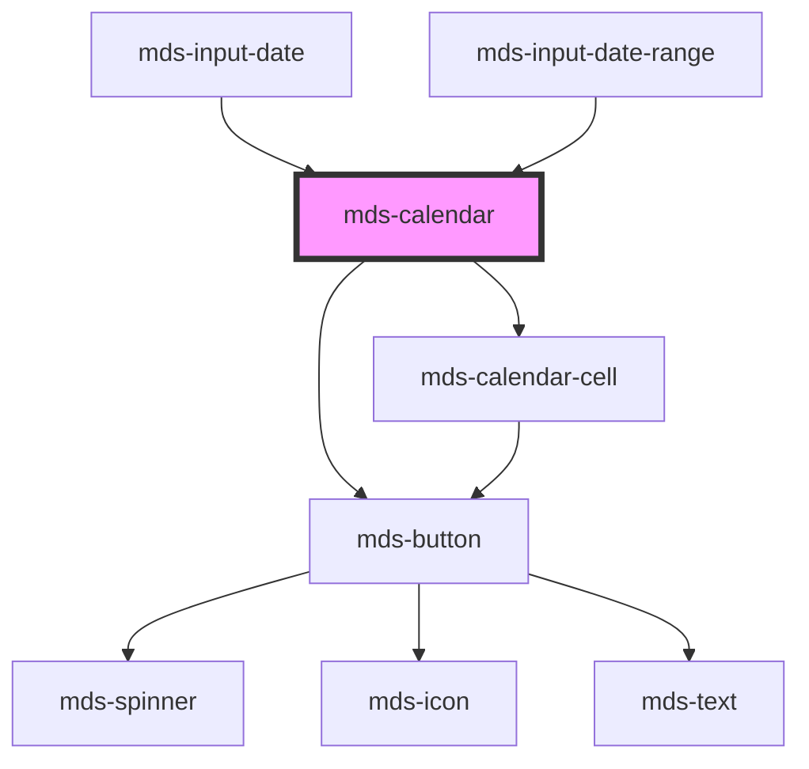

# mds-calendar

<!-- Auto Generated Below -->

## Properties

| Property                    | Attribute                      | Description                                                                               | Type             | Default |
| --------------------------- | ------------------------------ | ----------------------------------------------------------------------------------------- | ---------------- | ------- |
| `disableMonthYearSelection` | `disable-month-year-selection` | Disables switching to month or year selection views from the calendar header.             | `boolean`        | `false` |
| `endDate`                   | `end-date`                     | Specifies the end date of the selection                                                   | `null \| string` | `null`  |
| `hoverDate`                 | `hover-date`                   | Specifies the date used to preview the range selection across multiple visible calendars. | `null \| string` | `null`  |
| `max`                       | `max`                          | Specifies the minimum date of the selection                                               | `null \| string` | `null`  |
| `min`                       | `min`                          | Specifies the minimum date of the selection                                               | `null \| string` | `null`  |
| `rangePicker`               | `range-picker`                 |                                                                                           | `boolean`        | `true`  |
| `showNextButton`            | `show-next-button`             | Shows the next navigation button in the calendar header.                                  | `boolean`        | `true`  |
| `showPreviousButton`        | `show-previous-button`         | Shows the previous navigation button in the calendar header.                              | `boolean`        | `true`  |
| `startDate`                 | `start-date`                   | Specifies the start date of the selection                                                 | `null \| string` | `null`  |
| `viewDate`                  | `view-date`                    | Specifies the date used to determine the visible month without changing the selection.    | `null \| string` | `null`  |

## Events

| Event                  | Description | Type                                                                 |
| ---------------------- | ----------- | -------------------------------------------------------------------- |
| `mdsCalendarChange`    |             | `CustomEvent<{ startDate: string; endDate?: string \| undefined; }>` |
| `mdsCalendarHover`     |             | `CustomEvent<{ hoverDate: string \| null; }>`                        |
| `mdsCalendarNavigate`  |             | `CustomEvent<{ currentDate: string; delta: number; }>`               |
| `mdsCalendarPreselect` |             | `CustomEvent<void>`                                                  |

## Methods

### `updateCurrentDate(date: string) => Promise<void>`

#### Parameters

| Name   | Type     | Description |
| ------ | -------- | ----------- |
| `date` | `string` |             |

#### Returns

Type: `Promise<void>`

### `updateLang() => Promise<void>`

#### Returns

Type: `Promise<void>`

## Dependencies

### Used by

 - [mds-input-date](../mds-input-date)
 - [mds-input-date-range](../mds-input-date-range)

### Depends on

- [mds-button](../mds-button)
- [mds-calendar-cell](../mds-calendar-cell)

### Graph

----------------------------------------------

Built with love @ [Gruppo Maggioli](https://www.maggioli.com) from [R&D Department](https://www.maggioli.com/it-it/chi-siamo/ricerca-sviluppo)
