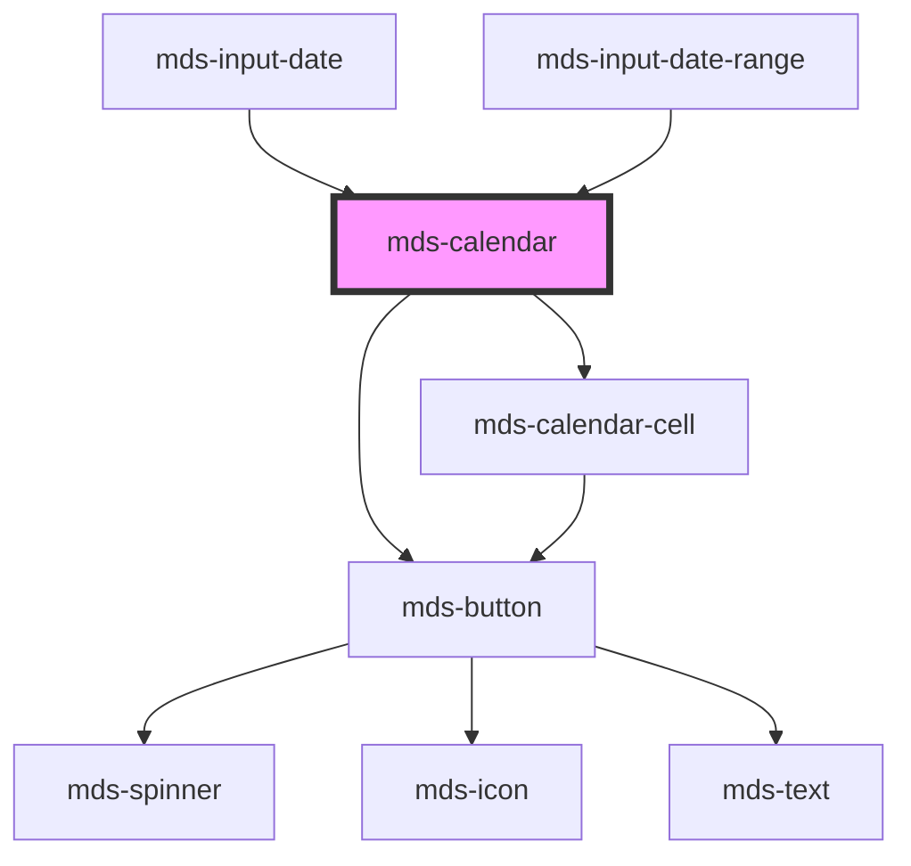

# mds-calendar

<!-- Auto Generated Below -->

## Properties

| Property      | Attribute      | Description                                 | Type             | Default |
| ------------- | -------------- | ------------------------------------------- | ---------------- | ------- |
| `endDate`     | `end-date`     | Specifies the end date of the selection     | `null \| string` | `null`  |
| `max`         | `max`          | Specifies the minimum date of the selection | `null \| string` | `null`  |
| `min`         | `min`          | Specifies the minimum date of the selection | `null \| string` | `null`  |
| `rangePicker` | `range-picker` |                                             | `boolean`        | `true`  |
| `startDate`   | `start-date`   | Specifies the start date of the selection   | `null \| string` | `null`  |

## Events

| Event                  | Description | Type                                                                 |
| ---------------------- | ----------- | -------------------------------------------------------------------- |
| `mdsCalendarChange`    |             | `CustomEvent<{ startDate: string; endDate?: string \| undefined; }>` |
| `mdsCalendarPreselect` |             | `CustomEvent<void>`                                                  |

## Methods

### `updateCurrentDate(date: string) => Promise<void>`

#### Parameters

| Name   | Type     | Description |
| ------ | -------- | ----------- |
| `date` | `string` |             |

#### Returns

Type: `Promise<void>`

### `updateLang() => Promise<void>`

#### Returns

Type: `Promise<void>`

## CSS Custom Properties

| Name                                          | Description                                                               |
| --------------------------------------------- | ------------------------------------------------------------------------- |
| `--mds-calendar-background`                   | The background color of the calendar container.                           |
| `--mds-calendar-border-radius`                | The border-radius of the calendar container.                              |
| `--mds-calendar-cell-gap`                     | The spacing between calendar day cells.                                   |
| `--mds-calendar-cell-other-month-visibility`  | Controls visibility of days from other months (e.g. "visible", "hidden"). |
| `--mds-calendar-day-number-color`             | The color of the day numbers of the current month.                        |
| `--mds-calendar-day-number-other-month-color` | The color of the day numbers belonging to previous/next months.           |
| `--mds-calendar-padding`                      | The internal padding of the calendar container.                           |

## Dependencies

### Used by

 - [mds-input-date](../mds-input-date)
 - [mds-input-date-range](../mds-input-date-range)

### Depends on

- [mds-button](../mds-button)
- [mds-calendar-cell](../mds-calendar-cell)

### Graph

----------------------------------------------

Built with love @ [Gruppo Maggioli](https://www.maggioli.com) from [R&D Department](https://www.maggioli.com/it-it/chi-siamo/ricerca-sviluppo)
