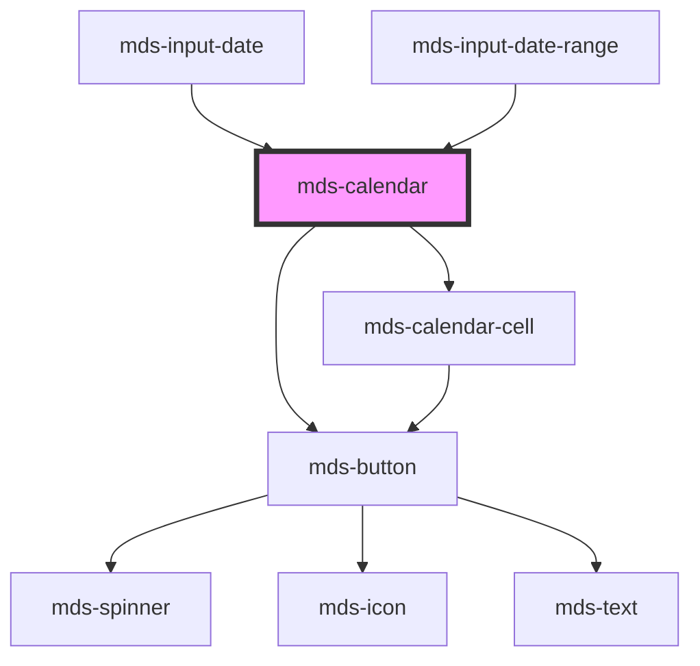

# mds-calendar


<!-- Auto Generated Below -->


## Usage

### 1. Description

The `<mds-calendar>` web component is the date-selection surface of the Magma Design System: a localized month grid that lets users pick either a single day or a date range. It is the visual engine behind `mds-input-date` and `mds-input-date-range`.

#### Semantic Behavior

- **Range vs. single mode**: `rangePicker` defaults to `true`. In range mode the first click sets the start, the second sets the end, and a third click resets the selection; in single mode each click replaces the prior choice.
- **Range auto-ordering**: If the second click lands before the current start, the two endpoints are swapped so `startDate` always precedes `endDate`; setting an `endDate` earlier than `startDate` is rejected with a console warning.
- **Hover preview**: While a range start is set, hovering over cells previews the candidate range live (range mode only).
- **Min/max bounds**: `min` and `max` mark out-of-range day cells as disabled, blocking their selection.
- **Multi-view navigation**: The header toggles between the day grid, a month picker, and a year picker; the year view pages in decades while the calendar view pages month by month.
- **Localization**: Weekday names, month names, and cell titles are formatted from the host's resolved locale (`it`, `en`, `es`, `el`).
- **Emitted events**: `mdsCalendarChange` fires with `{ startDate, endDate? }` once a selection is complete; `mdsCalendarPreselect` fires alongside it to let preselection chips re-evaluate their state.
- **Preselection slot**: A `preselection` named slot hosts quick-pick shortcuts.

#### Properties & Visual Configurations

Dates are exchanged as ISO 8601 strings (`YYYY-MM-DD`). `startDate` and `endDate` seed and reflect the current selection; on load, a valid `startDate` also determines which month is shown first.

- **`rangePicker`** is the mode switch: leave it `true` for two-ended range selection, set it `false` for single-day pickers. When `false`, any `endDate` is ignored and cleared with a warning.
- **`min`** / **`max`** define the selectable window; days outside it render disabled rather than being hidden.

This component does not use the shared `variant` / `tone` ladders on its host - those are defined in [`projects/stencil/SPEC.md`](../../../../SPEC.md#tone-and-variant-system) and are applied internally to the navigation buttons it renders.


### 2. Pattern

Correct and idiomatic ways to use the `<mds-calendar>` component, ordered from most common to most specialized. Patterns assume a working knowledge of the variant / tone ladders documented in [`docs/COMPONENTS.md`](../../../../../../docs/COMPONENTS.md) and the generic stencil rules in [`projects/stencil/SPEC.md`](../../../../SPEC.md).

#### Single-Day Picker

Disable range mode with `range-picker="false"` for a plain single-date selector. `mdsCalendarChange` fires once with `{ startDate }` and no `endDate`. Seed an initial date via `start-date`.

```html
<mds-calendar range-picker="false" start-date="2025-06-10"></mds-calendar>

<script>
  document.querySelector('mds-calendar').addEventListener('mdsCalendarChange', (e) => {
    console.log('Data selezionata:', e.detail.startDate);
  });
</script>
```

#### Range Picker (default mode)

`range-picker` defaults to `true`. The first click sets the start date, the second sets the end date. A third click resets the selection. Preload a range by supplying both `start-date` and `end-date`.

```html
<mds-calendar start-date="2025-09-01" end-date="2025-09-15"></mds-calendar>

<script>
  document.querySelector('mds-calendar').addEventListener('mdsCalendarChange', (e) => {
    const { startDate, endDate } = e.detail;
    console.log('Intervallo selezionato:', startDate, '-', endDate);
  });
</script>
```

#### Restricting the Selectable Window with `min` / `max`

Pass ISO 8601 strings to `min` and `max` to mark out-of-range days as disabled. Days outside the window are not hidden - they remain visible but cannot be clicked.

```html
<mds-calendar
  range-picker="false"
  min="2025-01-01"
  max="2025-12-31"
></mds-calendar>
```

#### Navigating to a Specific Month Programmatically

Use the `updateCurrentDate` method to jump the visible month without changing the current selection. Pass any ISO date string that falls within the target month.

```html
<mds-calendar id="cal" range-picker="false"></mds-calendar>

<script>
  document.querySelector('#cal').updateCurrentDate('2026-03-01');
</script>
```

#### Quick-Pick Preselection Shortcuts

The `preselection` named slot accepts shortcut components such as [`mds-input-date-range-preselection`](../../mds-input-date-range-preselection). When at least one child with the class `date-preselection--has-preselection` is present, the slot panel becomes visible automatically. `mdsCalendarPreselect` fires after each range selection so preselection chips can re-evaluate their active state.

```html
<mds-calendar start-date="2025-09-01" end-date="2025-09-07">
  <mds-input-date-range-preselection
    slot="preselection"
  ></mds-input-date-range-preselection>
</mds-calendar>
```

#### Listening for Selection Changes

Listen on the documented `mdsCalendarChange` event - not the native `change` event - so the handler receives the structured `{ startDate, endDate? }` detail object directly from the Shadow DOM.

```html
<mds-calendar id="picker" range-picker="false"></mds-calendar>

<script>
  document.querySelector('#picker').addEventListener('mdsCalendarChange', (e) => {
    const { startDate } = e.detail;
    document.querySelector('#output').textContent = 'Scadenza: ' + startDate;
  });
</script>
```

#### Embedded inside `mds-input-date` or `mds-input-date-range`

`<mds-calendar>` is the visual engine used internally by [`mds-input-date`](../../mds-input-date) and [`mds-input-date-range`](../../mds-input-date-range). In most product surfaces, reach for those higher-level components. Use `<mds-calendar>` directly only when you need a standalone always-visible date grid without an associated text input.

```html
<!-- Higher-level: input with calendar overlay -->
<mds-input-date name="scadenza" label="Scadenza"></mds-input-date>

<!-- Lower-level: always-visible standalone grid -->
<mds-calendar range-picker="false"></mds-calendar>
```

#### Styling Customization via CSS Custom Properties

Adjust the calendar appearance only through the documented `--mds-calendar-*` CSS custom properties. Set them on the host element or a parent selector; use Magma color tokens so dark mode and high-contrast modes keep working.

```css
.booking-widget mds-calendar {
  --mds-calendar-background: rgb(var(--tone-neutral-09));
  --mds-calendar-border-radius: var(--radius-xl);
  --mds-calendar-padding: var(--spacing-500);
  --mds-calendar-cell-gap: var(--gap-100);
  --mds-calendar-day-number-color: rgb(var(--tone-neutral-02));
  --mds-calendar-cell-other-month-visibility: hidden;
}
```


### 3. Antipattern

Common incorrect uses of `<mds-calendar>`. Each entry pairs the wrong form with the right one and a one-line reason. System-wide rules (boolean-as-string, shadow piercing, Tailwind color utilities, raw native event listening) live in [`docs/COMPONENTS.md`](../../../../../../docs/COMPONENTS.md#system-level-anti-patterns) - they apply here too but are not repeated.

#### Do Not Disable Range Mode with `range-picker="false"` as a Quoted String

`rangePicker` is a boolean prop. In HTML any non-empty attribute value is truthy, so `range-picker="false"` does not turn off range mode - it keeps it on. Remove the attribute to use the default `true`, or omit the quoted value and use just the bare attribute for `true`. For `false`, remove the attribute entirely via DOM or set the property to `false` in JavaScript.

```html
<!-- 🚫 INCORRECT -->
<mds-calendar range-picker="false"></mds-calendar>

<!-- ✅ CORRECT (HTML attribute approach) -->
<!-- Range mode OFF: omit the attribute and set the property in JS -->
<mds-calendar id="cal"></mds-calendar>
<script>
  document.querySelector('#cal').rangePicker = false;
</script>
```

#### Do Not Set `end-date` When `range-picker` Is Disabled

When `rangePicker` is `false`, the component rejects `endDate` with a console warning and clears it internally. Setting both `range-picker="false"` and `end-date` is contradictory and produces no visible selection for the end date.

```html
<!-- 🚫 INCORRECT -->
<mds-calendar range-picker="false" start-date="2025-06-01" end-date="2025-06-15"></mds-calendar>

<!-- ✅ CORRECT -->
<mds-calendar range-picker="false" start-date="2025-06-01"></mds-calendar>
```

#### Do Not Provide `startDate` After `endDate`

Dates must be chronologically ordered: `startDate` must precede `endDate`. If `startDate` is set to a value later than `endDate`, the component logs a console warning and does not apply the update. Always ensure `start-date <= end-date`.

```html
<!-- 🚫 INCORRECT -->
<mds-calendar start-date="2025-12-31" end-date="2025-12-01"></mds-calendar>

<!-- ✅ CORRECT -->
<mds-calendar start-date="2025-12-01" end-date="2025-12-31"></mds-calendar>
```

#### Do Not Listen for the Native `change` Event

`<mds-calendar>` does not bubble a native `change` event from inside its Shadow DOM. Use the documented `mdsCalendarChange` custom event so the handler reliably receives the structured `{ startDate, endDate? }` payload.

```html
<!-- 🚫 INCORRECT -->
<mds-calendar id="cal"></mds-calendar>
<script>
  document.querySelector('#cal').addEventListener('change', (e) => {
    console.log(e.target.value); // undefined - wrong event
  });
</script>

<!-- ✅ CORRECT -->
<mds-calendar id="cal"></mds-calendar>
<script>
  document.querySelector('#cal').addEventListener('mdsCalendarChange', (e) => {
    console.log(e.detail.startDate, e.detail.endDate);
  });
</script>
```

#### Do Not Place Arbitrary Content in the `preselection` Slot

The `preselection` slot is designed for preselection shortcut components - not for arbitrary labels, headings, or free text. Placing unsupported elements there disrupts the preset-panel layout and may interfere with the `mdsCalendarPreselect` coordination event.

```html
<!-- 🚫 INCORRECT -->
<mds-calendar>
  <span slot="preselection">Scegli un intervallo rapido</span>
</mds-calendar>

<!-- ✅ CORRECT -->
<mds-calendar>
  <mds-input-date-range-preselection
    slot="preselection"
  ></mds-input-date-range-preselection>
</mds-calendar>
```

#### Do Not Use `<mds-calendar>` as a Drop-In Replacement for `mds-input-date`

`<mds-calendar>` is not form-associated and emits no `name`/`value` pair for form submission. When you need a date picker tied to a form field, use [`mds-input-date`](../../mds-input-date) (single date) or [`mds-input-date-range`](../../mds-input-date-range) (range) instead.

```html
<!-- 🚫 INCORRECT -->
<form action="/prenota" method="post">
  <mds-calendar name="check-in" range-picker="false"></mds-calendar>
  <button type="submit">Prenota</button>
</form>

<!-- ✅ CORRECT -->
<form action="/prenota" method="post">
  <mds-input-date name="check-in" label="Data di arrivo"></mds-input-date>
  <button type="submit">Prenota</button>
</form>
```

#### Do Not Style Internals via Undocumented `::part()` Selectors

The only supported customization surface is the set of `--mds-calendar-*` CSS custom properties. Targeting shadow-DOM internals with `::part()` selectors that are not in the documentation couples your code to the implementation and will break on minor releases.

```css
/* 🚫 INCORRECT */
mds-calendar::part(nav) {
  background: red;
}
mds-calendar::part(cell) {
  border: 1px solid blue;
}

/* ✅ CORRECT */
mds-calendar {
  --mds-calendar-background: rgb(var(--tone-neutral-09));
  --mds-calendar-border-radius: var(--radius-xl);
  --mds-calendar-cell-other-month-visibility: hidden;
}
```


## Properties

| Property      | Attribute      | Description                                 | Type             | Default |
| ------------- | -------------- | ------------------------------------------- | ---------------- | ------- |
| `endDate`     | `end-date`     | Specifies the end date of the selection     | `null \| string` | `null`  |
| `max`         | `max`          | Specifies the minimum date of the selection | `null \| string` | `null`  |
| `min`         | `min`          | Specifies the minimum date of the selection | `null \| string` | `null`  |
| `rangePicker` | `range-picker` |                                             | `boolean`        | `true`  |
| `startDate`   | `start-date`   | Specifies the start date of the selection   | `null \| string` | `null`  |


## Events

| Event                  | Description | Type                                                                 |
| ---------------------- | ----------- | -------------------------------------------------------------------- |
| `mdsCalendarChange`    |             | `CustomEvent<{ startDate: string; endDate?: string \| undefined; }>` |
| `mdsCalendarPreselect` |             | `CustomEvent<void>`                                                  |


## Methods

### `updateCurrentDate(date: string) => Promise<void>`


#### Parameters

| Name   | Type     | Description |
| ------ | -------- | ----------- |
| `date` | `string` |             |

#### Returns

Type: `Promise<void>`


### `updateLang() => Promise<void>`


#### Returns

Type: `Promise<void>`


## Dependencies

### Used by

 - [mds-input-date](../mds-input-date)
 - [mds-input-date-range](../mds-input-date-range)

### Depends on

- [mds-button](../mds-button)
- [mds-calendar-cell](../mds-calendar-cell)

### Graph


----------------------------------------------

Built with love @ [Gruppo Maggioli](https://www.maggioli.com) from [R&D Department](https://www.maggioli.com/it-it/chi-siamo/ricerca-sviluppo)
