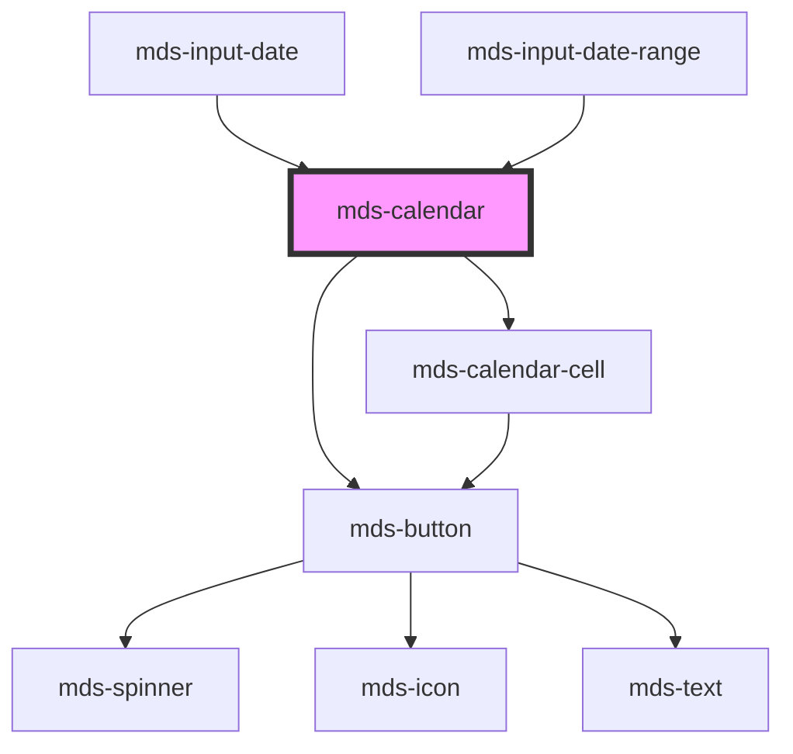

# mds-calendar


<!-- Auto Generated Below -->


## Usage

### 1. Description

The `<mds-calendar>` web component is the date-selection surface of the Magma Design System: a localized month grid that lets users pick either a single day or a date range. It is the visual engine behind `mds-input-date` and `mds-input-date-range`.

#### Semantic Behavior

- **Range vs. single mode**: range selection is the default; set `singlePicker` to pick one day. In range mode the first click sets the start, the second sets the end, and a third click starts a new range from the clicked day; in single mode each click replaces the prior choice.
- **Range auto-ordering**: If the second click lands before the current start, the two endpoints are swapped so `startDate` always precedes `endDate`; an `endDate` set earlier than `startDate` is not reordered: changed after load, it only logs a console warning.
- **Hover preview**: While a range start is set, hovering over cells previews the candidate range live (range mode only).
- **Min/max bounds**: `min` and `max` mark out-of-range day cells as disabled, blocking their selection.
- **Multi-view navigation**: The header toggles between the day grid, a month picker, and a year picker; the year view pages in decades while the calendar view pages month by month.
- **Localization**: Weekday names, month names, and cell titles are formatted in the page language (the `lang` attribute of `<html>`, `en` when absent).
- **Emitted events**: `mdsCalendarChange` fires on every pick with `{ startDate, endDate? }`: in range mode the first click emits `{ startDate }` alone, the second the full range; `mdsCalendarPreselect` fires only with a completed range, to let preselection shortcuts re-evaluate their state.
- **Preselection slot**: A `preselection` named slot hosts quick-pick shortcuts. The area appears only if, when the calendar loads, the host contains an element with the class `date-preselection--has-preselection`; `hidePreselection` collapses it.

#### Properties & Visual Configurations

Dates are exchanged as ISO 8601 strings (`YYYY-MM-DD`). `startDate` and `endDate` seed the selection (a click updates the internal selection and emits `mdsCalendarChange`, it does not rewrite the attributes); on load, a valid `startDate` also determines which month is shown first.

- **`singlePicker`** is the mode switch: omit it for two-ended range selection, set it for single-day pickers. When set, any `endDate` is ignored and cleared with a warning.
- **`hidePreviousButton`** / **`hideNextButton`** remove one of the header navigation buttons, typically on calendars paired side by side; **`disableMonthYearSelection`** keeps the header on the day grid; **`hideToday`** removes the highlight on today's date.
- Every boolean prop defaults to `false`: the feature is on until the bare attribute turns it off.
- **`min`** / **`max`** define the selectable window; days outside it render disabled rather than being hidden.

This component does not use the shared `variant` / `tone` ladders on its host - those are defined in [`docs/agents/variants.md`](../../../../../../docs/agents/variants.md) and are applied internally to the navigation buttons it renders.


### 2. Pattern

Correct and idiomatic ways to use the `<mds-calendar>` component, ordered from most common to most specialized. Patterns assume a working knowledge of the shared component rules in [`docs/agents/conventions.md`](../../../../../../docs/agents/conventions.md).

#### Single-Day Picker

Set the bare `single-picker` attribute for a plain single-date selector. `mdsCalendarChange` fires once with `{ startDate }` and no `endDate`. Seed an initial date via `start-date`.

```html
<mds-calendar single-picker start-date="2025-06-10"></mds-calendar>

<script>
  document.querySelector('mds-calendar').addEventListener('mdsCalendarChange', (e) => {
    console.log('Data selezionata:', e.detail.startDate);
  });
</script>
```

#### Range Picker (default mode)

Range selection is the default: omit `single-picker`. The first click sets the start date, the second sets the end date. A third click starts a new range from the clicked day. `mdsCalendarChange` fires on both clicks: after the first one `endDate` is absent. Preload a range by supplying both `start-date` and `end-date`.

```html
<mds-calendar start-date="2025-09-01" end-date="2025-09-15"></mds-calendar>

<script>
  document.querySelector('mds-calendar').addEventListener('mdsCalendarChange', (e) => {
    const { startDate, endDate } = e.detail;
    console.log('Intervallo selezionato:', startDate, '-', endDate);
  });
</script>
```

#### Restricting the Selectable Window with `min` / `max`

Pass ISO 8601 strings to `min` and `max` to mark out-of-range days as disabled. Days outside the window are not hidden - they remain visible but cannot be clicked.

```html
<mds-calendar
  single-picker
  min="2025-01-01"
  max="2025-12-31"
></mds-calendar>
```

#### Navigating to a Specific Month Programmatically

Use the `updateCurrentDate` method to jump the visible month without changing the current selection. Pass any ISO date string that falls within the target month.

```html
<mds-calendar id="cal" single-picker></mds-calendar>

<script>
  document.querySelector('#cal').updateCurrentDate('2026-03-01');
</script>
```

#### Quick-Pick Preselection Shortcuts

The `preselection` named slot hosts your own shortcuts, for example `mds-button` elements whose `click` sets `start-date` / `end-date` ([`mds-input-date-range-preselection`](../../mds-input-date-range-preselection) works only inside `mds-input-date-range`). The slot panel becomes visible only if, when the calendar loads, the host contains an element with the class `date-preselection--has-preselection`; set `hide-preselection` to keep it collapsed. `mdsCalendarPreselect` fires after each completed range selection so the shortcuts can re-evaluate their active state.

```html
<mds-calendar start-date="2025-09-01" end-date="2025-09-07">
  <div slot="preselection" class="date-preselection--has-preselection">
    <mds-button variant="dark" tone="text" label="Ultimi 7 giorni"></mds-button>
    <mds-button variant="dark" tone="text" label="Ultimi 30 giorni"></mds-button>
  </div>
</mds-calendar>
```

#### Paired Calendars Without Duplicate Navigation

Two calendars shown side by side (the pattern used by `mds-input-date-range` on wide viewports) should expose one previous and one next button in total: hide the inner buttons with `hide-previous-button` / `hide-next-button` and lock the header on the day grid with `disable-month-year-selection`, then keep the two `view-date` values one month apart from the `mdsCalendarNavigate` event.

```html
<mds-calendar id="start" view-date="2025-09-01" hide-next-button disable-month-year-selection></mds-calendar>
<mds-calendar id="end" view-date="2025-10-01" hide-previous-button disable-month-year-selection></mds-calendar>
```

#### Listening for Selection Changes

Listen on the documented `mdsCalendarChange` event - not the native `change` event - so the handler receives the structured `{ startDate, endDate? }` detail object directly from the Shadow DOM.

```html
<mds-calendar id="picker" single-picker></mds-calendar>

<script>
  document.querySelector('#picker').addEventListener('mdsCalendarChange', (e) => {
    const { startDate } = e.detail;
    document.querySelector('#output').textContent = 'Scadenza: ' + startDate;
  });
</script>
```

#### Embedded inside `mds-input-date` or `mds-input-date-range`

`<mds-calendar>` is the visual engine used internally by [`mds-input-date`](../../mds-input-date) and [`mds-input-date-range`](../../mds-input-date-range). In most product surfaces, reach for those higher-level components. Use `<mds-calendar>` directly only when you need a standalone always-visible date grid without an associated text input.

```html
<!-- Higher-level: input with calendar overlay -->
<mds-input-field label="Scadenza">
  <mds-input-date name="scadenza"></mds-input-date>
</mds-input-field>

<!-- Lower-level: always-visible standalone grid -->
<mds-calendar single-picker></mds-calendar>
```

#### Styling Customization via CSS Custom Properties

Adjust the calendar appearance only through the documented `--mds-calendar-*` CSS custom properties. Set them on the host element or a parent selector; use the semantic color roles so dark mode, named themes and high contrast keep working.

```css
.booking-widget mds-calendar {
  --mds-calendar-background: rgb(var(--magma-surface-muted));
  --mds-calendar-border-radius: var(--magma-radius-xl);
  --mds-calendar-padding: calc(var(--spacing) * 500);
  --mds-calendar-cell-gap: calc(var(--spacing) * 100);
  --mds-calendar-cell-other-month-visibility: hidden;
}
```


### 3. Antipattern

Common incorrect uses of `<mds-calendar>`. Each entry pairs the wrong form with the right one and a one-line reason. System-wide rules (boolean-as-string, shadow piercing, Tailwind color utilities, raw native event listening) live in [`docs/agents/anti-patterns.md`](../../../../../../docs/agents/anti-patterns.md) - they apply here too but are not repeated.

#### Do Not Toggle Single Mode with a Quoted Boolean String

`singlePicker` is a boolean prop that defaults to `false`. The component reads the string `"false"` as `false`, but the prop is not reflected, so `single-picker="false"` stays in the DOM and attribute selectors (`mds-calendar[single-picker]`) and any code reading the attribute still see it set. Use the bare attribute for single mode and omit it for the default range mode; toggle it at runtime by adding/removing the attribute or setting the property in JavaScript.

```html
<!-- INCORRECT -->
<mds-calendar single-picker="false"></mds-calendar>

<!-- CORRECT -->
<mds-calendar></mds-calendar>
<mds-calendar id="cal" single-picker></mds-calendar>
<script>
  document.querySelector('#cal').singlePicker = false; // back to range mode
</script>
```

#### Do Not Set `end-date` When `single-picker` Is Set

When `singlePicker` is set, the component rejects `endDate` with a console warning and clears it internally. Setting both `single-picker` and `end-date` is contradictory and produces no visible selection for the end date.

```html
<!-- INCORRECT -->
<mds-calendar single-picker start-date="2025-06-01" end-date="2025-06-15"></mds-calendar>

<!-- CORRECT -->
<mds-calendar single-picker start-date="2025-06-01"></mds-calendar>
```

#### Do Not Provide `startDate` After `endDate`

Dates must be chronologically ordered: `startDate` must precede `endDate`. The component does not reorder them: set at load, the two ends are marked with no range between them; changed later, it only logs a console warning. Always ensure `start-date <= end-date`.

```html
<!-- INCORRECT -->
<mds-calendar start-date="2025-12-31" end-date="2025-12-01"></mds-calendar>

<!-- CORRECT -->
<mds-calendar start-date="2025-12-01" end-date="2025-12-31"></mds-calendar>
```

#### Do Not Listen for the Native `change` Event

`<mds-calendar>` does not bubble a native `change` event from inside its Shadow DOM. Use the documented `mdsCalendarChange` custom event so the handler reliably receives the structured `{ startDate, endDate? }` payload.

```html
<!-- INCORRECT -->
<mds-calendar id="cal"></mds-calendar>
<script>
  document.querySelector('#cal').addEventListener('change', (e) => {
    console.log(e.target.value); // undefined - wrong event
  });
</script>

<!-- CORRECT -->
<mds-calendar id="cal"></mds-calendar>
<script>
  document.querySelector('#cal').addEventListener('mdsCalendarChange', (e) => {
    console.log(e.detail.startDate, e.detail.endDate);
  });
</script>
```

#### Do Not Use `<mds-calendar>` as a Drop-In Replacement for `mds-input-date`

`<mds-calendar>` is not form-associated and emits no `name`/`value` pair for form submission. When you need a date picker tied to a form field, use [`mds-input-date`](../../mds-input-date) (single date) or [`mds-input-date-range`](../../mds-input-date-range) (range) instead.

```html
<!-- INCORRECT -->
<form action="/prenota" method="post">
  <mds-calendar name="check-in" single-picker></mds-calendar>
  <mds-button type="submit" label="Prenota"></mds-button>
</form>

<!-- CORRECT -->
<form action="/prenota" method="post">
  <mds-input-field label="Data di arrivo">
    <mds-input-date name="check-in"></mds-input-date>
  </mds-input-field>
  <mds-button type="submit" label="Prenota"></mds-button>
</form>
```

#### Do Not Style Internals via Undocumented `::part()` Selectors

The only supported customization surface is the set of `--mds-calendar-*` CSS custom properties. Targeting shadow-DOM internals with `::part()` selectors that are not in the documentation couples your code to the implementation and will break on minor releases.

```css
/* INCORRECT */
mds-calendar::part(nav) {
  background: red;
}
mds-calendar::part(cell) {
  border: 1px solid blue;
}

/* CORRECT */
mds-calendar {
  --mds-calendar-background: rgb(var(--magma-surface-muted));
  --mds-calendar-border-radius: var(--magma-radius-xl);
  --mds-calendar-cell-other-month-visibility: hidden;
}
```


## Properties

| Property                    | Attribute                      | Description                                                                                                              | Type             | Default |
| --------------------------- | ------------------------------ | ------------------------------------------------------------------------------------------------------------------------ | ---------------- | ------- |
| `disableMonthYearSelection` | `disable-month-year-selection` | Disables switching to month or year selection views from the calendar header.                                            | `boolean`        | `false` |
| `endDate`                   | `end-date`                     | Specifies the end date of the selection                                                                                  | `null \| string` | `null`  |
| `hideNextButton`            | `hide-next-button`             | If set, the component hides the next navigation button in the calendar header.                                           | `boolean`        | `false` |
| `hidePreselection`          | `hide-preselection`            | If set, the component hides the preselection area above the calendar view even when the `preselection` slot has content. | `boolean`        | `false` |
| `hidePreviousButton`        | `hide-previous-button`         | If set, the component hides the previous navigation button in the calendar header.                                       | `boolean`        | `false` |
| `hideToday`                 | `hide-today`                   | Hides the highlight on today's date in the calendar view.                                                                | `boolean`        | `false` |
| `hoverDate`                 | `hover-date`                   | Specifies the date used to preview the range selection across multiple visible calendars.                                | `null \| string` | `null`  |
| `max`                       | `max`                          | Specifies the minimum date of the selection                                                                              | `null \| string` | `null`  |
| `min`                       | `min`                          | Specifies the minimum date of the selection                                                                              | `null \| string` | `null`  |
| `singlePicker`              | `single-picker`                | If set, the component selects a single date instead of a date range (start and end date).                                | `boolean`        | `false` |
| `startDate`                 | `start-date`                   | Specifies the start date of the selection                                                                                | `null \| string` | `null`  |
| `viewDate`                  | `view-date`                    | Specifies the date used to determine the visible month without changing the selection.                                   | `null \| string` | `null`  |


## Events

| Event                  | Description                                                                 | Type                                                                 |
| ---------------------- | --------------------------------------------------------------------------- | -------------------------------------------------------------------- |
| `mdsCalendarChange`    | Emitted when the selected date or date range changes.                       | `CustomEvent<{ startDate: string; endDate?: string \| undefined; }>` |
| `mdsCalendarHover`     | Emitted when the user hovers over a day, used to preview a range selection. | `CustomEvent<{ hoverDate: string \| null; }>`                        |
| `mdsCalendarNavigate`  | Emitted when the user navigates to a different month or year.               | `CustomEvent<{ currentDate: string; delta: number; }>`               |
| `mdsCalendarPreselect` | Emitted when the calendar's preselection options need to be re-evaluated.   | `CustomEvent<void>`                                                  |


## Methods

### `updateCurrentDate(date: string) => Promise<void>`

Sets the calendar's current date and re-renders the calendar accordingly.

#### Parameters

| Name   | Type     | Description                                     |
| ------ | -------- | ----------------------------------------------- |
| `date` | `string` | the date to display, in ISO format (YYYY-MM-DD) |

#### Returns

Type: `Promise<void>`


## Slots

| Slot             | Description                                                                  |
| ---------------- | ---------------------------------------------------------------------------- |
| `"preselection"` | Add `HTML elements` or `components` shown in the calendar preselection area. |


## CSS Custom Properties

| Name                                         | Description                                                                       |
| -------------------------------------------- | --------------------------------------------------------------------------------- |
| `--mds-calendar-background`                  | The background color of the calendar container.                                   |
| `--mds-calendar-border-radius`               | The border-radius of the calendar container.                                      |
| `--mds-calendar-cell-gap`                    | The spacing between calendar day cells.                                           |
| `--mds-calendar-cell-other-month-visibility` | Controls visibility of days from other months (e.g. "visible", "hidden").         |
| `--mds-calendar-day-number-color`            | The color of the day numbers of the current month.                                |
| `--mds-calendar-max-width`                   | The maximum inline size of the calendar; it fills its container up to this width. |
| `--mds-calendar-padding`                     | The internal padding of the calendar container.                                   |
| `--mds-calendar-select-month-or-year-height` | The height of the month/year selector in the calendar header.                     |
| `--mds-calendar-select-month-or-year-width`  | The width of the month/year selector in the calendar header.                      |


## Dependencies

### Used by

 - [mds-input-date](../mds-input-date)
 - [mds-input-date-range](../mds-input-date-range)

### Depends on

- [mds-button](../mds-button)
- [mds-calendar-cell](../mds-calendar-cell)

### Graph

```mermaid
graph TD;
  mds-calendar --> mds-button
  mds-calendar --> mds-calendar-cell
  mds-button --> mds-spinner
  mds-button --> mds-icon
  mds-button --> mds-text
  mds-calendar-cell --> mds-button
  mds-input-date --> mds-calendar
  mds-input-date-range --> mds-calendar
  style mds-calendar fill:#f9f,stroke:#333,stroke-width:4px
```

----------------------------------------------

Built with love @ [Gruppo Maggioli](https://www.maggioli.com) from [R&D Department](https://www.maggioli.com/it-it/chi-siamo/ricerca-sviluppo)
