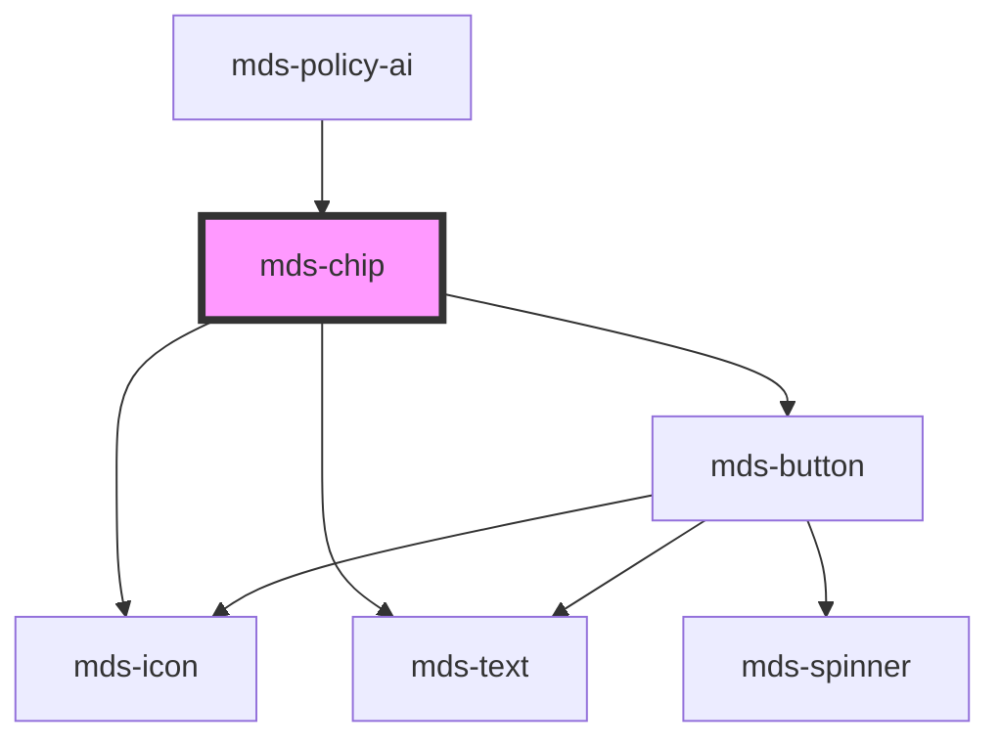

# mds-chip


This is a web-component from Maggioli Design System [Magma](https://magma.maggiolicloud.it), built with StencilJS, TypeScript, Storybook. It's based on the web-component standard and it's designed to be agnostic from the JavaScript framework you are using.

<!-- Auto Generated Below -->


## Usage

### 1. Description

The `<mds-chip>` web component is the Magma Design System's compact element for representing a discrete piece of information, a filter, a selection, or a removable token. It renders a label with optional leading icon and an optional delete affordance, and can be made interactive (clickable or selectable) to act as a lightweight button-like control rather than a static tag.

#### Semantic Behavior

- **Static by default**: With no interaction props the chip is a passive, non-focusable label; it becomes a focusable, button-like control only when `clickable` is set.
- **Selectable implies clickable**: Setting `selectable` automatically turns on `clickable`, so a selectable chip is always keyboard- and pointer-interactive.
- **Selection toggle**: When `selectable`, activating the chip flips `selected`; an unselected chip carries no `selected` attribute (rather than `selected="false"`).
- **Keyboard activation**: When interactive, Enter/Space activate the chip just like a pointer click.
- **Delete affordance**: When `deletable`, a trailing delete button is rendered with a localized title (el/en/es/it) and emits the delete event on activation.
- **Emitted events**: `mdsChipClickLabel` fires on activation for non-selectable chips, `mdsChipSelect` fires (carrying the new `selected` value) for selectable chips, and `mdsChipDelete` fires from the delete button - all carrying the originating event and host element.
- **Label is text, truncated**: Long labels are clipped on word boundaries rather than wrapping.

#### Properties & Visual Configurations

The shared `variant` / `tone` ladders are defined in [`projects/stencil/SPEC.md`](../../../../SPEC.md#tone-and-variant-system); the chip defaults to `variant="primary"` and `tone="strong"`, and accepts only the minimal `'strong'` / `'weak'` tone set.

#### Other behavioral props

- **`clickable`** opts the chip into interactivity (focus, keyboard and click handling) without changing its state on activation - use it for chips that act as actions rather than toggles.
- **`selectable`** makes the chip a toggle whose `selected` state flips on each activation; pick it for filter/choice chips where the visual selected state matters.
- **`selected`** drives the selected visual treatment and can be set externally to pre-select a chip; an unselected chip carries no attribute.
- **`deletable`** adds the trailing cancel button for removable tokens; reserve it for chips the user is meant to dismiss.
- **`icon`** is an SVG filename slug from the Magma icon library, shown decoratively to the left of the label.


### 2. Pattern

Correct and idiomatic ways to use the `<mds-chip>` component, ordered from most common to most specialized. Patterns assume a working knowledge of the variant / tone ladders documented in [`docs/COMPONENTS.md`](../../../../../../docs/COMPONENTS.md) and the generic stencil rules in [`projects/stencil/SPEC.md`](../../../../SPEC.md).

#### Static Tag (Label Only)

The simplest form. Use the required `label` prop to display a read-only tag. With no interaction props the chip is passive and non-focusable.

```html
<mds-chip label="In lavorazione" variant="warning" tone="strong"></mds-chip>
```

#### Variant and Tone for Semantic Emphasis

Pair the same `variant` with a different `tone` to express importance or category. Do not invent custom colors to dim or saturate.

```html
<!-- Status chips -->
<mds-chip label="Completato" variant="success" tone="strong"></mds-chip>
<mds-chip label="In attesa" variant="warning" tone="weak"></mds-chip>
<mds-chip label="Errore" variant="error" tone="strong"></mds-chip>

<!-- Decorative label chips -->
<mds-chip label="Natura" variant="green" tone="weak"></mds-chip>
<mds-chip label="Tecnologia" variant="blue" tone="strong"></mds-chip>
```

#### Chip with Leading Icon

Reference icons by their filename slug (no `.svg` extension). The icon is rendered decoratively to the left of the label inside a circular badge.

```html
<mds-chip
  label="Animali"
  icon="mi/baseline/pets"
  variant="primary"
  tone="strong"
></mds-chip>
```

#### Clickable Chip (Action, No Toggle)

Use `clickable` when the chip triggers an action but does not need a persistent selected state. The component adds `role="button"`, focus handling, and keyboard activation. Listen for `mdsChipClickLabel`.

```html
<mds-chip
  label="Apri dettagli"
  clickable
  icon="mi/baseline/open-in-new"
  variant="secondary"
  tone="weak"
></mds-chip>

<script>
  document.querySelector('mds-chip').addEventListener('mdsChipClickLabel', (e) => {
    console.log('clicked', e.detail.element);
  });
</script>
```

#### Selectable Chip (Toggle)

Use `selectable` for filter or choice chips where the visual selected state matters. `selectable` implies `clickable` automatically. Activating the chip flips `selected`; the event `mdsChipSelect` carries the new value in `e.detail.selected`.

```html
<mds-chip
  label="Vegetariano"
  selectable
  icon="mi/baseline/eco"
  variant="success"
  tone="weak"
></mds-chip>

<script>
  document.querySelector('mds-chip').addEventListener('mdsChipSelect', (e) => {
    console.log('selezionato:', e.detail.selected);
  });
</script>
```

#### Pre-selected Chip

Set `selected` externally to initialize a selectable chip in the selected state (e.g. when restoring saved filter state). An unselected chip carries no `selected` attribute.

```html
<mds-chip
  label="Urgente"
  selectable
  selected
  variant="error"
  tone="strong"
></mds-chip>
```

#### Deletable Chip (Removable Token)

Use `deletable` for chips the user is meant to dismiss - for example tags on an entity or active filters. A trailing cancel button emits `mdsChipDelete` on activation.

```html
<mds-chip
  label="Mario Rossi"
  deletable
  icon="mi/baseline/person"
  variant="primary"
  tone="weak"
></mds-chip>

<script>
  document.querySelector('mds-chip').addEventListener('mdsChipDelete', (e) => {
    e.detail.element.remove();
  });
</script>
```

#### Fully Interactive Chip

Combine `clickable` (or `selectable`) with `deletable` for chips that can both be activated and removed independently.

```html
<mds-chip
  label="Sport invernali"
  clickable
  deletable
  icon="mi/baseline/downhill-skiing"
  variant="info"
  tone="weak"
></mds-chip>
```

#### Disabled Chip

Set `disabled` to prevent all pointer and keyboard interaction. Do not use `disabled="false"` - remove the attribute to re-enable.

```html
<mds-chip
  label="Non disponibile"
  disabled
  variant="dark"
  tone="strong"
></mds-chip>
```

#### Styling Customization

Style the chip only through its documented `--mds-chip-*` CSS custom properties. Set them on the host or a parent selector; use Magma color tokens via `rgb(var(--<token>))` so dark mode and high-contrast modes keep working. The selected-state properties (`--mds-chip-backgroud-selected`, `--mds-chip-color-selected`, `--mds-chip-icon-background-selected`, `--mds-chip-icon-color-selected`) override the default tokens when `selected` is set.

```css
.filtri-categoria mds-chip {
  --mds-chip-background: rgb(var(--variant-primary-09));
  --mds-chip-color: rgb(var(--variant-primary-03));
  --mds-chip-icon-background: rgb(var(--variant-primary-06));
  --mds-chip-icon-color: rgb(var(--tone-neutral));
  --mds-chip-backgroud-selected: rgb(var(--variant-primary-04));
  --mds-chip-color-selected: rgb(var(--tone-neutral));
}
```


### 3. Antipattern

Common incorrect uses of `<mds-chip>`. Each entry pairs the wrong form with the right one and a one-line reason. System-wide rules (boolean-as-string, shadow piercing, Tailwind color utilities, raw native event listening) live in [`docs/COMPONENTS.md`](../../../../../../docs/COMPONENTS.md#system-level-anti-patterns) - they apply here too but are not repeated.

#### Do Not Use a Clickable Chip Without `clickable` or `selectable`

Without `clickable`, the chip has no `role`, no focus management, and no keyboard activation. Listening for click events on a static chip is a silent accessibility failure.

```html
<!-- 🚫 INCORRECT -->
<mds-chip label="Apri" variant="primary" onclick="doSomething()"></mds-chip>

<!-- ✅ CORRECT -->
<mds-chip label="Apri" clickable variant="primary"></mds-chip>
<script>
  document.querySelector('mds-chip').addEventListener('mdsChipClickLabel', doSomething);
</script>
```

#### Do Not Use `selected` Without `selectable`

`selected` only has visual and semantic meaning when `selectable` is also set. On a non-selectable chip the attribute renders the selected style but the selection can never be toggled and no event fires, misleading users.

```html
<!-- 🚫 INCORRECT -->
<mds-chip label="Attivo" selected variant="success"></mds-chip>

<!-- ✅ CORRECT -->
<mds-chip label="Attivo" selectable selected variant="success"></mds-chip>
```

#### Do Not Apply `tone` Values Outside the Minimal Ladder

`mds-chip` accepts only `ToneMinimalVariantType`: `strong` and `weak`. Passing `outline`, `text`, or `box` is invalid and silently falls back to the default tone.

```html
<!-- 🚫 INCORRECT -->
<mds-chip label="Categoria" tone="outline" variant="primary"></mds-chip>
<mds-chip label="Categoria" tone="text" variant="secondary"></mds-chip>

<!-- ✅ CORRECT -->
<mds-chip label="Categoria" tone="weak" variant="primary"></mds-chip>
<mds-chip label="Categoria" tone="strong" variant="secondary"></mds-chip>
```

#### Do Not Slot Content Into the Chip

`<mds-chip>` has no default or named slots - all content is driven by props (`label`, `icon`, `deletable`). Slotting HTML children is ignored by the Shadow DOM.

```html
<!-- 🚫 INCORRECT -->
<mds-chip>
  <span>Etichetta</span>
  <mds-icon name="mi/baseline/close"></mds-icon>
</mds-chip>

<!-- ✅ CORRECT -->
<mds-chip
  label="Etichetta"
  icon="mi/baseline/pets"
  deletable
  variant="primary"
></mds-chip>
```

#### Do Not Pierce Shadow DOM to Style the Delete Button

The inner `mds-button` used for the delete affordance is a Shadow DOM implementation detail. Target it with `>>>` or undocumented `::part()` names will break on minor releases.

```css
/* 🚫 INCORRECT */
mds-chip >>> .button-delete {
  color: red;
}

/* ✅ CORRECT */
mds-chip {
  --mds-chip-icon-color: rgb(var(--status-error-04));
  --mds-chip-icon-background: rgb(var(--status-error-09));
}
```

#### Do Not Forget to Remove `await`-Pattern Analogue: Removing `selected` by Setting It to `false`

Setting `selected="false"` is treated as truthy in HTML; the correct way to deselect a chip programmatically is to remove the attribute or set the prop to `undefined`.

```html
<!-- 🚫 INCORRECT -->
<mds-chip label="Filtro" selectable selected="false" variant="primary"></mds-chip>

<!-- ✅ CORRECT -->
<mds-chip label="Filtro" selectable variant="primary"></mds-chip>
```

```js
// 🚫 INCORRECT
chipEl.selected = false;

// ✅ CORRECT
chipEl.selected = undefined;
```

#### Do Not Use `<mds-chip>` as a Navigation Link

`<mds-chip>` has no `href` prop. Wrapping it in an `<a>` creates a nested interactive element, breaks keyboard semantics, and fails accessibility audits. Use [`mds-button`](../../mds-button) with `href` instead.

```html
<!-- 🚫 INCORRECT -->
<a href="/categoria/sport">
  <mds-chip label="Sport" variant="primary"></mds-chip>
</a>

<!-- ✅ CORRECT -->
<mds-button
  label="Sport"
  href="/categoria/sport"
  variant="primary"
  tone="weak"
></mds-button>
```


## Properties

| Property             | Attribute    | Description                                                        | Type                                                                                                                                                                                                                                          | Default     |
| -------------------- | ------------ | ------------------------------------------------------------------ | --------------------------------------------------------------------------------------------------------------------------------------------------------------------------------------------------------------------------------------------- | ----------- |
| `clickable`          | `clickable`  | Adds ARIA support to the element if has interaction                | `boolean \| undefined`                                                                                                                                                                                                                        | `undefined` |
| `deletable`          | `deletable`  | Shows the cross icon to perform cancel/delete action on element    | `boolean \| undefined`                                                                                                                                                                                                                        | `undefined` |
| `disabled`           | `disabled`   | Sets the component disabled status                                 | `boolean \| undefined`                                                                                                                                                                                                                        | `false`     |
| `icon`               | `icon`       | The icon displayed to the left of the component's label            | `string \| undefined`                                                                                                                                                                                                                         | `undefined` |
| `label` _(required)_ | `label`      | The label displayed to the right of the component's icon           | `string`                                                                                                                                                                                                                                      | `undefined` |
| `selectable`         | `selectable` | Sets if the component change is status to selected when is clicked | `boolean \| undefined`                                                                                                                                                                                                                        | `false`     |
| `selected`           | `selected`   | Sets the component selected                                        | `boolean \| undefined`                                                                                                                                                                                                                        | `undefined` |
| `tone`               | `tone`       | Sets the color variant tone of the component                       | `"strong" \| "weak" \| undefined`                                                                                                                                                                                                             | `'strong'`  |
| `variant`            | `variant`    | Sets the color variant of the component                            | `"ai" \| "amaranth" \| "aqua" \| "blue" \| "dark" \| "error" \| "green" \| "info" \| "lime" \| "orange" \| "orchid" \| "primary" \| "purple" \| "red" \| "secondary" \| "sky" \| "success" \| "violet" \| "warning" \| "yellow" \| undefined` | `'primary'` |


## Events

| Event               | Description                                                                                  | Type                        |
| ------------------- | -------------------------------------------------------------------------------------------- | --------------------------- |
| `mdsChipClickLabel` | Emits when the component's label is clicked                                                  | `CustomEvent<MdsChipEvent>` |
| `mdsChipDelete`     | Emits when the component's delete button is clicked                                          | `CustomEvent<MdsChipEvent>` |
| `mdsChipSelect`     | Emits when the component's label is clicked and when `selectable` attribute is set to `true` | `CustomEvent<MdsChipEvent>` |


## Methods

### `updateLang() => Promise<void>`


#### Returns

Type: `Promise<void>`


## CSS Custom Properties

| Name                                  | Description                                                                  |
| ------------------------------------- | ---------------------------------------------------------------------------- |
| `--mds-chip-backgroud-selected`       | Sets the `background-color` of the component when it's selected              |
| `--mds-chip-background`               | Sets the `background-color` of the component                                 |
| `--mds-chip-color`                    | Sets the `color` of the component                                            |
| `--mds-chip-color-selected`           | Sets the `color` of the component when it's selected                         |
| `--mds-chip-icon-background`          | Sets the `background-color` of the icon                                      |
| `--mds-chip-icon-background-selected` | Sets the `background-color` color of the icon when the component is selected |
| `--mds-chip-icon-color`               | Sets the `fill` color of the icon of the component                           |
| `--mds-chip-icon-color-selected`      | Sets the `fill` color of the icon of the component when it's selected        |
| `--mds-chip-opacity-disabled`         | Sets the `opacity` of the component when it's disabled                       |


## Dependencies

### Used by

 - [mds-policy-ai](../mds-policy-ai)

### Depends on

- [mds-icon](../mds-icon)
- [mds-text](../mds-text)
- [mds-button](../mds-button)

### Graph


----------------------------------------------

Built with love @ [Gruppo Maggioli](https://www.maggioli.com) from [R&D Department](https://www.maggioli.com/it-it/chi-siamo/ricerca-sviluppo)
