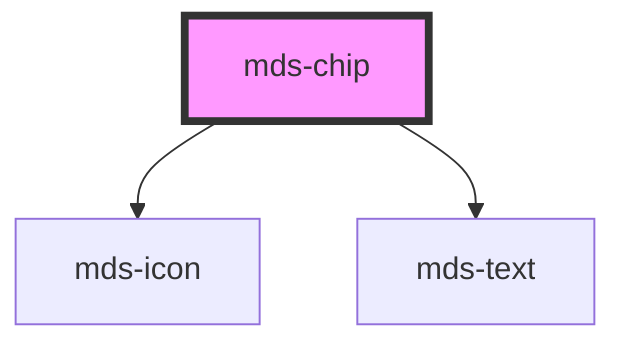

# mds-chip

This is a web-component from Maggioli Design System [Magma](https://magma.maggiolicloud.it), built with StencilJS, TypeScript, Storybook. It's based on the web-component standard and it's designed to be agnostic from the JavaScirpt framework you are using.

<!-- Auto Generated Below -->

## Properties

| Property             | Attribute      | Description                                                                        | Type                     | Default     |
| -------------------- | -------------- | ---------------------------------------------------------------------------------- | ------------------------ | ----------- |
| `clickable`          | `clickable`    | Adds ARIA support to the element if has interaction                                | `boolean \| undefined`   | `undefined` |
| `deletable`          | `deletable`    | Shows the cross icon to perform cancel/delete action on element                    | `boolean \| undefined`   | `undefined` |
| `deleteLabel`        | `delete-label` | Sets the cross icon accessibility label to perform cancel/delete action on element | `"Rimuovi" \| undefined` | `'Rimuovi'` |
| `disabled`           | `disabled`     | Sets the component disabled status                                                 | `boolean \| undefined`   | `false`     |
| `icon`               | `icon`         | The icon displayed to the left of the component's label                            | `string \| undefined`    | `undefined` |
| `label` _(required)_ | `label`        | The label displayed to the right of the component's icon                           | `string`                 | `undefined` |
| `selected`           | `selected`     | Sets the component selected                                                        | `boolean`                | `false`     |

## Events

| Event               | Description                                         | Type                        |
| ------------------- | --------------------------------------------------- | --------------------------- |
| `mdsChipClickLabel` | Emits when the component's label is clicked         | `CustomEvent<MdsChipEvent>` |
| `mdsChipDelete`     | Emits when the component's delete button is clicked | `CustomEvent<MdsChipEvent>` |

## Dependencies

### Depends on

- [mds-icon](../mds-icon)
- [mds-text](../mds-text)

### Graph

----------------------------------------------

Built with love @ **Maggioli Informatica / R&D Department**
