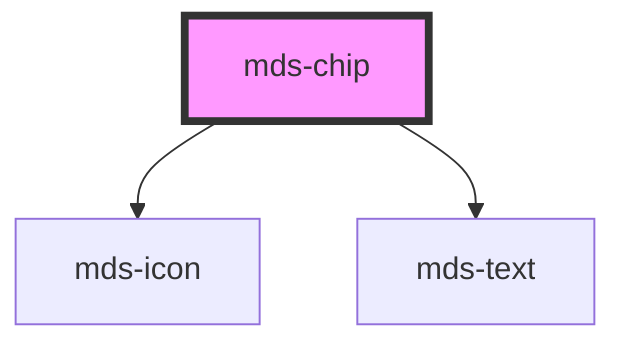

# mds-chip

<!-- Auto Generated Below -->

## Properties

| Property             | Attribute      | Description                                                                        | Type                     | Default     |
| -------------------- | -------------- | ---------------------------------------------------------------------------------- | ------------------------ | ----------- |
| `clickable`          | `clickable`    | Adds ARIA support to the element if has interaction                                | `boolean \| undefined`   | `undefined` |
| `deletable`          | `deletable`    | Shows the cross icon to perform cancel/delete action on element                    | `boolean \| undefined`   | `undefined` |
| `deleteLabel`        | `delete-label` | Sets the cross icon accessibility label to perform cancel/delete action on element | `"Rimuovi" \| undefined` | `'Rimuovi'` |
| `disabled`           | `disabled`     | Sets the component disabled status                                                 | `boolean \| undefined`   | `false`     |
| `icon`               | `icon`         | The icon displayed to the left of the component's label                            | `string \| undefined`    | `undefined` |
| `label` _(required)_ | `label`        | The label displayed to the right of the component's icon                           | `string`                 | `undefined` |
| `selected`           | `selected`     | Sets the component selected                                                        | `boolean`                | `false`     |

## Events

| Event               | Description                                         | Type                        |
| ------------------- | --------------------------------------------------- | --------------------------- |
| `mdsChipClickLabel` | Emits when the component's label is clicked         | `CustomEvent<MdsChipEvent>` |
| `mdsChipDelete`     | Emits when the component's delete button is clicked | `CustomEvent<MdsChipEvent>` |

## CSS Custom Properties

| Name                                          | Description                                                                                     |
| --------------------------------------------- | ----------------------------------------------------------------------------------------------- |
| `--mds-chip-backgroud-selected`               | Sets the `background-color` of the component when it's selected                                 |
| `--mds-chip-background`                       | Sets the `background-color` of the component                                                    |
| `--mds-chip-color`                            | Sets the `color` of the component                                                               |
| `--mds-chip-color-selected`                   | Sets the `color` of the component when it's selected                                            |
| `--mds-chip-delete-icon-color`                | Sets the `fill` color of the delete icon of the component                                       |
| `--mds-chip-delete-icon-color-hover`          | Sets the `fill` color of the delete icon when the mouse is over the component                   |
| `--mds-chip-delete-icon-color-hover-selected` | Sets the `fill` color of the delete icon when the mouse is over the component and it's selected |
| `--mds-chip-delete-icon-color-selected`       | Sets the `fill` color of the delete icon when the component and it's selected                   |
| `--mds-chip-icon-background`                  | Sets the `background-color` of the icon                                                         |
| `--mds-chip-icon-background-hover`            | Sets the `background-color` of the icon when the mouse is over the component                    |
| `--mds-chip-icon-background-selected`         | Sets the `background-color` color of the icon when the component is selected                    |
| `--mds-chip-icon-color`                       | Sets the `fill` color of the icon of the component                                              |
| `--mds-chip-icon-color-hover`                 | Sets the `fill` color of the icon when the mouse is over the component                          |
| `--mds-chip-icon-color-selected`              | Sets the `fill` color of the icon of the component when it's selected                           |
| `--mds-chip-opacity-disabled`                 | Sets the `opacity` of the component when it's disabled                                          |

## Dependencies

### Depends on

- [mds-icon](../mds-icon)
- [mds-text](../mds-text)

### Graph

----------------------------------------------

Built with love @ [Gruppo Maggioli](https://www.maggioli.com) from [R&D Department](https://www.maggioli.com/it-it/chi-siamo/ricerca-sviluppo)
