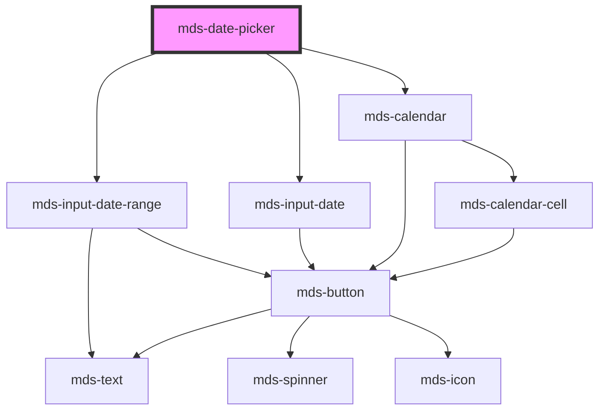

# mds-date-picker

<!-- Auto Generated Below -->

## Properties

| Property    | Attribute    | Description | Type     | Default |
| ----------- | ------------ | ----------- | -------- | ------- |
| `endDate`   | `end-date`   |             | `string` | `''`    |
| `startDate` | `start-date` |             | `string` | `''`    |

## Dependencies

### Depends on

- [mds-input-date-range](../mds-input-date-range)
- [mds-input-date](../mds-input-date)
- [mds-calendar](../mds-calendar)

### Graph

----------------------------------------------

Built with love @ [Gruppo Maggioli](https://www.maggioli.com) from [R&D Department](https://www.maggioli.com/it-it/chi-siamo/ricerca-sviluppo)
