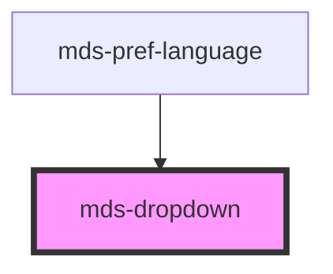

# mds-dropdown

### Best practices of usage

There are many situations where the component should be placed on the surface of the document:

```html
<body>
  <mds-dropdown target="ui-content">
    <mds-text>Dropdown contents</mds-text>
  </mds-dropdown>
  <div>
    <mds-text>Deep contents</mds-text>
    <div>
      <mds-text id="ui-content">Deeper contents</mds-text>
    </div>
  </div>
</body>
```

The next use case couldn't be rendered correctly depending by relative/absolute/etc. positioning and `strategy` attribute mix.

```html
<body>
  <div>
    <mds-text>Deep contents</mds-text>
    <div>
      <mds-text id="ui-content">Deeper contents</mds-text>
      <mds-dropdown target="ui-content">
        <mds-text>Dropdown contents</mds-text>
      </mds-dropdown>
    </div>
  </div>
</body>
```

Affected problems:

- Wrong `backdrop` render
- Wrong `mds-dropdown` positioning

This is a web-component from Maggioli Design System [Magma](https://magma.maggiolicloud.it), built with StencilJS, TypeScript, Storybook. It's based on the web-component standard and it's designed to be agnostic from the JavaScirpt framework you are using.

<!-- Auto Generated Below -->


## Properties

| Property              | Attribute        | Description                                                                                       | Type                                                                                                                                                                 | Default     |
| --------------------- | ---------------- | ------------------------------------------------------------------------------------------------- | -------------------------------------------------------------------------------------------------------------------------------------------------------------------- | ----------- |
| `arrow`               | `arrow`          | If set, the component will have an arrow pointing to the caller.                                  | `boolean`                                                                                                                                                            | `true`      |
| `arrowPadding`        | `arrow-padding`  | Sets the distance between arrow and dropdown margins.                                             | `number`                                                                                                                                                             | `24`        |
| `autoPlacement`       | `auto-placement` | If set, the component will be placed automatically near it's caller.                              | `boolean`                                                                                                                                                            | `false`     |
| `backdrop`            | `backdrop`       | Specifies if the component has a backdrop background                                              | `boolean`                                                                                                                                                            | `false`     |
| `flip`                | `flip`           | Specifies the placement of the component if no space is available where it is placed.             | `boolean`                                                                                                                                                            | `false`     |
| `interaction`         | `interaction`    | Specifies if the component is triggered from the caller on mouseover or click event               | `"click" \| "mouseover" \| "none" \| undefined`                                                                                                                      | `'click'`   |
| `offset`              | `offset`         | Sets distance between the dropdown and the caller.                                                | `number`                                                                                                                                                             | `24`        |
| `placement`           | `placement`      | Specifies where the component should be placed relative to the caller.                            | `"bottom" \| "bottom-end" \| "bottom-start" \| "left" \| "left-end" \| "left-start" \| "right" \| "right-end" \| "right-start" \| "top" \| "top-end" \| "top-start"` | `'bottom'`  |
| `shift`               | `shift`          | If set, the component will be kept inside the viewport.                                           | `boolean`                                                                                                                                                            | `true`      |
| `shiftPadding`        | `shift-padding`  | Sets a safe area distance between the dropdown and the viewport.                                  | `number`                                                                                                                                                             | `24`        |
| `smooth`              | `smooth`         | If set, the component will follow the caller smoothly, visible when the page scrolls.             | `boolean`                                                                                                                                                            | `true`      |
| `strategy`            | `strategy`       | Sets the CSS position strategy of the component.                                                  | `"absolute" \| "fixed"`                                                                                                                                              | `'fixed'`   |
| `target` _(required)_ | `target`         | Specifies the selector of the target element, this attribute is used with `querySelector` method. | `string`                                                                                                                                                             | `undefined` |
| `visible`             | `visible`        | Specifies the visibility of the component.                                                        | `boolean`                                                                                                                                                            | `false`     |
| `zIndex`              | `z-index`        | Specifies the visibility of the component.                                                        | `number`                                                                                                                                                             | `undefined` |


## Events

| Event                | Description                             | Type                                  |
| -------------------- | --------------------------------------- | ------------------------------------- |
| `mdsDropdownChange`  | Emits when a modal is visible or hidden | `CustomEvent<MdsDropdownEventDetail>` |
| `mdsDropdownHide`    | Emits when a modal is hidden            | `CustomEvent<MdsDropdownEventDetail>` |
| `mdsDropdownVisible` | Emits when a modal is visible           | `CustomEvent<MdsDropdownEventDetail>` |


## Slots

| Slot        | Description                                                                                                              |
| ----------- | ------------------------------------------------------------------------------------------------------------------------ |
| `"default"` | Add `text string`, `HTML elements` or `components` to this slot, elements will be shown when the component is triggered. |


## Dependencies

### Used by

 - [mds-pref-language](../mds-pref-language)

### Graph


----------------------------------------------

Built with love @ [Gruppo Maggioli](https://www.maggioli.com) from [R&D Department](https://www.maggioli.com/it-it/chi-siamo/ricerca-sviluppo)
