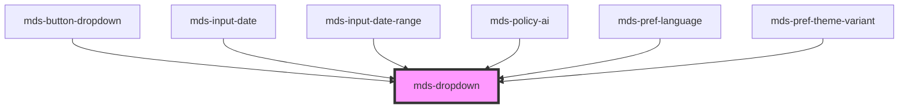

# mds-dropdown

### Best practices of usage

There are many situations where the component should be placed on the surface of the document:

```html
<body>
  <mds-dropdown target="ui-content">
    <mds-text>Dropdown contents</mds-text>
  </mds-dropdown>
  <div>
    <mds-text>Deep contents</mds-text>
    <div>
      <mds-text id="ui-content">Deeper contents</mds-text>
    </div>
  </div>
</body>
```

The next use case couldn't be rendered correctly depending by relative/absolute/etc. positioning and `strategy` attribute mix.

```html
<body>
  <div>
    <mds-text>Deep contents</mds-text>
    <div>
      <mds-text id="ui-content">Deeper contents</mds-text>
      <mds-dropdown target="ui-content">
        <mds-text>Dropdown contents</mds-text>
      </mds-dropdown>
    </div>
  </div>
</body>
```

Affected problems:

- Wrong `backdrop` render
- Wrong `mds-dropdown` positioning

This is a web-component from Maggioli Design System [Magma](https://magma.maggiolicloud.it), built with StencilJS, TypeScript, Storybook. It's based on the web-component standard and it's designed to be agnostic from the JavaScript framework you are using.

<!-- Auto Generated Below -->


## Usage

### 1. Description

The `<mds-dropdown>` web component is a floating overlay surface of the Magma Design System that anchors arbitrary slotted content next to an external trigger element. It has no built-in trigger of its own: it attaches to a separate caller resolved via `target` and positions, flips and shifts itself around that element.

#### Semantic Behavior

- **Caller binding**: The dropdown does not render a trigger; it resolves its caller from the `target` selector and wires the chosen interaction onto that external element. Changing `target` re-binds the caller.
- **Visibility is the single source of truth**: The `visible` prop drives the whole lifecycle - it positions the floating element, optionally shows the backdrop, and emits the events; setting it back to `false` dismisses it.
- **Outside-click dismissal**: While open, clicking outside both the host and the caller closes the dropdown.
- **Escape to close**: Pressing Escape hides the dropdown.
- **Backdrop**: When `backdrop` is set, a backdrop is shown while the dropdown is visible and removed on close.
- **Emitted events**: `mdsDropdownChange` fires on every visibility transition; `mdsDropdownVisible` and `mdsDropdownHide` fire on open and close respectively. Each detail carries the resolved `caller` and the current `visible` state.
- **Default slot is the panel content**: Anything in the default slot (text, HTML, or other components) is the surface shown when the dropdown is triggered.

#### Properties & Visual Configurations

- **`interaction`** decides how the caller opens the panel: `'click'` toggles on caller click (with outside-click and Escape dismissal), `'mouseover'` opens on hover and closes on mouse leave, and `'none'` disables all automatic wiring so visibility is controlled programmatically through `visible`.
- **`target`** (required) is the CSS selector of the external element the dropdown attaches to and positions against.

#### Other behavioral props

- **`placement`** sets the preferred side relative to the caller; **`autoPlacement`** chooses the best side automatically, **`flip`** allows falling back to the opposite side when space runs out, and **`shift`** / **`shiftPadding`** keep the panel inside the viewport with a safe margin.
- **`offset`** controls the gap between the panel and the caller; **`arrow`** toggles the pointer toward the caller and **`arrowPadding`** insets it from the panel edges.
- **`smooth`** keeps the panel tracking the caller as the page scrolls; **`strategy`** chooses the CSS positioning mode (`'absolute'` vs `'fixed'`) and **`zIndex`** sets the stacking order.


### 2. Pattern

Correct and idiomatic ways to use the `<mds-dropdown>` component, ordered from most common to most specialized. Patterns assume a working knowledge of the conventions documented in [`docs/COMPONENTS.md`](../../../../../../docs/COMPONENTS.md) and the generic stencil rules in [`projects/stencil/SPEC.md`](../../../../SPEC.md).

#### Basic Dropdown Menu

The minimal required setup: a trigger element with a unique `id` and a `<mds-dropdown>` with `target` pointing at it. The dropdown binds to the caller on `click` by default and dismisses on outside-click or Escape.

```html
<mds-button id="menu-utente" label="Profilo" icon="mi/baseline/account-circle" variant="secondary" tone="weak"></mds-button>

<mds-dropdown target="#menu-utente">
  <mds-button icon="mi/baseline/settings" variant="dark" tone="text" label="Impostazioni account"></mds-button>
  <mds-button icon="mi/baseline/logout" variant="error" tone="text" label="Esci"></mds-button>
</mds-dropdown>
```

#### Dropdown with Arrow Pointer

`arrow` is `true` by default. Use it to visually connect the panel to its caller. Adjust `arrow-padding` when the panel is narrow and the arrow would clip the rounded corners.

```html
<mds-button id="aiuto-contestuale" label="Aiuto" icon="mi/baseline/help-outline" variant="secondary" tone="outline"></mds-button>

<mds-dropdown target="#aiuto-contestuale" arrow arrow-padding="16">
  <mds-text typography="h6">Come funziona?</mds-text>
  <mds-text typography="detail">Seleziona un campo per vedere la guida contestuale.</mds-text>
</mds-dropdown>
```

#### Dropdown with Backdrop

Use `backdrop` to dim the rest of the page while the panel is open. This is appropriate for panels with a higher modal weight, such as user-account menus or multi-step pickers.

```html
<mds-button id="selezione-filtri" label="Filtra risultati" icon="mi/baseline/filter-list" variant="primary"></mds-button>

<mds-dropdown target="#selezione-filtri" backdrop>
  <mds-text typography="h6">Filtra per categoria</mds-text>
  <mds-filter>
    <mds-filter-item label="Documenti"></mds-filter-item>
    <mds-filter-item label="Immagini"></mds-filter-item>
    <mds-filter-item label="Video"></mds-filter-item>
  </mds-filter>
</mds-dropdown>
```

#### Mouseover Interaction

Set `interaction="mouseover"` for navigation mega-menus or info tooltips that should open on hover. The component adds a configurable delay (default 0.5 s, controlled by `--mds-dropdown-mouseover-delay`) before opening and closing.

```html
<mds-button id="info-progetto" label="Dettagli progetto" variant="dark" tone="text"></mds-button>

<mds-dropdown target="#info-progetto" interaction="mouseover">
  <mds-entity icon="mi/baseline/folder">
    <mds-text>Progetto Alfa - In corso</mds-text>
  </mds-entity>
</mds-dropdown>
```

#### Programmatic Control via `visible`

Set `interaction="none"` to disable automatic wiring and drive visibility yourself. This is useful when the trigger logic lives in app code - for example, opening on a keyboard shortcut or a programmatic state change.

```html
<mds-button id="apri-manuale" label="Apri pannello" variant="secondary"></mds-button>

<mds-dropdown id="pannello-opzioni" target="#apri-manuale" interaction="none">
  <mds-text typography="detail">Pannello gestito dal codice applicativo.</mds-text>
</mds-dropdown>

<script>
  const dropdown = document.querySelector('#pannello-opzioni');
  document.querySelector('#apri-manuale').addEventListener('click', () => {
    dropdown.visible = !dropdown.visible;
  });
</script>
```

#### Placement and Auto-Placement

Use `placement` to anchor the panel to a specific side of the caller. Enable `auto-placement` to let the component choose the best available side automatically based on viewport space.

```html
<!-- Explicit right-start placement -->
<mds-button id="azioni-riga" label="Azioni" icon="mi/baseline/more-vert" variant="dark" tone="text"></mds-button>

<mds-dropdown target="#azioni-riga" placement="right-start">
  <mds-button icon="mi/baseline/edit" variant="dark" tone="text" label="Modifica"></mds-button>
  <mds-button icon="mi/baseline/delete" variant="error" tone="text" label="Elimina"></mds-button>
</mds-dropdown>

<!-- Auto-placement for constrained viewports -->
<mds-button id="opzioni-voce" label="Opzioni" variant="secondary" tone="weak"></mds-button>
<mds-dropdown target="#opzioni-voce" auto-placement>
  <mds-button label="Duplica" icon="mi/baseline/content-copy" variant="dark" tone="text"></mds-button>
</mds-dropdown>
```

#### Flip and Shift for Viewport Safety

Enable `flip` to let the panel jump to the opposite side when there is not enough space in the preferred direction. Enable `shift` (on by default) together with `shift-padding` to keep the panel inside the viewport when near an edge.

```html
<mds-button id="btn-edge" label="Vicino al bordo" variant="primary"></mds-button>

<mds-dropdown target="#btn-edge" placement="top" flip shift shift-padding="16">
  <mds-text typography="detail">Questo pannello si sposta automaticamente se manca spazio.</mds-text>
</mds-dropdown>
```

#### Listening to Visibility Events

Listen for `mdsDropdownVisible`, `mdsDropdownHide`, or `mdsDropdownChange` to react to open/close transitions. Each event detail contains `caller` (the resolved trigger element) and `visible` (the new state).

```html
<mds-button id="btn-notifica" label="Notifiche" icon="mi/baseline/notifications" variant="secondary"></mds-button>

<mds-dropdown id="pannello-notifiche" target="#btn-notifica">
  <mds-text typography="detail">Nessuna nuova notifica.</mds-text>
</mds-dropdown>

<script>
  document.querySelector('#pannello-notifiche').addEventListener('mdsDropdownVisible', (e) => {
    console.log('Aperto. Trigger:', e.detail.caller);
  });
  document.querySelector('#pannello-notifiche').addEventListener('mdsDropdownHide', () => {
    console.log('Chiuso.');
  });
</script>
```

#### Strategy `fixed` Inside Scrolling or Stacked Containers

Use `strategy="fixed"` when the dropdown is placed inside a scroll container, a sticky header, or a modal. With `strategy="absolute"` (the default) the panel may be clipped by `overflow: hidden` ancestors.

```html
<!-- Inside a modal or a sticky nav - use fixed positioning -->
<mds-button id="menu-header" label="Menu" variant="secondary" tone="weak"></mds-button>

<mds-dropdown target="#menu-header" strategy="fixed">
  <mds-button label="Pagina principale" icon="mi/baseline/home" variant="dark" tone="text"></mds-button>
  <mds-button label="Impostazioni" icon="mi/baseline/settings" variant="dark" tone="text"></mds-button>
</mds-dropdown>
```

#### DOM Placement at the Document Root

Place `<mds-dropdown>` as a direct child of `<body>` (or as close as possible to the root) when the caller lives deep inside a stacking context. Nesting the dropdown inside the same transformed or `overflow: hidden` ancestor as the caller can break positioning and backdrop rendering.

```html
<body>
  <!-- Trigger lives inside a complex layout -->
  <div class="app-layout">
    <nav>
      <mds-button id="btn-profilo" label="Profilo" variant="secondary"></mds-button>
    </nav>
  </div>

  <!-- Dropdown is a sibling of the layout root, not nested inside it -->
  <mds-dropdown target="#btn-profilo" strategy="fixed" backdrop>
    <mds-text typography="h6">Mario Rossi</mds-text>
    <mds-button label="Esci" icon="mi/baseline/logout" variant="error" tone="text"></mds-button>
  </mds-dropdown>
</body>
```

#### Styling Customization

Customize the dropdown only through its documented `--mds-dropdown-*` CSS custom properties. Use Magma color tokens via `rgb(var(--<token>))` to preserve dark-mode and high-contrast behavior.

```css
.my-context mds-dropdown {
  --mds-dropdown-background: rgb(var(--tone-neutral-09));
  --mds-dropdown-drop-shadow-color-rgb: var(--variant-primary-03);
  --mds-dropdown-duration: 0.3s;
  --mds-dropdown-mouseover-delay: 0.2s;
  --mds-dropdown-z-index: 5000;
}
```


### 3. Antipattern

Common incorrect uses of `<mds-dropdown>`. Each entry pairs the wrong form with the right one and a one-line reason. System-wide rules (boolean-as-string, shadow piercing, Tailwind color utilities, raw native event listening) live in [`docs/COMPONENTS.md`](../../../../../../docs/COMPONENTS.md#system-level-anti-patterns) - they apply here too but are not repeated.

#### Do Not Place the Dropdown Deep Inside a Scroll or Stacking Context

Nesting `<mds-dropdown>` inside a transformed, sticky, or `overflow: hidden` ancestor breaks floating positioning and backdrop rendering. Place it as close to `<body>` as the page structure allows, or switch to `strategy="fixed"`.

```html
<!-- 🚫 INCORRECT -->
<div style="overflow: hidden; position: relative;">
  <mds-button id="trigger" label="Apri" variant="primary"></mds-button>
  <mds-dropdown target="#trigger" backdrop>
    <mds-text>Contenuto</mds-text>
  </mds-dropdown>
</div>

<!-- ✅ CORRECT -->
<div style="overflow: hidden; position: relative;">
  <mds-button id="trigger" label="Apri" variant="primary"></mds-button>
</div>
<mds-dropdown target="#trigger" strategy="fixed" backdrop>
  <mds-text>Contenuto</mds-text>
</mds-dropdown>
```

#### Do Not Use `visible="false"` to Close the Dropdown

`visible` is a boolean prop. Setting it to the string `"false"` is truthy in HTML - the dropdown stays open. Remove the attribute or set the property to `false` in JavaScript to close it.

```html
<!-- 🚫 INCORRECT -->
<mds-dropdown target="#btn" visible="false">
  <mds-text>Contenuto</mds-text>
</mds-dropdown>

<!-- ✅ CORRECT -->
<mds-dropdown target="#btn">
  <mds-text>Contenuto</mds-text>
</mds-dropdown>
```

```js
// ✅ CORRECT - closing programmatically
document.querySelector('mds-dropdown').visible = false;
```

#### Do Not Listen for Native `click` on the Target Instead of Dropdown Events

The dropdown manages its own interaction and emits `mdsDropdownVisible`, `mdsDropdownHide`, and `mdsDropdownChange`. Attaching a raw `click` listener to the caller can interfere with inside-click handling and may fire before the dropdown has updated its state.

```html
<!-- 🚫 INCORRECT -->
<mds-button id="btn-info" label="Info" variant="secondary"></mds-button>
<mds-dropdown target="#btn-info">...</mds-dropdown>

<script>
  // raw native event on the caller - races with dropdown internals
  document.querySelector('#btn-info').addEventListener('click', () => {
    console.log('cliccato');
  });
</script>

<!-- ✅ CORRECT -->
<mds-button id="btn-info" label="Info" variant="secondary"></mds-button>
<mds-dropdown id="dd-info" target="#btn-info">...</mds-dropdown>

<script>
  document.querySelector('#dd-info').addEventListener('mdsDropdownVisible', (e) => {
    console.log('dropdown aperto', e.detail.visible);
  });
</script>
```

#### Do Not Use `target` Without a Matching Element in the DOM

`target` is resolved with `querySelector` at `componentDidLoad` time. If the selector does not match any element the dropdown has no caller and cannot position or open itself. Always verify the `id` is present in the DOM before the component loads.

```html
<!-- 🚫 INCORRECT - typo: button has id "btn-salva", target points to "#salva" -->
<mds-button id="btn-salva" label="Salva" variant="primary"></mds-button>
<mds-dropdown target="#salva">
  <mds-text>Opzioni di salvataggio</mds-text>
</mds-dropdown>

<!-- ✅ CORRECT -->
<mds-button id="btn-salva" label="Salva" variant="primary"></mds-button>
<mds-dropdown target="#btn-salva">
  <mds-text>Opzioni di salvataggio</mds-text>
</mds-dropdown>
```

#### Do Not Use `<mds-button-dropdown>` and `<mds-dropdown>` Interchangeably

[`mds-button-dropdown`](../../mds-button-dropdown) is a compound component that already embeds a trigger button and a dropdown. Use it for a simple action-button-plus-menu. Use `<mds-dropdown>` directly only when the caller is not an `mds-button`, or when you need full control over the trigger element.

```html
<!-- 🚫 INCORRECT - re-implementing what mds-button-dropdown already does -->
<mds-button id="btn-azioni" label="Azioni" icon="mi/baseline/expand-more" variant="primary"></mds-button>
<mds-dropdown target="#btn-azioni">
  <mds-button label="Modifica" variant="dark" tone="text"></mds-button>
  <mds-button label="Elimina" variant="error" tone="text"></mds-button>
</mds-dropdown>

<!-- ✅ CORRECT - use the dedicated compound component -->
<mds-button-dropdown label="Azioni" variant="primary">
  <mds-button label="Modifica" variant="dark" tone="text"></mds-button>
  <mds-button label="Elimina" variant="error" tone="text"></mds-button>
</mds-button-dropdown>
```

#### Do Not Customize via Undocumented Shadow Internals

The supported customization surface is the `--mds-dropdown-*` CSS custom properties. Targeting internal elements via `::part()` on non-documented parts, `>>>`, or class-name selectors couples your code to the Shadow DOM structure and breaks on any internal refactor.

```css
/* 🚫 INCORRECT */
mds-dropdown::part(panel) {
  border: 2px solid red;
}
mds-dropdown >>> .arrow {
  display: none;
}

/* ✅ CORRECT */
mds-dropdown {
  --mds-dropdown-background: rgb(var(--tone-neutral-08));
  --mds-dropdown-z-index: 6000;
}
```


## Properties

| Property              | Attribute        | Description                                                                                       | Type                                                                                                                                                                 | Default      |
| --------------------- | ---------------- | ------------------------------------------------------------------------------------------------- | -------------------------------------------------------------------------------------------------------------------------------------------------------------------- | ------------ |
| `arrow`               | `arrow`          | If set, the component will have an arrow pointing to the caller.                                  | `boolean`                                                                                                                                                            | `true`       |
| `arrowPadding`        | `arrow-padding`  | Sets the distance between arrow and dropdown margins.                                             | `number`                                                                                                                                                             | `24`         |
| `autoPlacement`       | `auto-placement` | If set, the component will be placed automatically near it's caller.                              | `boolean`                                                                                                                                                            | `false`      |
| `backdrop`            | `backdrop`       | Specifies if the component has a backdrop background                                              | `boolean \| undefined`                                                                                                                                               | `false`      |
| `flip`                | `flip`           | Specifies the placement of the component if no space is available where it is placed.             | `boolean`                                                                                                                                                            | `false`      |
| `interaction`         | `interaction`    | Specifies if the component is triggered from the caller on mouseover or click event               | `"click" \| "mouseover" \| "none"`                                                                                                                                   | `'click'`    |
| `offset`              | `offset`         | Sets distance between the dropdown and the caller.                                                | `number`                                                                                                                                                             | `24`         |
| `placement`           | `placement`      | Specifies where the component should be placed relative to the caller.                            | `"bottom" \| "bottom-end" \| "bottom-start" \| "left" \| "left-end" \| "left-start" \| "right" \| "right-end" \| "right-start" \| "top" \| "top-end" \| "top-start"` | `'bottom'`   |
| `shift`               | `shift`          | If set, the component will be kept inside the viewport.                                           | `boolean`                                                                                                                                                            | `true`       |
| `shiftPadding`        | `shift-padding`  | Sets a safe area distance between the dropdown and the viewport.                                  | `number`                                                                                                                                                             | `24`         |
| `smooth`              | `smooth`         | If set, the component will follow the caller smoothly, visible when the page scrolls.             | `boolean`                                                                                                                                                            | `true`       |
| `strategy`            | `strategy`       | Sets the CSS position strategy of the component.                                                  | `"absolute" \| "fixed"`                                                                                                                                              | `'absolute'` |
| `target` _(required)_ | `target`         | Specifies the selector of the target element, this attribute is used with `querySelector` method. | `string`                                                                                                                                                             | `undefined`  |
| `visible`             | `visible`        | Specifies the visibility of the component.                                                        | `boolean`                                                                                                                                                            | `false`      |
| `zIndex`              | `z-index`        | Specifies the visibility of the component.                                                        | `number`                                                                                                                                                             | `undefined`  |


## Events

| Event                | Description                             | Type                                  |
| -------------------- | --------------------------------------- | ------------------------------------- |
| `mdsDropdownChange`  | Emits when a modal is visible or hidden | `CustomEvent<MdsDropdownEventDetail>` |
| `mdsDropdownHide`    | Emits when a modal is hidden            | `CustomEvent<MdsDropdownEventDetail>` |
| `mdsDropdownVisible` | Emits when a modal is visible           | `CustomEvent<MdsDropdownEventDetail>` |


## Slots

| Slot        | Description                                                                                                              |
| ----------- | ------------------------------------------------------------------------------------------------------------------------ |
| `"default"` | Add `text string`, `HTML elements` or `components` to this slot, elements will be shown when the component is triggered. |


## Dependencies

### Used by

 - [mds-button-dropdown](../mds-button-dropdown)
 - [mds-input-date](../mds-input-date)
 - [mds-input-date-range](../mds-input-date-range)
 - [mds-policy-ai](../mds-policy-ai)
 - [mds-pref-language](../mds-pref-language)
 - [mds-pref-theme-variant](../mds-pref-theme-variant)

### Graph


----------------------------------------------

Built with love @ [Gruppo Maggioli](https://www.maggioli.com) from [R&D Department](https://www.maggioli.com/it-it/chi-siamo/ricerca-sviluppo)
