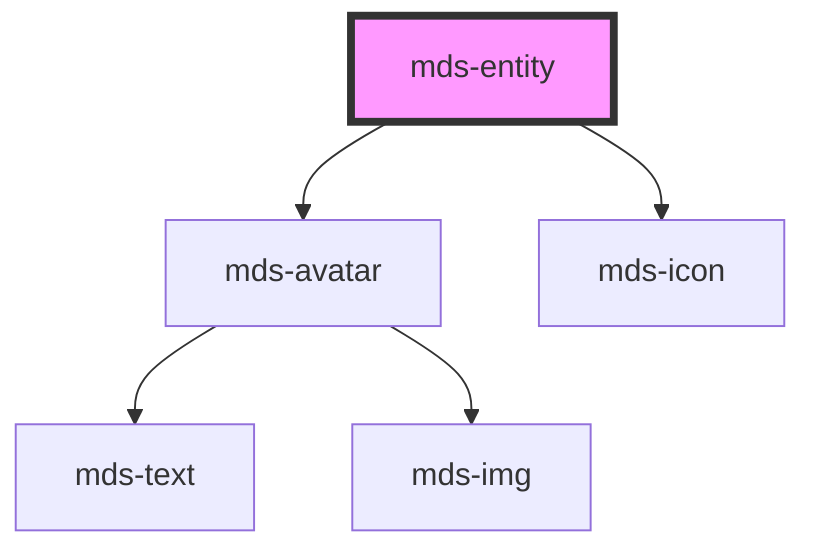

# mds-entity

<!-- Auto Generated Below -->

## Properties

| Property   | Attribute  | Description                                                                     | Type                  | Default     |
| ---------- | ---------- | ------------------------------------------------------------------------------- | --------------------- | ----------- |
| `icon`     | `icon`     | Specifies the icon to be displayed if src propery is not used                   | `string \| undefined` | `undefined` |
| `initials` | `initials` | The user's inizials displayed if there's no image available and icon is not set | `string \| undefined` | `undefined` |
| `src`      | `src`      | Specifies the path to the image                                                 | `string \| undefined` | `undefined` |

## Slots

| Slot        | Description                                                                             |
| ----------- | --------------------------------------------------------------------------------------- |
| `"action"`  | Add `HTML elements` or `components`, it is **recommended** to use `mds-button` element. |
| `"default"` | Add `text string`, `HTML elements` or `components` to this slot.                        |
| `"default"` | Add `text string`, `HTML elements` or `components` to this slot.                        |

## Dependencies

### Depends on

- [mds-avatar](../mds-avatar)
- [mds-icon](../mds-icon)

### Graph

----------------------------------------------

Built with love @ **Maggioli Informatica / R&D Department**
