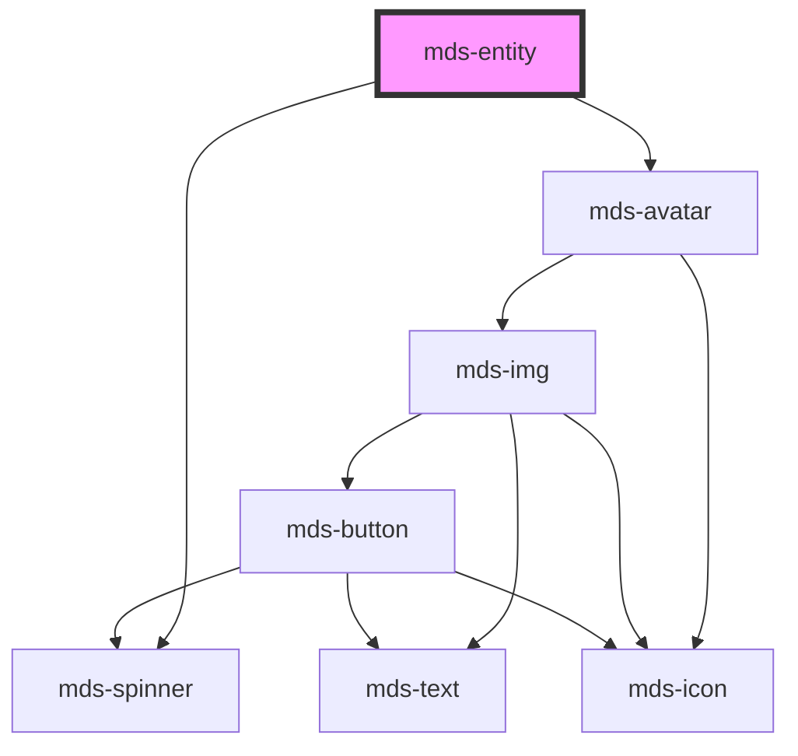

# mds-entity


This is a web-component from Maggioli Design System [Magma](https://magma.maggiolicloud.it), built with StencilJS, TypeScript, Storybook. It's based on the web-component standard and it's designed to be agnostic from the JavaScript framework you are using.

<!-- Auto Generated Below -->


## Usage

### 1. Description

The `<mds-entity>` web component represents a person, organization, or resource as a compact identity block in the Magma Design System, pairing an avatar with a name, optional secondary details, and contextual actions. It has no native HTML equivalent; it standardises how entities are surfaced in lists, headers, and cards.

#### Semantic Behavior

- **Avatar resolution**: The leading avatar renders only when one of `src`, `icon`, or `initials` is provided, following avatar priority (image, then icon, then initials).
- **Await state**: While `await` is set the avatar is suppressed and a spinner is shown in its place, signalling that the entity is still loading.
- **Conditional regions**: The `detail` and `action` regions are rendered only when content is actually projected into those slots.
- **Default slot is the name**: The default slot carries the entity's primary label (text, HTML, or components) and is always rendered inside the info column.

#### Properties & Visual Configurations

- **`src`** is the path to an entity image; **`icon`** is a Magma icon library slug used when no image is supplied; **`initials`** is the text fallback shown when neither image nor icon is set. Provide whichever best identifies the entity - they are mutually prioritised, not combined.
- **`await`** marks the entity as loading and takes visual precedence over any avatar source.

The shared `tone` / `variant` ladders are defined in [`projects/stencil/SPEC.md`](../../../../SPEC.md#tone-and-variant-system) and color the inner avatar. `tone` is limited to the minimal `'strong'` / `'weak'` pair, and `variant` accepts the avatar colour set; pick them to colour the avatar chip in line with the entity's category.

#### Slots

- **`detail`** holds secondary information (role, email, status) rendered beneath the name.
- **`action`** holds trailing controls; `mds-button` is the recommended element here.


### 2. Pattern

Correct and idiomatic ways to use the `<mds-entity>` component, ordered from most common to most specialized. Patterns assume a working knowledge of the variant / tone ladders documented in [`docs/COMPONENTS.md`](../../../../../../docs/COMPONENTS.md) and the generic stencil rules in [`projects/stencil/SPEC.md`](../../../../SPEC.md).

#### Person Entity with Image

The most common form. Supply `src` for the avatar image and put the entity name in the default slot. Use `<mds-text>` with `typography="h6"` for the primary label so typography tokens are applied consistently.

```html
<mds-entity src="/avatars/mario-rossi.png">
  <mds-text truncate="word" typography="h6">Mario Rossi</mds-text>
</mds-entity>
```

#### Entity with Initials Fallback

When no image is available, provide `initials` instead of `src`. The avatar chip renders the initials text.

```html
<mds-entity initials="mr">
  <mds-text truncate="word" typography="h6">Mario Rossi</mds-text>
</mds-entity>
```

#### Entity with Icon

Use `icon` for non-person entities (locations, files, organizations). Reference icons by their slug from the Magma icon library.

```html
<mds-entity icon="mi/baseline/location-on">
  <mds-text truncate="word" typography="h6">Maggioli Headquarters</mds-text>
</mds-entity>
```

#### Secondary Details via `detail` Slot

Project additional information (role, email, status) into the `detail` slot. It renders below the primary name in a subdued color. Use `<mds-text typography="caption">` for plain text details.

```html
<mds-entity src="/avatars/giulia-bianchi.png">
  <mds-text truncate="word" typography="h6">Giulia Bianchi</mds-text>
  <mds-text truncate="word" slot="detail" typography="caption">giulia@example.com</mds-text>
  <mds-badge slot="detail" variant="success" tone="weak">Attiva</mds-badge>
</mds-entity>
```

#### Trailing Action Buttons via `action` Slot

Use the `action` slot for icon-only `<mds-button>` elements. Each button is sized and spaced automatically by the component. Always provide `title` on icon-only buttons for accessibility.

```html
<mds-entity src="/avatars/luca-verdi.png">
  <mds-text truncate="word" typography="h6">Luca Verdi</mds-text>
  <mds-text truncate="word" slot="detail" typography="caption">luca@example.com</mds-text>
  <mds-button slot="action" icon="mdi/pencil" variant="primary" tone="strong" title="Modifica"></mds-button>
  <mds-button slot="action" icon="mdi/delete" variant="error" tone="strong" title="Elimina"></mds-button>
</mds-entity>
```

#### Colored Avatar with `variant` and `tone`

Pair `variant` and `tone` to color the avatar chip by entity category. `tone` is limited to `strong` and `weak`; `variant` accepts the full avatar color set.

```html
<!-- Strong fill, primary variant -->
<mds-entity icon="mi/baseline/business" variant="primary" tone="strong">
  <mds-text truncate="word" typography="h6">Divisione Commerciale</mds-text>
</mds-entity>

<!-- Weak tint, warning variant -->
<mds-entity icon="mi/baseline/warning" variant="warning" tone="weak">
  <mds-text truncate="word" typography="h6">Alert configurazione</mds-text>
</mds-entity>
```

#### Await / Loading State

Set the `await` boolean attribute while the entity data is being fetched. The avatar is hidden and a spinner appears in its place. Remove the attribute when loading is complete - do not set `await="false"`.

```html
<mds-entity await icon="mi/baseline/done" variant="success">
  <mds-text truncate="word" typography="h6">Caricamento in corso...</mds-text>
  <mds-text truncate="word" slot="detail" typography="caption">Attendere prego</mds-text>
</mds-entity>
```

#### Upload / Async Workflow

Combine `await` with `icon` and `variant` to drive a state machine: show the spinner while uploading, then reveal the result icon when done.

```html
<!-- While uploading -->
<mds-entity await>
  <mds-text truncate="word" typography="h6">Report finanziario 2024.docx</mds-text>
  <mds-text truncate="word" slot="detail" typography="caption">Upload in corso...</mds-text>
  <mds-button slot="action" icon="mi/baseline/cancel" variant="light" title="Annulla upload"></mds-button>
</mds-entity>

<!-- After success -->
<mds-entity icon="mi/baseline/done" variant="success" tone="weak">
  <mds-text truncate="word" typography="h6">Report finanziario 2024.docx</mds-text>
  <mds-text truncate="word" slot="detail" typography="caption">Upload completato con successo</mds-text>
</mds-entity>
```

#### Styling Customization

Style the entity only through its documented `--mds-entity-*` CSS custom properties. Set them on the host or a parent selector; use Magma color tokens via `rgb(var(--<token>))` so dark mode and high-contrast modes keep working.

```css
.entity-highlight mds-entity {
  --mds-entity-background: rgb(var(--variant-primary-09));
  --mds-entity-color: rgb(var(--variant-primary-02));
  --mds-entity-detail-color: rgb(var(--variant-primary-04));
  --mds-entity-icon-background: rgb(var(--variant-primary-07));
  --mds-entity-icon-color: rgb(var(--variant-primary-03));
}
```


### 3. Antipattern

Common incorrect uses of `<mds-entity>`. Each entry pairs the wrong form with the right one and a one-line reason. System-wide rules (boolean-as-string, shadow piercing, Tailwind color utilities, raw native event listening) live in [`docs/COMPONENTS.md`](../../../../../../docs/COMPONENTS.md#system-level-anti-patterns) - they apply here too but are not repeated.

#### Do Not Put the Name as a Plain Text String in the Default Slot

The default slot accepts HTML elements and components, and the component applies truncation to slotted nodes. Passing a bare string bypasses `<mds-text>` typography tokens and truncation utilities; the result may overflow or render with inconsistent styles.

```html
<!-- 🚫 INCORRECT -->
<mds-entity src="/avatars/mario-rossi.png">
  Mario Rossi
</mds-entity>

<!-- ✅ CORRECT -->
<mds-entity src="/avatars/mario-rossi.png">
  <mds-text truncate="word" typography="h6">Mario Rossi</mds-text>
</mds-entity>
```

#### Do Not Use `await="false"` to Cancel the Loading State

`await` is a boolean attribute. Setting `await="false"` is still a truthy string value - the spinner stays visible. Remove the attribute (or set the prop to `undefined`) to exit the loading state.

```html
<!-- 🚫 INCORRECT -->
<mds-entity await="false" src="/avatars/mario-rossi.png">
  <mds-text truncate="word" typography="h6">Mario Rossi</mds-text>
</mds-entity>

<!-- ✅ CORRECT -->
<mds-entity src="/avatars/mario-rossi.png">
  <mds-text truncate="word" typography="h6">Mario Rossi</mds-text>
</mds-entity>
```

#### Do Not Put Non-Button Elements in the `action` Slot

The `action` slot is sized and spaced for icon-only `<mds-button>` elements. Projecting arbitrary elements (raw `<button>`, `<a>`, large widgets) breaks the fixed square dimensions applied by `::slotted([slot='action'])`.

```html
<!-- 🚫 INCORRECT -->
<mds-entity src="/avatars/mario-rossi.png">
  <mds-text truncate="word" typography="h6">Mario Rossi</mds-text>
  <button slot="action">Modifica</button>
</mds-entity>

<!-- ✅ CORRECT -->
<mds-entity src="/avatars/mario-rossi.png">
  <mds-text truncate="word" typography="h6">Mario Rossi</mds-text>
  <mds-button slot="action" icon="mdi/pencil" variant="primary" tone="strong" title="Modifica"></mds-button>
</mds-entity>
```

#### Do Not Combine `src`, `icon`, and `initials` Expecting All Three to Show

The component resolves to a single avatar representation. Only one source is shown at a time - the priority order is `src`, then `icon`, then `initials`. Setting all three does not create a layered avatar; the lower-priority sources are silently ignored.

```html
<!-- 🚫 INCORRECT (expects image, icon, and initials to all appear) -->
<mds-entity src="/avatars/mario-rossi.png" icon="mi/baseline/person" initials="mr">
  <mds-text truncate="word" typography="h6">Mario Rossi</mds-text>
</mds-entity>

<!-- ✅ CORRECT - provide the most specific source available -->
<mds-entity src="/avatars/mario-rossi.png">
  <mds-text truncate="word" typography="h6">Mario Rossi</mds-text>
</mds-entity>
```

#### Do Not Apply an Invalid `tone` Value

`<mds-entity>` uses `ToneMinimalVariantType`, which accepts only `strong` and `weak`. Passing other tone values like `outline` or `text` is a type error and will silently fall back, leaving the avatar unstyled.

```html
<!-- 🚫 INCORRECT -->
<mds-entity icon="mi/baseline/business" variant="primary" tone="outline">
  <mds-text truncate="word" typography="h6">Divisione Commerciale</mds-text>
</mds-entity>

<!-- ✅ CORRECT -->
<mds-entity icon="mi/baseline/business" variant="primary" tone="strong">
  <mds-text truncate="word" typography="h6">Divisione Commerciale</mds-text>
</mds-entity>
```

#### Do Not Pierce the Shadow DOM to Style the Avatar

The component exposes a `::part(avatar)` surface for styling the inner `<mds-avatar>`, but only for documented properties. Use `--mds-entity-icon-background`, `--mds-entity-icon-color`, and other `--mds-entity-*` custom properties for color customization; do not target undocumented internals.

```css
/* 🚫 INCORRECT */
mds-entity::part(avatar) .inner-circle {
  background: hotpink;
}
mds-entity >>> mds-avatar {
  width: 80px;
}

/* ✅ CORRECT */
mds-entity {
  --mds-entity-icon-background: rgb(var(--variant-primary-07));
  --mds-entity-icon-color: rgb(var(--variant-primary-03));
}
```


## Properties

| Property   | Attribute  | Description                                                                     | Type                                                                                                                                                                                                         | Default     |
| ---------- | ---------- | ------------------------------------------------------------------------------- | ------------------------------------------------------------------------------------------------------------------------------------------------------------------------------------------------------------ | ----------- |
| `await`    | `await`    | Specifies if the component is awaiting a response from an external resource     | `boolean \| undefined`                                                                                                                                                                                       | `undefined` |
| `icon`     | `icon`     | Specifies the icon to be displayed if src propery is not used                   | `string \| undefined`                                                                                                                                                                                        | `undefined` |
| `initials` | `initials` | The user's inizials displayed if there's no image available and icon is not set | `string \| undefined`                                                                                                                                                                                        | `undefined` |
| `src`      | `src`      | Specifies the path to the image                                                 | `string \| undefined`                                                                                                                                                                                        | `undefined` |
| `tone`     | `tone`     | Specifies the color tone of the component                                       | `"strong" \| "weak" \| undefined`                                                                                                                                                                            | `undefined` |
| `variant`  | `variant`  | Specifies the color variant of the component                                    | `"amaranth" \| "aqua" \| "blue" \| "error" \| "green" \| "info" \| "lime" \| "orange" \| "orchid" \| "primary" \| "purple" \| "red" \| "sky" \| "success" \| "violet" \| "warning" \| "yellow" \| undefined` | `undefined` |


## Slots

| Slot        | Description                                                                             |
| ----------- | --------------------------------------------------------------------------------------- |
| `"action"`  | Add `HTML elements` or `components`, it is **recommended** to use `mds-button` element. |
| `"default"` | Add `text string`, `HTML elements` or `components` to this slot.                        |
| `"detail"`  | Add `HTML elements` or `components` to this slot.                                       |


## Shadow Parts

| Part        | Description         |
| ----------- | ------------------- |
| `"avatar"`  | The avatar element  |
| `"spinner"` | The spinner element |


## Dependencies

### Depends on

- [mds-spinner](../mds-spinner)
- [mds-avatar](../mds-avatar)

### Graph


----------------------------------------------

Built with love @ [Gruppo Maggioli](https://www.maggioli.com) from [R&D Department](https://www.maggioli.com/it-it/chi-siamo/ricerca-sviluppo)
