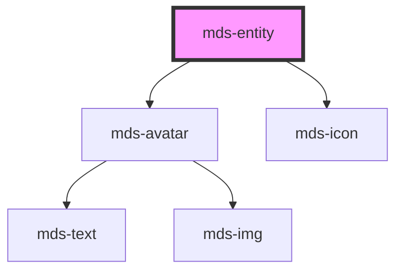

# mds-entity

<!-- Auto Generated Below -->

## Properties

| Property    | Attribute   | Description                                                     | Type      | Default     |
| ----------- | ----------- | --------------------------------------------------------------- | --------- | ----------- |
| `deletable` | `deletable` | Shows the cross icon to perform cancel/delete action on element | `boolean` | `undefined` |
| `icon`      | `icon`      | Specifies the icon to be displayed if src propery is not used   | `string`  | `undefined` |
| `initials`  | `initials`  | The user's inizials displayed if there's no image available     | `string`  | `undefined` |
| `src`       | `src`       | Specifies the path to the image                                 | `string`  | `undefined` |

## CSS Custom Properties

| Name                  | Description                               |
| --------------------- | ----------------------------------------- |
| `--background`        | The background-color of the entity        |
| `--color`             | The color of the entity name              |
| `--delete-background` | The background-color of the delete action |
| `--delete-color`      | The icon color of the delete action       |
| `--detail-color`      | The color of the text details             |
| `--icon-background`   | The background-color of the icon          |
| `--icon-color`        | The color of the icon                     |

## Dependencies

### Depends on

- [mds-avatar](../mds-avatar)
- [mds-icon](../mds-icon)

### Graph

----------------------------------------------

Built with love @ **Maggioli Informatica / R&D Department**
