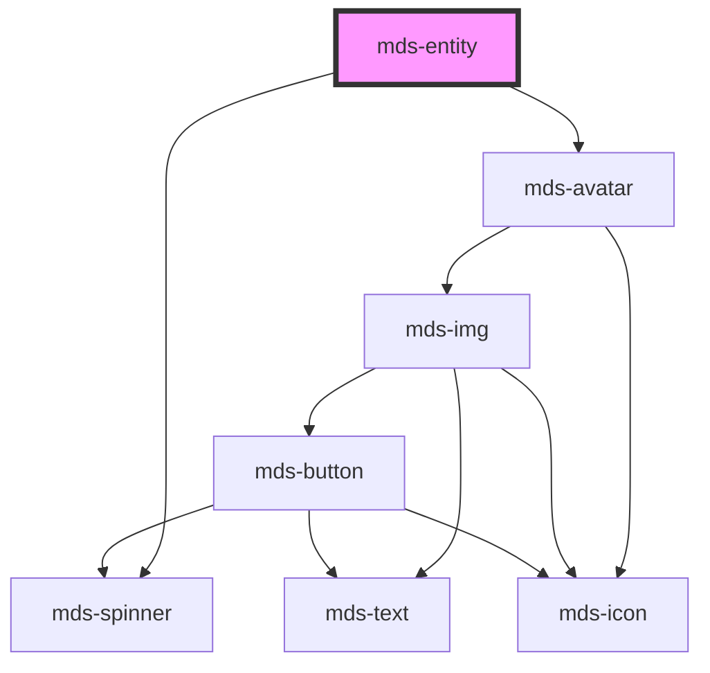

# mds-entity

This is a web-component from Maggioli Design System [Magma](https://magma.maggiolicloud.it), built with StencilJS, TypeScript, Storybook. It's based on the web-component standard and it's designed to be agnostic from the JavaScirpt framework you are using.

<!-- Auto Generated Below -->

## Properties

| Property   | Attribute  | Description                                                                     | Type                                                                                                                                                                                    | Default     |
| ---------- | ---------- | ------------------------------------------------------------------------------- | --------------------------------------------------------------------------------------------------------------------------------------------------------------------------------------- | ----------- |
| `await`    | `await`    | Specifies if the component is awaiting a response from an external resource     | `boolean \| undefined`                                                                                                                                                                  | `undefined` |
| `icon`     | `icon`     | Specifies the icon to be displayed if src propery is not used                   | `string \| undefined`                                                                                                                                                                   | `undefined` |
| `initials` | `initials` | The user's inizials displayed if there's no image available and icon is not set | `string \| undefined`                                                                                                                                                                   | `undefined` |
| `src`      | `src`      | Specifies the path to the image                                                 | `string \| undefined`                                                                                                                                                                   | `undefined` |
| `tone`     | `tone`     | Specifies the color tone of the component                                       | `"strong" \| "weak" \| undefined`                                                                                                                                                       | `undefined` |
| `variant`  | `variant`  | Specifies the color variant of the component                                    | `"amaranth" \| "aqua" \| "blue" \| "error" \| "green" \| "info" \| "lime" \| "orange" \| "orchid" \| "primary" \| "sky" \| "success" \| "violet" \| "warning" \| "yellow" \| undefined` | `undefined` |

## Slots

| Slot        | Description                                                                             |
| ----------- | --------------------------------------------------------------------------------------- |
| `"action"`  | Add `HTML elements` or `components`, it is **recommended** to use `mds-button` element. |
| `"default"` | Add `text string`, `HTML elements` or `components` to this slot.                        |
| `"default"` | Add `text string`, `HTML elements` or `components` to this slot.                        |

## CSS Custom Properties

| Name                           | Description                        |
| ------------------------------ | ---------------------------------- |
| `--mds-entity-background`      | The background-color of the entity |
| `--mds-entity-color`           | The color of the entity name       |
| `--mds-entity-detail-color`    | The color of the text details      |
| `--mds-entity-icon-background` | The background-color of the icon   |
| `--mds-entity-icon-color`      | The color of the icon              |
| `--mds-entity-shadow`          | The box-shadow od the component    |

## Dependencies

### Depends on

- [mds-spinner](../mds-spinner)
- [mds-avatar](../mds-avatar)

### Graph

----------------------------------------------

Built with love @ [Gruppo Maggioli](https://www.maggioli.com) from [R&D Department](https://www.maggioli.com/it-it/chi-siamo/ricerca-sviluppo)
