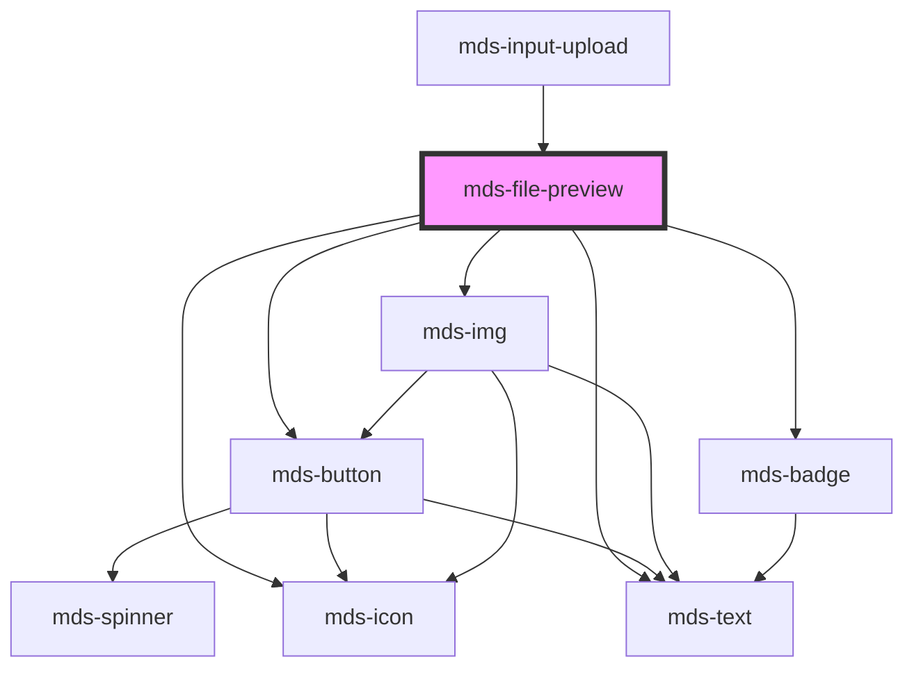

# mds-file-preview

<!-- Auto Generated Below -->

## Properties

| Property                | Attribute      | Description                                                                                                                                                              | Type                                                                                                                                                                                                                                                                                                                                                                                                                                                                                                                                                                           | Default     |
| ----------------------- | -------------- | ------------------------------------------------------------------------------------------------------------------------------------------------------------------------ | ------------------------------------------------------------------------------------------------------------------------------------------------------------------------------------------------------------------------------------------------------------------------------------------------------------------------------------------------------------------------------------------------------------------------------------------------------------------------------------------------------------------------------------------------------------------------------ | ----------- |
| `deletable`             | `deletable`    | Enables the cross icon to perform cancel/delete action on element                                                                                                        | `boolean \| undefined`                                                                                                                                                                                                                                                                                                                                                                                                                                                                                                                                                         | `undefined` |
| `description`           | `description`  | Overrides the default filetype description                                                                                                                               | `string \| undefined`                                                                                                                                                                                                                                                                                                                                                                                                                                                                                                                                                          | `undefined` |
| `downloadable`          | `downloadable` | Enables the download icon to perform the related action on element                                                                                                       | `boolean \| undefined`                                                                                                                                                                                                                                                                                                                                                                                                                                                                                                                                                         | `undefined` |
| `filename` _(required)_ | `filename`     | The filename shown as component title, is used to auto assign one of the filetype known in the filetype dictionary                                                       | `string`                                                                                                                                                                                                                                                                                                                                                                                                                                                                                                                                                                       | `undefined` |
| `filesize`              | `filesize`     | The filesize shown, if you pass a string you can write whathever you want, if you pass a number it expect filesize in bytes, the component will format it automatically. | `string \| undefined`                                                                                                                                                                                                                                                                                                                                                                                                                                                                                                                                                          | `undefined` |
| `format`                | `format`       | Sets if the download icon must be shown or not                                                                                                                           | `string \| undefined`                                                                                                                                                                                                                                                                                                                                                                                                                                                                                                                                                          | `undefined` |
| `icon`                  | `icon`         | The name of the icon or a base64 string to render it as an svg                                                                                                           | `string`                                                                                                                                                                                                                                                                                                                                                                                                                                                                                                                                                                       | `undefined` |
| `message`               | `message`      | Sets a feedback message related to the component                                                                                                                         | `string \| undefined`                                                                                                                                                                                                                                                                                                                                                                                                                                                                                                                                                          | `undefined` |
| `src`                   | `src`          | The image preview src if available of a file, useful if you have a logo to display, or a smaller version of a bigger image                                               | `string \| undefined`                                                                                                                                                                                                                                                                                                                                                                                                                                                                                                                                                          | `undefined` |
| `suffix`                | `suffix`       | Overrides the automatic filetype recongition by forcing the suffix to one of the available formats choosen                                                               | `"ai" \| "7z" \| "ace" \| "db" \| "default" \| "dmg" \| "doc" \| "docm" \| "docx" \| "eml" \| "eps" \| "exe" \| "flac" \| "gif" \| "heic" \| "htm" \| "html" \| "jpe" \| "jpeg" \| "jpg" \| "js" \| "json" \| "jsx" \| "m2v" \| "mp2" \| "mp3" \| "mp4" \| "mp4v" \| "mpeg" \| "mpg4" \| "mpg" \| "mpga" \| "odf" \| "odp" \| "ods" \| "odt" \| "ole" \| "p7m" \| "pdf" \| "php" \| "png" \| "ppt" \| "rar" \| "rtf" \| "sass" \| "shtml" \| "svg" \| "tar" \| "tiff" \| "ts" \| "tsd" \| "txt" \| "wav" \| "webp" \| "xar" \| "xls" \| "xlsx" \| "xml" \| "zip" \| undefined` | `undefined` |
| `truncate`              | `truncate`     | Truncates the filename shown                                                                                                                                             | `"all" \| "none" \| "word" \| undefined`                                                                                                                                                                                                                                                                                                                                                                                                                                                                                                                                       | `'word'`    |
| `variant`               | `variant`      | The variant of the component, is shown only if the message attribute is defined                                                                                          | `"amaranth" \| "aqua" \| "blue" \| "error" \| "green" \| "info" \| "lime" \| "orange" \| "orchid" \| "primary" \| "purple" \| "red" \| "sky" \| "success" \| "violet" \| "warning" \| "yellow" \| undefined`                                                                                                                                                                                                                                                                                                                                                                   | `undefined` |

## Events

| Event             | Description                                               | Type                                     |
| ----------------- | --------------------------------------------------------- | ---------------------------------------- |
| `mdsFileDelete`   | Emits when the component is removed, returning file infos | `CustomEvent<MdsFilePreviewEventDetail>` |
| `mdsFileDownload` | Emits when the component is clicked, returning file infos | `CustomEvent<MdsFilePreviewEventDetail>` |

## Methods

### `updateLang() => Promise<void>`

#### Returns

Type: `Promise<void>`

## Shadow Parts

| Part     | Description |
| -------- | ----------- |
| `"card"` |             |

## CSS Custom Properties

| Name                                  | Description                                             |
| ------------------------------------- | ------------------------------------------------------- |
| `--mds-file-preview-background-color` | Sets the background color of the file preview container |
| `--mds-file-preview-border-radius`    | Sets the border-radius of the file preview container    |
| `--mds-file-preview-color`            | Sets the text color used inside the file preview        |
| `--mds-file-preview-icon-background`  | Sets the background color of the file preview icon      |
| `--mds-file-preview-icon-color`       | Sets the color of the file preview icon                 |

## Dependencies

### Used by

 - [mds-input-upload](../mds-input-upload)

### Depends on

- [mds-button](../mds-button)
- [mds-img](../mds-img)
- [mds-icon](../mds-icon)
- [mds-text](../mds-text)
- [mds-badge](../mds-badge)

### Graph

----------------------------------------------

Built with love @ [Gruppo Maggioli](https://www.maggioli.com) from [R&D Department](https://www.maggioli.com/it-it/chi-siamo/ricerca-sviluppo)
