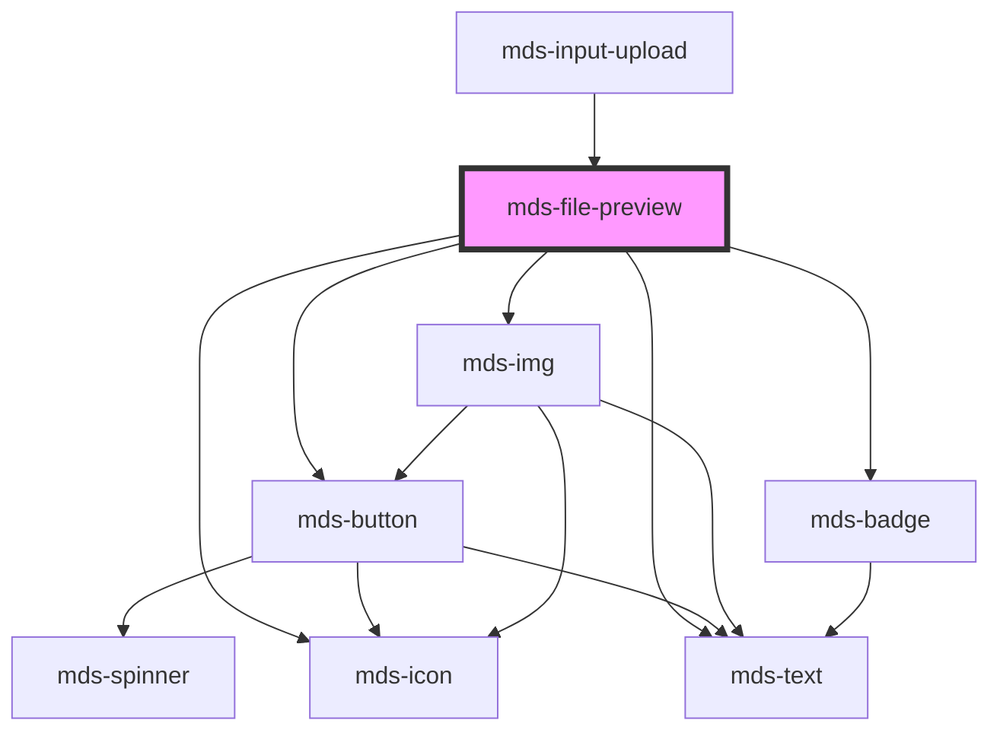

# mds-file-preview


<!-- Auto Generated Below -->


## Usage

### 1. Description

The `<mds-file-preview>` web component is the Magma Design System card that previews an uploaded or referenced file, surfacing its name, size, type, and a format-aware icon or thumbnail. It pairs with `<mds-input-upload>` to represent each attached file and adds download/delete affordances around the bare file metadata.

#### Semantic Behavior

- **Format auto-detection**: The `filename` extension determines the icon, badge tone, and human-readable description; `suffix` forces a specific known format and `format` is the resolved category.
- **Download interaction**: When `downloadable` is set, clicking the card emits `mdsFileDownload` with `{ target, filename, extension }`.
- **Delete affordance**: When `deletable` is set, a light icon button renders in the corner and emits `mdsFileDelete` with the same detail payload, leaving the actual removal to the consumer.
- **Filesize formatting**: A numeric `filesize` string is treated as bytes and formatted automatically; any non-numeric string is shown verbatim.
- **Preview vs. icon vs. status**: A thumbnail renders only when `src` is set, the format supports preview, and no `message` is present; otherwise a format icon is shown, and when `message` is present the card switches to a status layout displaying that feedback text.
- **Localization**: Default type descriptions and action titles resolve through the locale system (el/en/es/it).

#### Properties & Visual Configurations

- **`filename`** is the source of truth: beyond being the title, it drives icon, badge, and description inference, so prefer a real name with extension over a cosmetic label.
- **`suffix`** overrides extension detection when the filename is unreliable or missing an extension; pick from the known format set rather than passing the description directly.
- **`description`** overrides only the textual filetype caption, leaving icon and badge inference intact.
- **`src`** supplies a thumbnail (e.g. a logo or downscaled image) shown in place of the generic icon when the format is previewable and no message is active.
- **`message`** turns the card into a feedback/status state (validation, error, progress text) and suppresses the thumbnail.

#### Component-specific variants and tones

The shared `variant` / `tone` ladders are defined in [`projects/stencil/SPEC.md`](../../../../SPEC.md#tone-and-variant-system). `variant` here is an avatar-flavored value and is rendered **only when `message` is set**, coloring the status layout; the format badge derives its own tone from the detected filetype independently.

#### Other behavioral props

- **`icon`** overrides the auto-detected glyph with a named Magma icon or a base64 SVG string.
- **`truncate`** controls how the filename is shortened when it overflows, defaulting to `'word'`.


### 2. Pattern

Correct and idiomatic ways to use the `<mds-file-preview>` component, ordered from most common to most specialized. Patterns assume a working knowledge of the variant / tone ladders documented in [`docs/COMPONENTS.md`](../../../../../../docs/COMPONENTS.md) and the generic stencil rules in [`projects/stencil/SPEC.md`](../../../../SPEC.md).

#### Minimal File Card

The required prop is `filename`. The component infers icon, badge colour, and type description automatically from the extension. Always pass a real filename with extension.

```html
<mds-file-preview filename="relazione-annuale.pdf"></mds-file-preview>
```

#### File Card with Size

Pass `filesize` as a numeric byte count and the component formats it automatically (JEDEC: KB, MB, GB). Pass a plain string to show a pre-formatted label verbatim.

```html
<!-- Numeric bytes - auto-formatted to "9.77 MB" -->
<mds-file-preview filename="contratto.docx" filesize="10248594"></mds-file-preview>

<!-- Pre-formatted string - shown verbatim -->
<mds-file-preview filename="archivio.zip" filesize="12 MB"></mds-file-preview>
```

#### Download Interaction

Add `downloadable` to make the whole card clickable. The component emits `mdsFileDownload` with `{ target, filename, extension }` on click. Listen to the event; do not add a click handler on a wrapper element.

```html
<mds-file-preview
  filename="documento.pdf"
  filesize="2048000"
  downloadable
></mds-file-preview>
```

```javascript
document.querySelector('mds-file-preview').addEventListener('mdsFileDownload', (e) => {
  const { filename, extension } = e.detail;
  console.log('Download richiesto:', filename, extension);
});
```

#### Delete Affordance

Add `deletable` to show a dismiss button in the top-right corner. The component emits `mdsFileDelete` with `{ target, filename, extension }`. The consumer is responsible for removing the element from the DOM.

```html
<mds-file-preview
  filename="bozza.docx"
  filesize="512000"
  deletable
></mds-file-preview>
```

```javascript
document.querySelector('mds-file-preview').addEventListener('mdsFileDelete', (e) => {
  e.detail.target.remove();
});
```

#### Image Thumbnail

Set `src` to show a thumbnail instead of the generic icon. The thumbnail renders only when the format supports preview (images) and no `message` is set; other formats fall back to the icon.

```html
<mds-file-preview
  filename="foto-profilo.jpg"
  filesize="84791746"
  src="./thumbnails/foto-profilo-thumb.webp"
></mds-file-preview>
```

#### Status / Feedback State

Set `message` to switch the card to a feedback layout - the thumbnail is suppressed and the text is displayed alongside the icon. Pair with `variant` to colour the status region semantically. `variant` has no visual effect without `message`.

```html
<!-- Errore di formato -->
<mds-file-preview
  filename="documento.exe"
  message="Formato file non consentito"
  variant="error"
></mds-file-preview>

<!-- Caricamento in corso -->
<mds-file-preview
  filename="video.mp4"
  filesize="52428800"
  message="Caricamento in corso..."
  variant="info"
></mds-file-preview>
```

#### Overriding Format Detection

Use `suffix` to force a known extension category when the filename has no extension or the extension is ambiguous. Use `description` to override only the textual type caption while leaving icon and badge inference intact.

```html
<!-- Force suffix when filename has no extension -->
<mds-file-preview filename="report" suffix="pdf"></mds-file-preview>

<!-- Custom description label, icon unchanged -->
<mds-file-preview
  filename="modulo.pdf"
  description="Modulo di iscrizione"
></mds-file-preview>
```

#### Custom Icon

Set `icon` to override the auto-detected glyph with any icon slug from the Magma library, or a base64 SVG string for a dynamic icon from an API.

```html
<!-- Named icon slug -->
<mds-file-preview
  filename="report.csv"
  filesize="32768"
  icon="mi/baseline/table-chart"
></mds-file-preview>
```

#### Filename Truncation

`truncate` defaults to `word`. Use `all` to break on any character for long filenames without word boundaries. Use `none` to allow the filename to wrap freely.

```html
<mds-file-preview
  filename="Questo-e-uno-dei-nomi-file-piu-lunghi-che-lumanita-abbia-mai-visto.docx"
  filesize="84791746"
  truncate="all"
></mds-file-preview>
```

#### Inside `mds-input-upload`

`<mds-file-preview>` is the child card rendered by [`mds-input-upload`](../../mds-input-upload). When integrating with the upload component, let `mds-input-upload` manage the cards rather than instantiating `mds-file-preview` directly.

```html
<mds-input-upload
  label="Carica documenti"
  multiple
  accept=".pdf,.docx"
></mds-input-upload>
```

#### Styling Customization

Style the card only through its documented `--mds-file-preview-*` CSS custom properties. Set them on the host or a parent selector; use Magma color tokens via `rgb(var(--<token>))` so dark mode keeps working.

```css
.carta-allegato mds-file-preview {
  --mds-file-preview-background-color: rgb(var(--tone-neutral-01));
  --mds-file-preview-border-radius: var(--radius-md);
  --mds-file-preview-icon-background: rgb(var(--variant-primary-01));
  --mds-file-preview-icon-color: rgb(var(--variant-primary-05));
}
```


### 3. Antipattern

Common incorrect uses of `<mds-file-preview>`. Each entry pairs the wrong form with the right one and a one-line reason. System-wide rules (boolean-as-string, shadow piercing, Tailwind color utilities, raw native event listening) live in [`docs/COMPONENTS.md`](../../../../../../docs/COMPONENTS.md#system-level-anti-patterns) - they apply here too but are not repeated.

#### Do Not Pass a Label Instead of a Real Filename

`filename` drives automatic icon, badge, and description inference. Passing a cosmetic label without an extension produces a generic fallback icon and no type badge, losing all format-aware information.

```html
<!-- 🚫 INCORRECT -->
<mds-file-preview filename="Contratto"></mds-file-preview>

<!-- ✅ CORRECT -->
<mds-file-preview filename="contratto-2024.pdf"></mds-file-preview>
```

#### Do Not Set `variant` Without `message`

`variant` colours the status layout that is only rendered when `message` is set. Setting `variant` alone has no visual effect and misleads readers of the code into thinking the card is themed.

```html
<!-- 🚫 INCORRECT -->
<mds-file-preview filename="report.pdf" variant="error"></mds-file-preview>

<!-- ✅ CORRECT -->
<mds-file-preview
  filename="report.pdf"
  message="File danneggiato"
  variant="error"
></mds-file-preview>
```

#### Do Not Listen for Native `click` to Handle Downloads

When `downloadable` is set the component wires a click listener internally and emits `mdsFileDownload` with the file detail. Attaching an outer `click` handler bypasses the detail payload and fires even when `downloadable` is not set.

```html
<!-- 🚫 INCORRECT -->
<div onclick="handleClick()">
  <mds-file-preview filename="documento.docx" downloadable></mds-file-preview>
</div>

<!-- ✅ CORRECT -->
<mds-file-preview filename="documento.docx" downloadable></mds-file-preview>
```

```javascript
// INCORRECT - native click on a wrapper
document.querySelector('div').addEventListener('click', handleClick);

// CORRECT - documented mdsFileDownload event
document.querySelector('mds-file-preview').addEventListener('mdsFileDownload', (e) => {
  download(e.detail.filename);
});
```

#### Do Not Remove the Element Yourself Without Listening to `mdsFileDelete`

`deletable` makes the delete button visible but leaves removal to the consumer. Removing the element from a `click` listener on a wrapper - rather than `mdsFileDelete` - bypasses the detail payload and creates a race if the event is also handled elsewhere.

```html
<!-- 🚫 INCORRECT -->
<mds-file-preview filename="allegato.zip" deletable onclick="this.remove()"></mds-file-preview>

<!-- ✅ CORRECT -->
<mds-file-preview filename="allegato.zip" deletable></mds-file-preview>
```

```javascript
document.querySelector('mds-file-preview').addEventListener('mdsFileDelete', (e) => {
  e.detail.target.remove();
});
```

#### Do Not Wrap `mds-file-preview` in an Anchor to Add Download

Wrapping a card in `<a href="...">` creates a focusable interactive element around an already-interactive card, breaks keyboard navigation, and fails accessibility audits. Use `downloadable` and handle `mdsFileDownload` instead.

```html
<!-- 🚫 INCORRECT -->
<a href="/files/documento.pdf" download>
  <mds-file-preview filename="documento.pdf"></mds-file-preview>
</a>

<!-- ✅ CORRECT -->
<mds-file-preview filename="documento.pdf" downloadable></mds-file-preview>
```

#### Do Not Use `suffix` to Pass a Free-Form String

`suffix` accepts only values from the documented `ExtensionSuffixType` union (e.g. `"pdf"`, `"docx"`, `"jpg"`). Passing an unsupported string silently falls back to the default icon and loses format inference.

```html
<!-- 🚫 INCORRECT -->
<mds-file-preview filename="report" suffix="documento-word"></mds-file-preview>

<!-- ✅ CORRECT -->
<mds-file-preview filename="report" suffix="docx"></mds-file-preview>
```

#### Customize via Documented Vars and the `card` Part Only

The only documented shadow part is `card`. Targeting inner selectors via `::part()`, `>>>`, or attribute hacks couples code to internal Shadow DOM structure and will break on minor releases.

```css
/* 🚫 INCORRECT */
mds-file-preview::part(icon) {
  width: 48px;
}
mds-file-preview >>> .file-name {
  font-size: 1rem;
}

/* ✅ CORRECT */
mds-file-preview {
  --mds-file-preview-icon-color: rgb(var(--variant-primary-05));
  --mds-file-preview-background-color: rgb(var(--tone-neutral-01));
}
mds-file-preview::part(card) {
  padding: var(--spacing-600);
}
```


## Properties

| Property                | Attribute      | Description                                                                                                                                                              | Type                                                                                                                                                                                                                                                                                                                                                                                                                                                                                                                                                                           | Default     |
| ----------------------- | -------------- | ------------------------------------------------------------------------------------------------------------------------------------------------------------------------ | ------------------------------------------------------------------------------------------------------------------------------------------------------------------------------------------------------------------------------------------------------------------------------------------------------------------------------------------------------------------------------------------------------------------------------------------------------------------------------------------------------------------------------------------------------------------------------ | ----------- |
| `deletable`             | `deletable`    | Enables the cross icon to perform cancel/delete action on element                                                                                                        | `boolean \| undefined`                                                                                                                                                                                                                                                                                                                                                                                                                                                                                                                                                         | `undefined` |
| `description`           | `description`  | Overrides the default filetype description                                                                                                                               | `string \| undefined`                                                                                                                                                                                                                                                                                                                                                                                                                                                                                                                                                          | `undefined` |
| `downloadable`          | `downloadable` | Enables the download icon to perform the related action on element                                                                                                       | `boolean \| undefined`                                                                                                                                                                                                                                                                                                                                                                                                                                                                                                                                                         | `undefined` |
| `filename` _(required)_ | `filename`     | The filename shown as component title, is used to auto assign one of the filetype known in the filetype dictionary                                                       | `string`                                                                                                                                                                                                                                                                                                                                                                                                                                                                                                                                                                       | `undefined` |
| `filesize`              | `filesize`     | The filesize shown, if you pass a string you can write whathever you want, if you pass a number it expect filesize in bytes, the component will format it automatically. | `string \| undefined`                                                                                                                                                                                                                                                                                                                                                                                                                                                                                                                                                          | `undefined` |
| `format`                | `format`       | Sets if the download icon must be shown or not                                                                                                                           | `string \| undefined`                                                                                                                                                                                                                                                                                                                                                                                                                                                                                                                                                          | `undefined` |
| `icon`                  | `icon`         | The name of the icon or a base64 string to render it as an svg                                                                                                           | `string`                                                                                                                                                                                                                                                                                                                                                                                                                                                                                                                                                                       | `undefined` |
| `message`               | `message`      | Sets a feedback message related to the component                                                                                                                         | `string \| undefined`                                                                                                                                                                                                                                                                                                                                                                                                                                                                                                                                                          | `undefined` |
| `src`                   | `src`          | The image preview src if available of a file, useful if you have a logo to display, or a smaller version of a bigger image                                               | `string \| undefined`                                                                                                                                                                                                                                                                                                                                                                                                                                                                                                                                                          | `undefined` |
| `suffix`                | `suffix`       | Overrides the automatic filetype recongition by forcing the suffix to one of the available formats choosen                                                               | `"7z" \| "ace" \| "ai" \| "db" \| "default" \| "dmg" \| "doc" \| "docm" \| "docx" \| "eml" \| "eps" \| "exe" \| "flac" \| "gif" \| "heic" \| "htm" \| "html" \| "jpe" \| "jpeg" \| "jpg" \| "js" \| "json" \| "jsx" \| "m2v" \| "mp2" \| "mp3" \| "mp4" \| "mp4v" \| "mpeg" \| "mpg" \| "mpg4" \| "mpga" \| "odf" \| "odp" \| "ods" \| "odt" \| "ole" \| "p7m" \| "pdf" \| "php" \| "png" \| "ppt" \| "rar" \| "rtf" \| "sass" \| "shtml" \| "svg" \| "tar" \| "tiff" \| "ts" \| "tsd" \| "txt" \| "wav" \| "webp" \| "xar" \| "xls" \| "xlsx" \| "xml" \| "zip" \| undefined` | `undefined` |
| `truncate`              | `truncate`     | Truncates the filename shown                                                                                                                                             | `"all" \| "none" \| "word" \| undefined`                                                                                                                                                                                                                                                                                                                                                                                                                                                                                                                                       | `'word'`    |
| `variant`               | `variant`      | The variant of the component, is shown only if the message attribute is defined                                                                                          | `"amaranth" \| "aqua" \| "blue" \| "error" \| "green" \| "info" \| "lime" \| "orange" \| "orchid" \| "primary" \| "purple" \| "red" \| "sky" \| "success" \| "violet" \| "warning" \| "yellow" \| undefined`                                                                                                                                                                                                                                                                                                                                                                   | `undefined` |


## Events

| Event             | Description                                               | Type                                     |
| ----------------- | --------------------------------------------------------- | ---------------------------------------- |
| `mdsFileDelete`   | Emits when the component is removed, returning file infos | `CustomEvent<MdsFilePreviewEventDetail>` |
| `mdsFileDownload` | Emits when the component is clicked, returning file infos | `CustomEvent<MdsFilePreviewEventDetail>` |


## Methods

### `updateLang() => Promise<void>`

Updates the component's texts to the locale currently set on the host element.

#### Returns

Type: `Promise<void>`


## Shadow Parts

| Part     | Description |
| -------- | ----------- |
| `"card"` |             |


## CSS Custom Properties

| Name                                  | Description                                             |
| ------------------------------------- | ------------------------------------------------------- |
| `--mds-file-preview-background-color` | Sets the background color of the file preview container |
| `--mds-file-preview-border-radius`    | Sets the border-radius of the file preview container    |
| `--mds-file-preview-color`            | Sets the text color used inside the file preview        |
| `--mds-file-preview-icon-background`  | Sets the background color of the file preview icon      |
| `--mds-file-preview-icon-color`       | Sets the color of the file preview icon                 |


## Dependencies

### Used by

 - [mds-input-upload](../mds-input-upload)

### Depends on

- [mds-button](../mds-button)
- [mds-img](../mds-img)
- [mds-icon](../mds-icon)
- [mds-text](../mds-text)
- [mds-badge](../mds-badge)

### Graph


----------------------------------------------

Built with love @ [Gruppo Maggioli](https://www.maggioli.com) from [R&D Department](https://www.maggioli.com/it-it/chi-siamo/ricerca-sviluppo)
