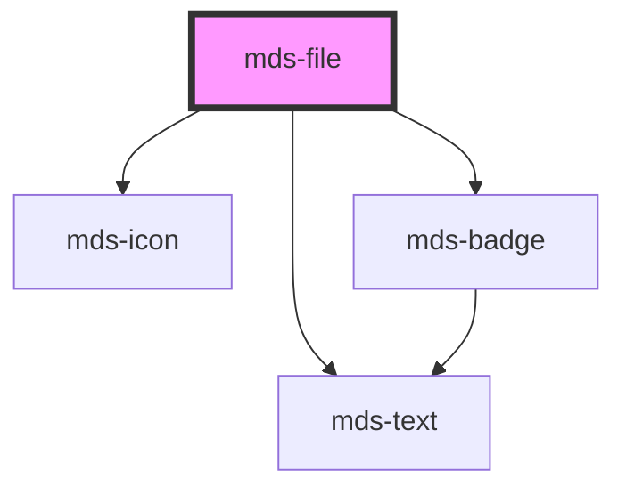

# mds-file

<!-- Auto Generated Below -->

## Properties

| Property      | Attribute     | Description                                                                                                                | Type                                                                                                                                                                                                                                                                                                                                                                                                                                                                                   | Default     |
| ------------- | ------------- | -------------------------------------------------------------------------------------------------------------------------- | -------------------------------------------------------------------------------------------------------------------------------------------------------------------------------------------------------------------------------------------------------------------------------------------------------------------------------------------------------------------------------------------------------------------------------------------------------------------------------------- | ----------- |
| `description` | `description` | Overrides the default filetype description                                                                                 | `string`                                                                                                                                                                                                                                                                                                                                                                                                                                                                               | `undefined` |
| `filename`    | `filename`    | The filename shown as component title, is used to auto assign one of the filetype known in the filetype dictionary         | `string`                                                                                                                                                                                                                                                                                                                                                                                                                                                                               | `undefined` |
| `preview`     | `preview`     | The image preview src if available of a file, useful if you have a logo to display, or a smaller version of a bigger image | `string`                                                                                                                                                                                                                                                                                                                                                                                                                                                                               | `undefined` |
| `suffix`      | `suffix`      | Overrides the automatic filetype recongition by forcing the suffix to one of the available formats choosen                 | `"html" \| "svg" \| "default" \| "json" \| "ts" \| "7z" \| "ace" \| "ai" \| "db" \| "dmg" \| "doc" \| "docm" \| "docx" \| "eml" \| "eps" \| "exe" \| "flac" \| "gif" \| "htm" \| "jpe" \| "jpeg" \| "jpg" \| "js" \| "jsx" \| "m2v" \| "mp2" \| "mp3" \| "mp4" \| "mp4v" \| "mpeg" \| "mpg" \| "mpg4" \| "mpga" \| "odp" \| "ods" \| "odt" \| "pdf" \| "php" \| "png" \| "ppt" \| "rar" \| "rtf" \| "sass" \| "shtml" \| "tar" \| "txt" \| "wav" \| "xar" \| "xls" \| "xlsx" \| "zip"` | `undefined` |

## CSS Custom Properties

| Name             | Description                                                    |
| ---------------- | -------------------------------------------------------------- |
| `--shadow`       | Sets the box-shadow of the component                           |
| `--shadow-hover` | Sets the box-shadow of the component when the mouse is over it |

## Dependencies

### Depends on

- [mds-icon](../mds-icon)
- [mds-text](../mds-text)
- [mds-badge](../mds-badge)

### Graph

----------------------------------------------

Built with love @ **Maggioli Informatica / R&D Department**
