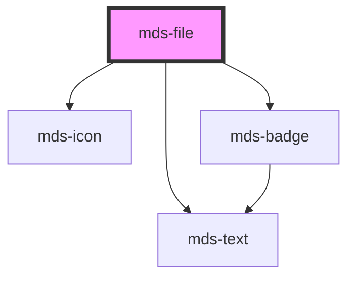

# mds-file

This is a web-component from Maggioli Design System [Magma](https://magma.maggiolicloud.it), built with StencilJS, TypeScript, Storybook. It's based on the web-component standard and it's designed to be agnostic from the JavaScript framework you are using.

<!-- Auto Generated Below -->

## Properties

| Property             | Attribute              | Description                                                                                                                | Type                                                                                                                                                                                                                                                                                                                                                                                                                                                                                                                                                                           | Default     |
| -------------------- | ---------------------- | -------------------------------------------------------------------------------------------------------------------------- | ------------------------------------------------------------------------------------------------------------------------------------------------------------------------------------------------------------------------------------------------------------------------------------------------------------------------------------------------------------------------------------------------------------------------------------------------------------------------------------------------------------------------------------------------------------------------------ | ----------- |
| `description`        | `description`          | Overrides the default filetype description                                                                                 | `string \| undefined`                                                                                                                                                                                                                                                                                                                                                                                                                                                                                                                                                          | `undefined` |
| `filename`           | `filename`             | The filename shown as component title, is used to auto assign one of the filetype known in the filetype dictionary         | `string`                                                                                                                                                                                                                                                                                                                                                                                                                                                                                                                                                                       | `undefined` |
| `format`             | `format`               | Sets if the download icon must be shown or not                                                                             | `string \| undefined`                                                                                                                                                                                                                                                                                                                                                                                                                                                                                                                                                          | `undefined` |
| `preview`            | `preview`              | The image preview src if available of a file, useful if you have a logo to display, or a smaller version of a bigger image | `string \| undefined`                                                                                                                                                                                                                                                                                                                                                                                                                                                                                                                                                          | `undefined` |
| `showDownloadedIcon` | `show-downloaded-icon` | Sets if the download icon must be shown or not                                                                             | `boolean \| undefined`                                                                                                                                                                                                                                                                                                                                                                                                                                                                                                                                                         | `true`      |
| `suffix`             | `suffix`               | Overrides the automatic filetype recongition by forcing the suffix to one of the available formats choosen                 | `"ai" \| "7z" \| "ace" \| "db" \| "default" \| "dmg" \| "doc" \| "docm" \| "docx" \| "eml" \| "eps" \| "exe" \| "flac" \| "gif" \| "heic" \| "htm" \| "html" \| "jpe" \| "jpeg" \| "jpg" \| "js" \| "json" \| "jsx" \| "m2v" \| "mp2" \| "mp3" \| "mp4" \| "mp4v" \| "mpeg" \| "mpg4" \| "mpg" \| "mpga" \| "odf" \| "odp" \| "ods" \| "odt" \| "ole" \| "p7m" \| "pdf" \| "php" \| "png" \| "ppt" \| "rar" \| "rtf" \| "sass" \| "shtml" \| "svg" \| "tar" \| "tiff" \| "ts" \| "tsd" \| "txt" \| "wav" \| "webp" \| "xar" \| "xls" \| "xlsx" \| "xml" \| "zip" \| undefined` | `undefined` |

## Events

| Event             | Description                                               | Type                              |
| ----------------- | --------------------------------------------------------- | --------------------------------- |
| `mdsFileDownload` | Emits when the component is clicked, returning file infos | `CustomEvent<MdsFileEventDetail>` |

## Methods

### `updateLang() => Promise<void>`

#### Returns

Type: `Promise<void>`

## CSS Custom Properties

| Name                                | Description                                        |
| ----------------------------------- | -------------------------------------------------- |
| `--mds-file-preview-color`          | Sets the text color used in the file preview       |
| `--mds-file-preview-icon-bacground` | Sets the background color of the file preview icon |
| `--mds-file-preview-icon-color`     | Sets the color of the file preview icon            |

## Dependencies

### Depends on

- [mds-icon](../mds-icon)
- [mds-text](../mds-text)
- [mds-badge](../mds-badge)

### Graph

----------------------------------------------

Built with love @ [Gruppo Maggioli](https://www.maggioli.com) from [R&D Department](https://www.maggioli.com/it-it/chi-siamo/ricerca-sviluppo)
