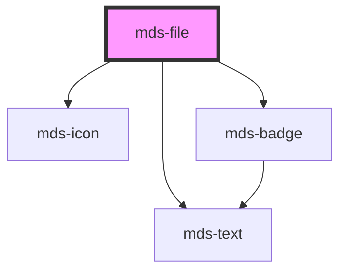

# mds-file

This is a web-component from Maggioli Design System [Magma](https://magma.maggiolicloud.it), built with StencilJS, TypeScript, Storybook. It's based on the web-component standard and it's designed to be agnostic from the JavaScirpt framework you are using.

<!-- Auto Generated Below -->

## Properties

| Property      | Attribute     | Description                                                                                                                | Type                               | Default     |
| ------------- | ------------- | -------------------------------------------------------------------------------------------------------------------------- | ---------------------------------- | ----------- |
| `description` | `description` | Overrides the default filetype description                                                                                 | `string \| undefined`              | `undefined` |
| `filename`    | `filename`    | The filename shown as component title, is used to auto assign one of the filetype known in the filetype dictionary         | `string`                           | `undefined` |
| `preview`     | `preview`     | The image preview src if available of a file, useful if you have a logo to display, or a smaller version of a bigger image | `string \| undefined`              | `undefined` |
| `suffix`      | `suffix`      | Overrides the automatic filetype recongition by forcing the suffix to one of the available formats choosen                 | `ExtensionSuffixType \| undefined` | `undefined` |

## Events

| Event             | Description                                               | Type                              |
| ----------------- | --------------------------------------------------------- | --------------------------------- |
| `mdsFileDownload` | Emits when the component is clicked, returning file infos | `CustomEvent<MdsFileEventDetail>` |

## Dependencies

### Depends on

- [mds-icon](../mds-icon)
- [mds-text](../mds-text)
- [mds-badge](../mds-badge)

### Graph

----------------------------------------------

Built with love @ **Maggioli Informatica / R&D Department**
