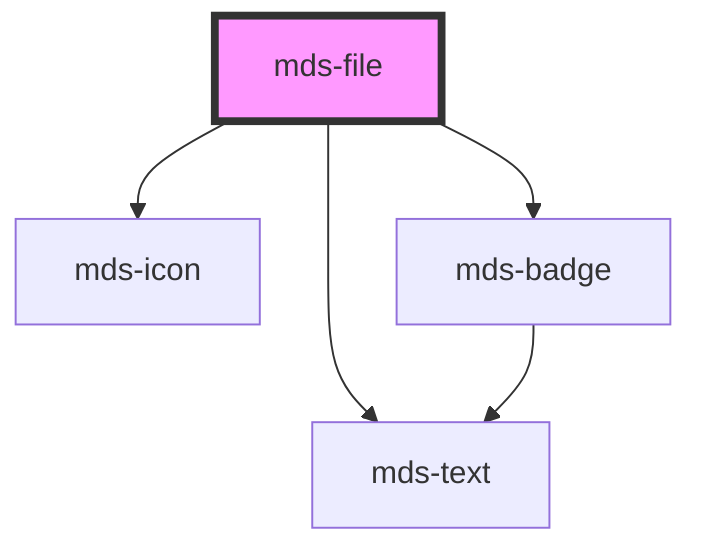

# mds-file


This is a web-component from Maggioli Design System [Magma](https://magma.maggiolicloud.it), built with StencilJS, TypeScript, Storybook. It's based on the web-component standard and it's designed to be agnostic from the JavaScript framework you are using.

<!-- Auto Generated Below -->


## Usage

### 1. Description

The `<mds-file>` web component is the Magma Design System control for representing a downloadable file as a rich, clickable card. It pairs a filename with an auto-detected file-type icon, badge, and human-readable description, and tracks whether the file has already been downloaded.

#### Semantic Behavior

- **Clickable card**: The whole host is focusable and clicking it emits `mdsFileDownload`; the component itself does not fetch or download - the consumer wires the actual download to that event.
- **Download event payload**: `mdsFileDownload` carries the resolved `description`, `extension`, `filename`, the host element as `target`, and the detected `type`/format.
- **Downloaded persistence**: On click the component remembers the file as downloaded and shows a "done" indicator on subsequent renders; the state survives reloads.
- **Automatic file-type recognition**: From `filename` it derives the format icon, badge variant, and default description; `suffix` overrides this detection.
- **Localization**: Descriptions and the "already downloaded" tooltip are resolved against the active locale.

#### Properties & Visual Configurations

- **`filename`** is the primary input: it provides the displayed title and drives icon, badge, suffix, and description detection. The name and extension are rendered separately, with the extension shown only when not explicitly overridden by `suffix`.
- **`suffix`** forces a specific file type from the supported format set when the filename's extension is missing or wrong; it bypasses automatic recognition.
- **`description`** overrides the derived, localized file-type description when a custom label is needed.
- **`preview`** supplies an image URL (logo or thumbnail) rendered as the preview surface instead of the generic format icon - use it when a meaningful visual of the file exists.
- **`showDownloadedIcon`** (default `true`) toggles the persisted "already downloaded" indicator; set it to `false` to suppress that affordance.
- **`format`** is normally populated by the component itself from detection rather than set by the consumer.


### 2. Pattern

Correct and idiomatic ways to use the `<mds-file>` component, ordered from most common to most specialized. Patterns assume a working knowledge of the conventions documented in [`docs/COMPONENTS.md`](../../../../../../docs/COMPONENTS.md) and the generic stencil rules in [`projects/stencil/SPEC.md`](../../../../SPEC.md).

#### Basic File Card

The minimal form. Pass `filename` with a real filename (including extension) and the component auto-detects the format icon, badge color, and localized description.

```html
<mds-file filename="relazione-annuale.pdf"></mds-file>
```

#### Handling the Download Event

The component does not fetch or download anything by itself. Listen for `mdsFileDownload` and trigger the actual download in the event handler. The event detail carries `filename`, `extension`, `type`, `description`, and `target`.

```html
<mds-file filename="contratto-servizio.docx" id="file-card"></mds-file>

<script>
  document.getElementById('file-card').addEventListener('mdsFileDownload', (event) => {
    const { filename, extension, type } = event.detail;
    console.log(`Download avviato: ${filename} (${type})`);
    // avvia il download effettivo dal server
  });
</script>
```

#### Forcing a File Type with `suffix`

When the filename lacks an extension or carries a misleading one, use `suffix` to force a specific format from the supported set.

```html
<!-- filename senza estensione - forza il riconoscimento come PDF -->
<mds-file filename="documento-firmato" suffix="pdf"></mds-file>

<!-- estensione sconosciuta - forzata come archivio ZIP -->
<mds-file filename="backup.bkp" suffix="zip"></mds-file>
```

#### Custom Description

Override the localized auto-generated description with a specific label relevant to the document context. Use `description` when the default type label (e.g. "Documento PDF") is not informative enough.

```html
<mds-file
  filename="verbale-cda-2024.pdf"
  description="Verbale approvato dal Consiglio di Amministrazione"
></mds-file>
```

#### Image Preview

Provide `preview` with an image URL when a meaningful visual thumbnail is available - a logo, a reduced version of an image file, or a document cover. The preview replaces the generic format icon in the left panel.

```html
<mds-file
  filename="logo-aziendale.png"
  preview="https://cdn.example.com/thumbnails/logo-aziendale-128.png"
></mds-file>
```

#### Hiding the "Already Downloaded" Indicator

By default the component persists a "done" indicator once the file has been downloaded. Set `show-downloaded-icon="false"` to suppress it when the affordance is not appropriate for the context (e.g. a list where every file is always shown as fresh).

```html
<mds-file filename="modulo-richiesta.xlsx" show-downloaded-icon="false"></mds-file>
```

Note: this is the only valid way to turn the indicator off - do not set it to the string `"false"` (see the Antipattern file).

#### Rendering a List of Files

Place multiple `<mds-file>` cards inside a container and attach a single delegated event listener when the file list is dynamic.

```html
<div class="file-list">
  <mds-file filename="allegato-1.pdf"></mds-file>
  <mds-file filename="allegato-2.docx"></mds-file>
  <mds-file filename="allegato-3.xlsx"></mds-file>
</div>

<script>
  document.querySelector('.file-list').addEventListener('mdsFileDownload', (event) => {
    const { filename } = event.detail;
    avviaDownload(filename);
  });
</script>
```

#### Styling Customization

Style the preview panel only through the three documented `--mds-file-*` CSS custom properties. Use Magma color tokens via `rgb(var(--<token>))` so dark mode and high-contrast modes keep working.

```css
.archivio-documenti mds-file {
  --mds-file-preview-icon-color: rgb(var(--variant-primary-04));
  --mds-file-preview-icon-bacground: rgb(var(--variant-primary-10));
  --mds-file-preview-color: rgb(var(--variant-primary-04));
}
```


### 3. Antipattern

Common incorrect uses of `<mds-file>`. Each entry pairs the wrong form with the right one and a one-line reason. System-wide rules (boolean-as-string, shadow piercing, Tailwind color utilities, raw native event listening) live in [`docs/COMPONENTS.md`](../../../../../../docs/COMPONENTS.md#system-level-anti-patterns) - they apply here too but are not repeated.

#### Do Not Expect the Component to Perform the Download

`<mds-file>` is a display card, not a download trigger. It emits `mdsFileDownload` and the consumer must wire the actual download logic to that event.

```html
<!-- 🚫 INCORRECT - expecting the component to handle the download itself -->
<mds-file filename="report.pdf" href="/files/report.pdf"></mds-file>

<!-- ✅ CORRECT - consumer listens to the event and handles the download -->
<mds-file filename="report.pdf" id="card-report"></mds-file>

<script>
  document.getElementById('card-report').addEventListener('mdsFileDownload', (e) => {
    window.location.href = '/files/' + e.detail.filename;
  });
</script>
```

#### Do Not Set `show-downloaded-icon` to the String "false"

`showDownloadedIcon` is a boolean prop. Setting the attribute to the string `"false"` evaluates as truthy in HTML and leaves the indicator enabled. Remove the attribute or set the prop to `false` in your framework binding.

```html
<!-- 🚫 INCORRECT -->
<mds-file filename="modulo.pdf" show-downloaded-icon="false"></mds-file>

<!-- ✅ CORRECT (HTML attribute absent = disabled) -->
<mds-file filename="modulo.pdf"></mds-file>
```

#### Do Not Set `format` Manually

`format` is an internal reflected attribute automatically derived from the filename and suffix. Setting it directly has no guaranteed effect because the component overwrites it during `componentWillLoad` and on every `filename` change. Use `suffix` to control type detection.

```html
<!-- 🚫 INCORRECT -->
<mds-file filename="archivio" format="document"></mds-file>

<!-- ✅ CORRECT - use suffix to override file-type detection -->
<mds-file filename="archivio" suffix="pdf"></mds-file>
```

#### Do Not Pierce Shadow DOM to Style the Preview Panel

The supported customization surface is `--mds-file-preview-*` CSS custom properties. Targeting internal elements with `>>>`, `/deep/`, or undocumented selectors couples your code to the Shadow DOM structure and will break on minor releases.

```css
/* 🚫 INCORRECT */
mds-file >>> .preview {
  background-color: blue;
}

/* ✅ CORRECT */
mds-file {
  --mds-file-preview-icon-bacground: rgb(var(--variant-primary-10));
  --mds-file-preview-icon-color: rgb(var(--variant-primary-04));
}
```

#### Do Not Wrap `<mds-file>` in a Native Anchor or Button

The host is already focusable, keyboard-accessible, and emits its own interaction event. Wrapping it in `<a>` or `<button>` creates nested interactive controls and breaks keyboard semantics.

```html
<!-- 🚫 INCORRECT -->
<a href="/download/report.pdf">
  <mds-file filename="report.pdf"></mds-file>
</a>

<!-- ✅ CORRECT - use the mdsFileDownload event to trigger navigation or download -->
<mds-file filename="report.pdf" id="file-report"></mds-file>

<script>
  document.getElementById('file-report').addEventListener('mdsFileDownload', () => {
    window.location.href = '/download/report.pdf';
  });
</script>
```

#### Do Not Use a Raw `<div>` or `<li>` as a File Row When `<mds-file>` Exists

`<mds-file>` handles format detection, theming, accessibility focus, download persistence, and localization. Rolling a custom file row loses all of these affordances.

```html
<!-- 🚫 INCORRECT -->
<div class="file-row" onclick="download('report.pdf')">
  
  <span>report.pdf</span>
</div>

<!-- ✅ CORRECT -->
<mds-file filename="report.pdf"></mds-file>
```


## Properties

| Property             | Attribute              | Description                                                                                                                | Type                                                                                                                                                                                                                                                                                                                                                                                                                                                                                                                                                                           | Default     |
| -------------------- | ---------------------- | -------------------------------------------------------------------------------------------------------------------------- | ------------------------------------------------------------------------------------------------------------------------------------------------------------------------------------------------------------------------------------------------------------------------------------------------------------------------------------------------------------------------------------------------------------------------------------------------------------------------------------------------------------------------------------------------------------------------------ | ----------- |
| `description`        | `description`          | Overrides the default filetype description                                                                                 | `string \| undefined`                                                                                                                                                                                                                                                                                                                                                                                                                                                                                                                                                          | `undefined` |
| `filename`           | `filename`             | The filename shown as component title, is used to auto assign one of the filetype known in the filetype dictionary         | `string`                                                                                                                                                                                                                                                                                                                                                                                                                                                                                                                                                                       | `undefined` |
| `format`             | `format`               | Sets if the download icon must be shown or not                                                                             | `string \| undefined`                                                                                                                                                                                                                                                                                                                                                                                                                                                                                                                                                          | `undefined` |
| `preview`            | `preview`              | The image preview src if available of a file, useful if you have a logo to display, or a smaller version of a bigger image | `string \| undefined`                                                                                                                                                                                                                                                                                                                                                                                                                                                                                                                                                          | `undefined` |
| `showDownloadedIcon` | `show-downloaded-icon` | Sets if the download icon must be shown or not                                                                             | `boolean \| undefined`                                                                                                                                                                                                                                                                                                                                                                                                                                                                                                                                                         | `true`      |
| `suffix`             | `suffix`               | Overrides the automatic filetype recongition by forcing the suffix to one of the available formats choosen                 | `"7z" \| "ace" \| "ai" \| "db" \| "default" \| "dmg" \| "doc" \| "docm" \| "docx" \| "eml" \| "eps" \| "exe" \| "flac" \| "gif" \| "heic" \| "htm" \| "html" \| "jpe" \| "jpeg" \| "jpg" \| "js" \| "json" \| "jsx" \| "m2v" \| "mp2" \| "mp3" \| "mp4" \| "mp4v" \| "mpeg" \| "mpg" \| "mpg4" \| "mpga" \| "odf" \| "odp" \| "ods" \| "odt" \| "ole" \| "p7m" \| "pdf" \| "php" \| "png" \| "ppt" \| "rar" \| "rtf" \| "sass" \| "shtml" \| "svg" \| "tar" \| "tiff" \| "ts" \| "tsd" \| "txt" \| "wav" \| "webp" \| "xar" \| "xls" \| "xlsx" \| "xml" \| "zip" \| undefined` | `undefined` |


## Events

| Event             | Description                                               | Type                              |
| ----------------- | --------------------------------------------------------- | --------------------------------- |
| `mdsFileDownload` | Emits when the component is clicked, returning file infos | `CustomEvent<MdsFileEventDetail>` |


## Methods

### `updateLang() => Promise<void>`


#### Returns

Type: `Promise<void>`


## CSS Custom Properties

| Name                                | Description                                        |
| ----------------------------------- | -------------------------------------------------- |
| `--mds-file-preview-color`          | Sets the text color used in the file preview       |
| `--mds-file-preview-icon-bacground` | Sets the background color of the file preview icon |
| `--mds-file-preview-icon-color`     | Sets the color of the file preview icon            |


## Dependencies

### Depends on

- [mds-icon](../mds-icon)
- [mds-text](../mds-text)
- [mds-badge](../mds-badge)

### Graph


----------------------------------------------

Built with love @ [Gruppo Maggioli](https://www.maggioli.com) from [R&D Department](https://www.maggioli.com/it-it/chi-siamo/ricerca-sviluppo)
