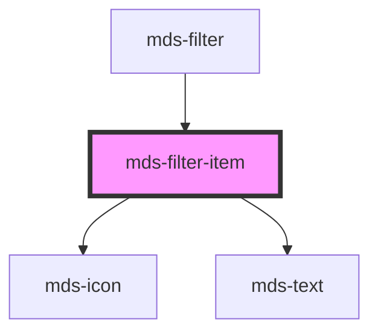

# mds-filter-item

<!-- Auto Generated Below -->

## Properties

| Property   | Attribute  | Description                                           | Type      | Default     |
| ---------- | ---------- | ----------------------------------------------------- | --------- | ----------- |
| `icon`     | `icon`     | Sets the icon of the filter item                      | `string`  | `undefined` |
| `label`    | `label`    | Sets the label of the filter item                     | `string`  | `undefined` |
| `selected` | `selected` | Sets the component to selected state                  | `boolean` | `undefined` |
| `value`    | `value`    | Sets the value of the component to be used with forms | `string`  | `undefined` |

## Events

| Event                 | Description                      | Type                              |
| --------------------- | -------------------------------- | --------------------------------- |
| `mdsFilterItemSelect` | Emits when the element is active | `CustomEvent<FilterClickedEvent>` |

## Dependencies

### Used by

 - [mds-filter](../mds-filter)

### Depends on

- [mds-icon](../mds-icon)
- [mds-text](../mds-text)

### Graph

----------------------------------------------

Built with love @ **Maggioli Informatica / R&D Department**
