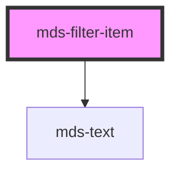

# mds-filter-item

<!-- Auto Generated Below -->

## Properties

| Property             | Attribute | Description                                           | Type      | Default     |
| -------------------- | --------- | ----------------------------------------------------- | --------- | ----------- |
| `active`             | `active`  | Sets the component to active state                    | `boolean` | `undefined` |
| `label` _(required)_ | `label`   | Sets the label of the filter item                     | `string`  | `undefined` |
| `value` _(required)_ | `value`   | Sets the value of the component to be used with forms | `string`  | `undefined` |

## Events

| Event         | Description                      | Type                              |
| ------------- | -------------------------------- | --------------------------------- |
| `activeEvent` | Emits when the element is active | `CustomEvent<FilterClickedEvent>` |

## Dependencies

### Depends on

- [mds-text](../mds-text)

### Graph

----------------------------------------------

Built with love @ **Maggioli Informatica / R&D Department**
