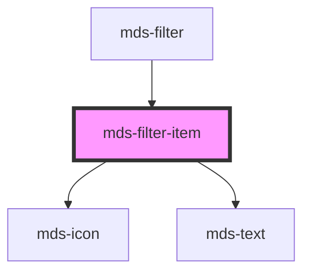

# mds-filter-item


This is a web-component from Maggioli Design System [Magma](https://magma.maggiolicloud.it), built with StencilJS, TypeScript, Storybook. It's based on the web-component standard and it's designed to be agnostic from the JavaScript framework you are using.

<!-- Auto Generated Below -->


## Usage

### 1. Description

The `<mds-filter-item>` web component is a single selectable option inside the [`<mds-filter>`](../../mds-filter) container of the Magma Design System. It renders as an interactive menu item (icon, label, and an optional count badge) and acts as the toggleable unit that drives the parent's filter selection - it has no standalone HTML primitive equivalent.

#### Semantic Behavior

- **Compound child only**: `<mds-filter-item>` must be a direct slot child of `<mds-filter>`; it is not used standalone and should not be mixed with other child types.
- **Self-toggling + event**: Clicking (or activating via the keyboard) flips `selected` and emits `mdsFilterItemSelect` with `{ id, selected }`. The parent enforces single vs. multiple selection and re-emits `mdsFilterChange` with the aggregated value list.
- **State owned with the parent**: `selected` doubles as a styling hook and as the flag the parent reads/writes - in single-select mode the parent clears the other items' selection, and on reset it clears the whole group.
- **Keyboard activation**: The item responds to keyboard activation like a pointer click.
- **Focus management**: The item is focusable unless `disabled`, in which case it drops out of the tab order.

#### Properties & Visual Configurations

- **`selected`**: The selection state of the item. Set it on initial markup to pre-select a filter; at runtime it is normally driven by the parent rather than set directly.
- **`value`**: The form/data value contributed to the parent's aggregated `mdsFilterChange` payload when the item is selected. Provide a meaningful value distinct from the human-readable `label`.
- **`count`**: An optional badge showing how many results the filter would yield. Use it only when the count is meaningful to the user; omit it for purely categorical filters.
- **`icon`**: Optional leading icon (an icon name string). It also serves as the accessible-label fallback, so an icon-only item without a `label` should use a recognizable icon.
- **`disabled`**: Renders the item non-interactive and removes it from the tab order; the parent uses this for the reset affordance when no filter is active.


### 2. Pattern

Correct and idiomatic ways to use the `<mds-filter-item>` component, ordered from most common to most specialized. Patterns assume a working knowledge of the compound component rules documented in [`docs/COMPONENTS.md`](../../../../../../docs/COMPONENTS.md) and the generic stencil rules in [`projects/stencil/SPEC.md`](../../../../SPEC.md).

#### Basic Filter Group

The canonical form. Place one or more `<mds-filter-item>` elements as direct children of `<mds-filter>`. Every item requires a `label` (the visible text) and a `value` (the machine-readable token emitted by the parent's `mdsFilterChange` event).

```html
<mds-filter label="Stato">
  <mds-filter-item label="Attivo" value="active"></mds-filter-item>
  <mds-filter-item label="In attesa" value="pending"></mds-filter-item>
  <mds-filter-item label="Archiviato" value="archived"></mds-filter-item>
</mds-filter>
```

#### Pre-selecting an Item on Load

Set `selected` on an item in the initial markup to make it active before any user interaction. The parent reads `selected` on mount and reflects the aggregated state correctly.

```html
<mds-filter label="Categoria">
  <mds-filter-item label="Tutti" value="all" selected></mds-filter-item>
  <mds-filter-item label="Notizie" value="news"></mds-filter-item>
  <mds-filter-item label="Eventi" value="events"></mds-filter-item>
</mds-filter>
```

#### Count Badge

Pass a `count` string to show how many results each filter would yield. Use it when the number is meaningful to the user; omit it for purely categorical filters to keep the UI uncluttered.

```html
<mds-filter label="Priorita">
  <mds-filter-item label="Alta" value="high" count="12"></mds-filter-item>
  <mds-filter-item label="Media" value="medium" count="34"></mds-filter-item>
  <mds-filter-item label="Bassa" value="low" count="5"></mds-filter-item>
</mds-filter>
```

#### Icon-Only Item

Omit `label` and provide only `icon`. The component automatically uses the icon slug as the `aria-label` fallback. Use a recognizable icon so the purpose is clear without text.

```html
<mds-filter label="Vista">
  <mds-filter-item icon="mi/baseline/grid-view" value="grid"></mds-filter-item>
  <mds-filter-item icon="mi/baseline/view-list" value="list"></mds-filter-item>
  <mds-filter-item icon="mi/baseline/map" value="map"></mds-filter-item>
</mds-filter>
```

#### Item with Icon and Label

Combine `icon` and `label` for a filter item that pairs a glyph with a text description.

```html
<mds-filter label="Tipo documento">
  <mds-filter-item icon="mi/baseline/picture-as-pdf" label="PDF" value="pdf"></mds-filter-item>
  <mds-filter-item icon="mi/baseline/image" label="Immagini" value="image"></mds-filter-item>
  <mds-filter-item icon="mi/baseline/video-library" label="Video" value="video"></mds-filter-item>
</mds-filter>
```

#### Multiple Selection

Add `multiple` to `<mds-filter>` to allow several items to be selected at the same time. The parent aggregates the selected `value`s into a comma-separated string and emits it via `mdsFilterChange`.

```html
<mds-filter label="Settore" multiple>
  <mds-filter-item label="Sanita" value="health"></mds-filter-item>
  <mds-filter-item label="Istruzione" value="education"></mds-filter-item>
  <mds-filter-item label="Trasporti" value="transport"></mds-filter-item>
  <mds-filter-item label="Ambiente" value="environment"></mds-filter-item>
</mds-filter>
```

#### Listening for Selection Events

Listen to `mdsFilterItemSelect` on a single item for per-item reactions, or to `mdsFilterChange` on the parent for the aggregated selection. The event detail for `mdsFilterItemSelect` is `{ id: string, selected: boolean }`.

```html
<mds-filter id="tipo-filter" label="Tipo">
  <mds-filter-item label="Bozza" value="draft"></mds-filter-item>
  <mds-filter-item label="Pubblicato" value="published"></mds-filter-item>
</mds-filter>

<script>
  document.getElementById('tipo-filter').addEventListener('mdsFilterChange', (e) => {
    console.log('Valori selezionati:', e.detail.value);
  });
</script>
```

#### Reset Affordance

Add `reset` to `<mds-filter>` to show an automatic reset button when at least one item is active. The button is rendered by the parent internally - no extra `<mds-filter-item>` is needed.

```html
<mds-filter label="Regione" reset>
  <mds-filter-item label="Nord" value="north"></mds-filter-item>
  <mds-filter-item label="Centro" value="center"></mds-filter-item>
  <mds-filter-item label="Sud" value="south"></mds-filter-item>
</mds-filter>
```

#### CSS Custom Properties for the Count Badge

Customize the count badge colors through the four documented `--mds-filter-item-count-*` CSS custom properties. Set them on the host element or on a parent selector; use Magma color tokens via `rgb(var(--<token>))`.

```css
.priority-filter mds-filter-item {
  --mds-filter-item-count-background-default: rgb(var(--tone-neutral-07));
  --mds-filter-item-count-color-default: rgb(var(--tone-neutral-02));
  --mds-filter-item-count-background-selected: rgb(var(--variant-primary-03));
  --mds-filter-item-count-color-selected: rgb(var(--tone-neutral));
}
```


### 3. Antipattern

Common incorrect uses of `<mds-filter-item>`. Each entry pairs the wrong form with the right one and a one-line reason. System-wide rules (boolean-as-string, shadow piercing, Tailwind color utilities, raw native event listening) live in [`docs/COMPONENTS.md`](../../../../../../docs/COMPONENTS.md#system-level-anti-patterns) - they apply here too but are not repeated.

#### Do Not Use `<mds-filter-item>` Outside `<mds-filter>`

`<mds-filter-item>` is a compound child component. Without its parent it has no selection management, no keyboard group navigation, and no `mdsFilterChange` aggregation. Always wrap it in `<mds-filter>`.

```html
<!-- 🚫 INCORRECT -->
<div class="my-filters">
  <mds-filter-item label="Attivo" value="active"></mds-filter-item>
  <mds-filter-item label="Archiviato" value="archived"></mds-filter-item>
</div>

<!-- ✅ CORRECT -->
<mds-filter label="Stato">
  <mds-filter-item label="Attivo" value="active"></mds-filter-item>
  <mds-filter-item label="Archiviato" value="archived"></mds-filter-item>
</mds-filter>
```

#### Do Not Set `selected="false"` to Deselect

`selected` is a boolean prop. Any non-empty string attribute value is truthy in HTML - `selected="false"` keeps the item selected. Remove the attribute entirely to deselect.

```html
<!-- 🚫 INCORRECT -->
<mds-filter-item label="Attivo" value="active" selected="false"></mds-filter-item>

<!-- ✅ CORRECT -->
<mds-filter-item label="Attivo" value="active"></mds-filter-item>
```

#### Do Not Omit `value`

`value` is the machine-readable token the parent aggregates into `mdsFilterChange`. Without it the parent's event payload is empty or meaningless for consumers - always provide a distinct, meaningful value.

```html
<!-- 🚫 INCORRECT -->
<mds-filter label="Priorita">
  <mds-filter-item label="Alta"></mds-filter-item>
  <mds-filter-item label="Bassa"></mds-filter-item>
</mds-filter>

<!-- ✅ CORRECT -->
<mds-filter label="Priorita">
  <mds-filter-item label="Alta" value="high"></mds-filter-item>
  <mds-filter-item label="Bassa" value="low"></mds-filter-item>
</mds-filter>
```

#### Do Not Slot Content Inside `<mds-filter-item>`

`<mds-filter-item>` has no publicly documented default or named slots. Icon, label, and count are all props. Slotting arbitrary HTML has no effect - use the dedicated props instead.

```html
<!-- 🚫 INCORRECT -->
<mds-filter-item value="pdf">
  <mds-icon name="mi/baseline/picture-as-pdf"></mds-icon>
  PDF
</mds-filter-item>

<!-- ✅ CORRECT -->
<mds-filter-item icon="mi/baseline/picture-as-pdf" label="PDF" value="pdf"></mds-filter-item>
```

#### Do Not Listen for Native `click` Instead of `mdsFilterItemSelect`

The component handles its own toggle internally and emits `mdsFilterItemSelect` when selection changes. Listening for native `click` events bypasses the toggle guard, fires before state is updated, and may not bubble consistently out of the shadow root.

```html
<!-- 🚫 INCORRECT -->
<mds-filter-item id="item" label="Attivo" value="active"></mds-filter-item>
<script>
  document.getElementById('item').addEventListener('click', (e) => {
    console.log('selected?', e.target.selected); // state not yet updated
  });
</script>

<!-- ✅ CORRECT -->
<mds-filter-item id="item" label="Attivo" value="active"></mds-filter-item>
<script>
  document.getElementById('item').addEventListener('mdsFilterItemSelect', (e) => {
    console.log('selected:', e.detail.selected);
  });
</script>
```

#### Do Not Customize via Undocumented Shadow Parts or Internal Selectors

The supported customization surface is the four `--mds-filter-item-count-*` CSS custom properties. Targeting shadow internals via `::part()`, `>>>`, or other selectors couples code to the implementation and will break on minor releases.

```css
/* 🚫 INCORRECT */
mds-filter-item >>> .count {
  border-radius: 4px;
}
mds-filter-item::part(count) {
  background: red;
}

/* ✅ CORRECT */
mds-filter-item {
  --mds-filter-item-count-background-default: rgb(var(--variant-primary-08));
  --mds-filter-item-count-color-default: rgb(var(--variant-primary-02));
}
```


## Properties

| Property   | Attribute  | Description                                                 | Type                   | Default     |
| ---------- | ---------- | ----------------------------------------------------------- | ---------------------- | ----------- |
| `count`    | `count`    | Shows the number of items will be filtered by the component | `string \| undefined`  | `undefined` |
| `disabled` | `disabled` | Sets if the component is disabled or not                    | `boolean \| undefined` | `undefined` |
| `icon`     | `icon`     | Sets the icon of the filter item                            | `string \| undefined`  | `undefined` |
| `label`    | `label`    | Sets the label of the filter item                           | `string`               | `undefined` |
| `selected` | `selected` | Sets the component to selected state                        | `boolean \| undefined` | `undefined` |
| `value`    | `value`    | Sets the value of the component to be used with forms       | `string`               | `undefined` |


## Events

| Event                 | Description                      | Type                                    |
| --------------------- | -------------------------------- | --------------------------------------- |
| `mdsFilterItemSelect` | Emits when the element is active | `CustomEvent<MdsFilterItemEventDetail>` |


## CSS Custom Properties

| Name                                          | Description                                                         |
| --------------------------------------------- | ------------------------------------------------------------------- |
| `--mds-filter-item-count-background-default`  | Sets the default `background-color` of the count element            |
| `--mds-filter-item-count-background-selected` | Sets the `background-color` of the count element when it's selected |
| `--mds-filter-item-count-color-default`       | Sets the default text `color` of the count element                  |
| `--mds-filter-item-count-color-selected`      | Sets the `color` of the count element when it's selected            |


## Dependencies

### Used by

 - [mds-filter](../mds-filter)

### Depends on

- [mds-icon](../mds-icon)
- [mds-text](../mds-text)

### Graph


----------------------------------------------

Built with love @ [Gruppo Maggioli](https://www.maggioli.com) from [R&D Department](https://www.maggioli.com/it-it/chi-siamo/ricerca-sviluppo)
