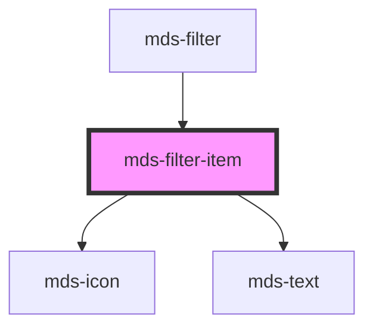

# mds-filter-item

This is a web-component from Maggioli Design System [Magma](https://magma.maggiolicloud.it), built with StencilJS, TypeScript, Storybook. It's based on the web-component standard and it's designed to be agnostic from the JavaScript framework you are using.

<!-- Auto Generated Below -->

## Properties

| Property   | Attribute  | Description                                                 | Type                   | Default     |
| ---------- | ---------- | ----------------------------------------------------------- | ---------------------- | ----------- |
| `count`    | `count`    | Shows the number of items will be filtered by the component | `string \| undefined`  | `undefined` |
| `disabled` | `disabled` | Sets if the component is disabled or not                    | `boolean \| undefined` | `undefined` |
| `icon`     | `icon`     | Sets the icon of the filter item                            | `string \| undefined`  | `undefined` |
| `label`    | `label`    | Sets the label of the filter item                           | `string`               | `undefined` |
| `selected` | `selected` | Sets the component to selected state                        | `boolean \| undefined` | `undefined` |
| `value`    | `value`    | Sets the value of the component to be used with forms       | `string`               | `undefined` |

## Events

| Event                 | Description                      | Type                                    |
| --------------------- | -------------------------------- | --------------------------------------- |
| `mdsFilterItemSelect` | Emits when the element is active | `CustomEvent<MdsFilterItemEventDetail>` |

## CSS Custom Properties

| Name                                          | Description                                                         |
| --------------------------------------------- | ------------------------------------------------------------------- |
| `--mds-filter-item-count-background-default`  | Sets the default `background-color` of the count element            |
| `--mds-filter-item-count-background-selected` | Sets the `background-color` of the count element when it's selected |
| `--mds-filter-item-count-color-default`       | Sets the default text `color` of the count element                  |
| `--mds-filter-item-count-color-selected`      | Sets the `color` of the count element when it's selected            |

## Dependencies

### Used by

 - [mds-filter](../mds-filter)

### Depends on

- [mds-icon](../mds-icon)
- [mds-text](../mds-text)

### Graph

----------------------------------------------

Built with love @ [Gruppo Maggioli](https://www.maggioli.com) from [R&D Department](https://www.maggioli.com/it-it/chi-siamo/ricerca-sviluppo)
