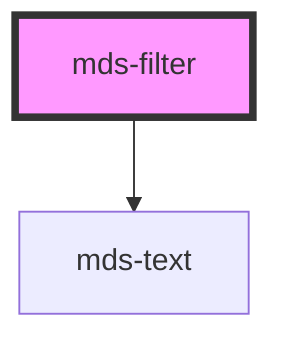

# mds-filter

<!-- Auto Generated Below -->

## Properties

| Property    | Attribute    | Description                                                            | Type      | Default     |
| ----------- | ------------ | ---------------------------------------------------------------------- | --------- | ----------- |
| `autoReset` | `auto-reset` | Sets an automatic reset of active filters if all filters are triggered | `boolean` | `undefined` |
| `label`     | `label`      | Sets the label of the filter group                                     | `string`  | `undefined` |
| `multiple`  | `multiple`   | Sets if the filter group can filter multiple filters simultaneously    | `boolean` | `undefined` |

## Events

| Event          | Description                                   | Type                  |
| -------------- | --------------------------------------------- | --------------------- |
| `changedEvent` | Emits when the one of the children is changed | `CustomEvent<string>` |

## CSS Custom Properties

| Name                        | Description                                                             |
| --------------------------- | ----------------------------------------------------------------------- |
| `--items-background`        | Sets the background-color of the items row area                         |
| `--items-background-active` | Sets the background-color of the items row area when a filter is active |
| `--items-gap`               | Sets the gap between items                                              |
| `--items-padding`           | Sets the padding of the items row area                                  |
| `--items-radius`            | Sets the border-radius of the items row area                            |
| `--label-padding`           | Sets the padding of the label                                           |

## Dependencies

### Depends on

- [mds-text](../mds-text)

### Graph

----------------------------------------------

Built with love @ **Maggioli Informatica / R&D Department**
