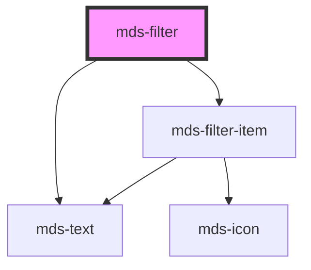

# mds-filter

This is a web-component from Maggioli Design System [Magma](https://magma.maggiolicloud.it), built with StencilJS, TypeScript, Storybook. It's based on the web-component standard and it's designed to be agnostic from the JavaScirpt framework you are using.

<!-- Auto Generated Below -->

## Properties

| Property    | Attribute    | Description                                                            | Type                   | Default     |
| ----------- | ------------ | ---------------------------------------------------------------------- | ---------------------- | ----------- |
| `autoReset` | `auto-reset` | Sets an automatic reset of active filters if all filters are triggered | `boolean \| undefined` | `undefined` |
| `label`     | `label`      | Sets the label of the filter group                                     | `string \| undefined`  | `undefined` |
| `multiple`  | `multiple`   | Sets if the filter group can filter multiple filters simultaneously    | `boolean \| undefined` | `undefined` |
| `reset`     | `reset`      | Shows a reset button if one or more filters are active                 | `boolean \| undefined` | `undefined` |

## Events

| Event             | Description                                   | Type                                |
| ----------------- | --------------------------------------------- | ----------------------------------- |
| `mdsFilterChange` | Emits when the one of the children is changed | `CustomEvent<MdsFilterEventDetail>` |

## Slots

| Slot        | Description                      |
| ----------- | -------------------------------- |
| `"default"` | Add `mds-filter-item` element/s. |

## CSS Custom Properties

| Name                                   | Description                                                             |
| -------------------------------------- | ----------------------------------------------------------------------- |
| `--mds-filter-items-background`        | Sets the background-color of the items row area                         |
| `--mds-filter-items-background-active` | Sets the background-color of the items row area when a filter is active |
| `--mds-filter-items-gap`               | Sets the gap between items                                              |
| `--mds-filter-items-padding`           | Sets the padding of the items row area                                  |
| `--mds-filter-items-radius`            | Sets the border-radius of the items row area                            |
| `--mds-filter-label-padding`           | Sets the padding of the label                                           |

## Dependencies

### Depends on

- [mds-text](../mds-text)
- [mds-filter-item](../mds-filter-item)

### Graph

----------------------------------------------

Built with love @ [Gruppo Maggioli](https://www.maggioli.com) from [R&D Department](https://www.maggioli.com/it-it/chi-siamo/ricerca-sviluppo)
