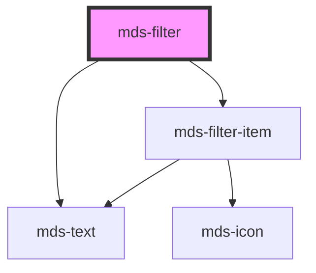

# mds-filter


This is a web-component from Maggioli Design System [Magma](https://magma.maggiolicloud.it), built with StencilJS, TypeScript, Storybook. It's based on the web-component standard and it's designed to be agnostic from the JavaScript framework you are using.

<!-- Auto Generated Below -->


## Usage

### 1. Description

The `<mds-filter>` web component is a compound container that groups a set of `<mds-filter-item>` chips into a single, scrollable filter bar, coordinating their selection state and exposing the active values as one combined change event. It has no native HTML equivalent: it orchestrates its children rather than rendering a control of its own.

#### Semantic Behavior

- **Compound parent**: Acts as the controller for slotted `<mds-filter-item>` children, driving their state in response to selection events.
- **Selection coordination**: In single mode it enforces exclusive selection (selecting one deselects the others); in `multiple` mode it keeps every selected child active and tracks how many are selected.
- **Combined change event**: `mdsFilterChange` fires whenever any child's selection changes, carrying both the live child node list and a comma-joined string of the selected items' `value`s.
- **Reset control**: When `reset` is set, a clear-all control appears once a filter is active and clears all selections when clicked.
- **Auto-scroll**: On each selection the bar scrolls horizontally to center the most recently selected item.
- **Default slot**: The default slot is for `<mds-filter-item>` elements only, not arbitrary text or markup.

#### Properties & Visual Configurations

- **`multiple`** switches the bar from exclusive single-select behavior to allowing several items active at once; choose it when filters are additive rather than mutually exclusive.
- **`reset`** opts the bar into showing a dedicated clear-all control whenever one or more filters are active.
- **`autoReset`** automatically clears all selections once every item has been selected - useful in `multiple` mode where "all selected" is equivalent to "no filter applied".


### 2. Pattern

Correct and idiomatic ways to use the `<mds-filter>` component, ordered from most common to most specialized. Patterns assume a working knowledge of the variant / tone ladders documented in [`docs/COMPONENTS.md`](../../../../../../docs/COMPONENTS.md) and the generic stencil rules in [`projects/stencil/SPEC.md`](../../../../SPEC.md).

#### Basic Single-Select Filter Bar

The canonical form. Slot `<mds-filter-item>` children directly; the parent enforces exclusive selection in single mode - selecting one item deselects all others. Always provide `value` on each item so the `mdsFilterChange` event carries meaningful data.

```html
<mds-filter label="Categoria">
  <mds-filter-item label="Tutti" value="all"></mds-filter-item>
  <mds-filter-item label="Notizie" value="news"></mds-filter-item>
  <mds-filter-item label="Comunicati" value="press" count="14"></mds-filter-item>
  <mds-filter-item label="Aggiornamenti" value="updates" count="3"></mds-filter-item>
</mds-filter>
```

#### Listening to Selection Changes

Listen to `mdsFilterChange` on the parent. The event detail carries `value` (comma-joined string of selected `value` attributes) and `children` (the live node list for advanced inspection).

```html
<mds-filter id="filter-stato" label="Stato">
  <mds-filter-item label="Bozza" value="draft"></mds-filter-item>
  <mds-filter-item label="Pubblicato" value="published"></mds-filter-item>
  <mds-filter-item label="Archiviato" value="archived"></mds-filter-item>
</mds-filter>

<script>
  document.getElementById('filter-stato').addEventListener('mdsFilterChange', (event) => {
    console.log('Filtro attivo:', event.detail.value);
  });
</script>
```

#### Multi-Select Filter Bar

Set `multiple` when filters are additive rather than mutually exclusive. All selected items stay active simultaneously; `mdsFilterChange` fires after each toggle.

```html
<mds-filter label="Etichette" multiple>
  <mds-filter-item label="Urgente" value="urgent" count="2"></mds-filter-item>
  <mds-filter-item label="In revisione" value="review" count="7"></mds-filter-item>
  <mds-filter-item label="Completato" value="done" count="31"></mds-filter-item>
  <mds-filter-item label="Annullato" value="cancelled"></mds-filter-item>
</mds-filter>
```

#### Reset Button

Set `reset` to show a clear-all control whenever at least one item is active. The reset control is hidden when no filter is selected and becomes visible automatically when a selection is made.

```html
<mds-filter label="Tipo documento" multiple reset>
  <mds-filter-item label="PDF" value="pdf" count="5"></mds-filter-item>
  <mds-filter-item label="Word" value="doc" count="12"></mds-filter-item>
  <mds-filter-item label="Immagine" value="image" count="8"></mds-filter-item>
</mds-filter>
```

#### Auto-Reset on Full Selection

Use `auto-reset` together with `multiple` when selecting all items is semantically identical to "no filter applied". Once every item is selected, the component clears all selections automatically.

```html
<mds-filter label="Priorita" multiple auto-reset>
  <mds-filter-item label="Alta" value="high"></mds-filter-item>
  <mds-filter-item label="Media" value="medium"></mds-filter-item>
  <mds-filter-item label="Bassa" value="low"></mds-filter-item>
</mds-filter>
```

#### Filter Item with Icon

Supply `icon` on individual `<mds-filter-item>` children to add a glyph alongside the label. The icon slug follows iconsauce conventions; `aria-label` is derived from `label` (or `icon` when no label is present).

```html
<mds-filter label="Formato">
  <mds-filter-item label="Video" value="video" icon="mi/baseline/videocam"></mds-filter-item>
  <mds-filter-item label="Audio" value="audio" icon="mi/baseline/headset"></mds-filter-item>
  <mds-filter-item label="Testo" value="text" icon="mi/baseline/article"></mds-filter-item>
</mds-filter>
```

#### Pre-Selected Item

Set `selected` on a child at page load to reflect a filter that is already active (e.g. restored from a URL parameter or user preference). The parent picks up the initial state during `componentWillLoad`.

```html
<mds-filter label="Periodo">
  <mds-filter-item label="Oggi" value="today"></mds-filter-item>
  <mds-filter-item label="Settimana corrente" value="week" selected></mds-filter-item>
  <mds-filter-item label="Mese corrente" value="month"></mds-filter-item>
</mds-filter>
```

#### Disabled Item

Set `disabled` on individual `<mds-filter-item>` children to make them non-interactive. Disabled items are removed from the tab order.

```html
<mds-filter label="Stato pratica">
  <mds-filter-item label="Aperta" value="open" count="9"></mds-filter-item>
  <mds-filter-item label="In attesa" value="pending" count="2"></mds-filter-item>
  <mds-filter-item label="Chiusa" value="closed" disabled></mds-filter-item>
</mds-filter>
```

#### Styling Customization

Style the filter bar only through its documented `--mds-filter-*` CSS custom properties. Set them on the host or a parent selector; use Magma color tokens via `rgb(var(--<token>))` so dark mode and high-contrast modes keep working.

```css
.filtri-personalizzati mds-filter {
  --mds-filter-items-background: rgb(var(--tone-neutral-08));
  --mds-filter-items-background-active: rgb(var(--variant-primary-09));
  --mds-filter-items-radius: var(--radius-md);
  --mds-filter-items-gap: var(--spacing-300);
  --mds-filter-wrapper-shadow-color: rgb(var(--variant-primary-05));
  --mds-filter-wrapper-shadow-opacity: 0.2;
}
```


### 3. Antipattern

Common incorrect uses of `<mds-filter>`. Each entry pairs the wrong form with the right one and a one-line reason. System-wide rules (boolean-as-string, shadow piercing, Tailwind color utilities, raw native event listening) live in [`docs/COMPONENTS.md`](../../../../../../docs/COMPONENTS.md#system-level-anti-patterns) - they apply here too but are not repeated.

#### Do Not Slot Arbitrary Elements Instead of `mds-filter-item`

The default slot accepts only `<mds-filter-item>` elements. The parent wires its coordination logic - exclusive selection, scroll-centering, value aggregation - by querying for `mds-filter-item` children. Slotting plain buttons, spans, or any other element breaks all of that coordination.

```html
<!-- 🚫 INCORRECT -->
<mds-filter label="Tipo">
  <button>Notizie</button>
  <button>Comunicati</button>
</mds-filter>

<!-- ✅ CORRECT -->
<mds-filter label="Tipo">
  <mds-filter-item label="Notizie" value="news"></mds-filter-item>
  <mds-filter-item label="Comunicati" value="press"></mds-filter-item>
</mds-filter>
```

#### Do Not Use `mds-filter-item` Outside `mds-filter`

`<mds-filter-item>` communicates state upward via the `mdsFilterItemSelect` event, which `<mds-filter>` listens for internally. Used standalone, the item has no parent to coordinate selection, no auto-scroll, and no combined `mdsFilterChange` output.

```html
<!-- 🚫 INCORRECT -->
<div class="my-filter-bar">
  <mds-filter-item label="Tutti" value="all"></mds-filter-item>
  <mds-filter-item label="Attivi" value="active"></mds-filter-item>
</div>

<!-- ✅ CORRECT -->
<mds-filter>
  <mds-filter-item label="Tutti" value="all"></mds-filter-item>
  <mds-filter-item label="Attivi" value="active"></mds-filter-item>
</mds-filter>
```

#### Do Not Listen to Native `change` Instead of `mdsFilterChange`

`<mds-filter>` emits the documented `mdsFilterChange` custom event. Native `change` and `input` events do not bubble out of shadow DOM reliably; listening for them produces no result.

```html
<!-- 🚫 INCORRECT -->
<mds-filter id="f" label="Stato">
  <mds-filter-item label="Aperto" value="open"></mds-filter-item>
</mds-filter>
<script>
  document.getElementById('f').addEventListener('change', handler);
</script>

<!-- ✅ CORRECT -->
<mds-filter id="f" label="Stato">
  <mds-filter-item label="Aperto" value="open"></mds-filter-item>
</mds-filter>
<script>
  document.getElementById('f').addEventListener('mdsFilterChange', handler);
</script>
```

#### Do Not Set Boolean Props to the String `"false"`

`auto-reset`, `multiple`, and `reset` are boolean attributes. In HTML, any non-empty string - including `"false"` - is truthy. Remove the attribute entirely to deactivate it.

```html
<!-- 🚫 INCORRECT -->
<mds-filter multiple="false" reset="false" label="Tipo">
  <mds-filter-item label="Tutti" value="all"></mds-filter-item>
</mds-filter>

<!-- ✅ CORRECT -->
<mds-filter label="Tipo">
  <mds-filter-item label="Tutti" value="all"></mds-filter-item>
</mds-filter>
```

#### Do Not Use `auto-reset` Without `multiple`

`auto-reset` is meaningful only in `multiple` mode - it triggers when all items are simultaneously selected. In single-select mode only one item can ever be active, so the "all selected" condition is never reached and `auto-reset` has no effect.

```html
<!-- 🚫 INCORRECT -->
<mds-filter auto-reset label="Priorita">
  <mds-filter-item label="Alta" value="high"></mds-filter-item>
  <mds-filter-item label="Bassa" value="low"></mds-filter-item>
</mds-filter>

<!-- ✅ CORRECT -->
<mds-filter multiple auto-reset label="Priorita">
  <mds-filter-item label="Alta" value="high"></mds-filter-item>
  <mds-filter-item label="Bassa" value="low"></mds-filter-item>
</mds-filter>
```

#### Do Not Omit `value` on `mds-filter-item`

The `mdsFilterChange` event's `value` field is a comma-joined string of the selected items' `value` attributes. Items without a `value` contribute an empty string to the output, making the combined value ambiguous and hard to parse in application code.

```html
<!-- 🚫 INCORRECT -->
<mds-filter label="Formato">
  <mds-filter-item label="PDF"></mds-filter-item>
  <mds-filter-item label="Word"></mds-filter-item>
</mds-filter>

<!-- ✅ CORRECT -->
<mds-filter label="Formato">
  <mds-filter-item label="PDF" value="pdf"></mds-filter-item>
  <mds-filter-item label="Word" value="doc"></mds-filter-item>
</mds-filter>
```

#### Do Not Customize Via Undocumented Shadow Selectors

The supported customization surface for `<mds-filter>` is the documented `--mds-filter-*` CSS custom properties. Piercing the shadow DOM via `>>>` or undocumented `::part()` names couples your code to the implementation and will break on minor releases.

```css
/* 🚫 INCORRECT */
mds-filter >>> .items {
  background: white;
}
mds-filter::part(items-wrapper) {
  border: 2px solid red;
}

/* ✅ CORRECT */
mds-filter {
  --mds-filter-items-background: rgb(var(--tone-neutral-08));
  --mds-filter-wrapper-shadow-color: rgb(var(--variant-primary-05));
}
```


## Properties

| Property    | Attribute    | Description                                                            | Type                   | Default     |
| ----------- | ------------ | ---------------------------------------------------------------------- | ---------------------- | ----------- |
| `autoReset` | `auto-reset` | Sets an automatic reset of active filters if all filters are triggered | `boolean \| undefined` | `undefined` |
| `label`     | `label`      | Sets the label of the filter group                                     | `string \| undefined`  | `undefined` |
| `multiple`  | `multiple`   | Sets if the filter group can filter multiple filters simultaneously    | `boolean \| undefined` | `undefined` |
| `reset`     | `reset`      | Shows a reset button if one or more filters are active                 | `boolean \| undefined` | `undefined` |


## Events

| Event             | Description                                   | Type                                |
| ----------------- | --------------------------------------------- | ----------------------------------- |
| `mdsFilterChange` | Emits when the one of the children is changed | `CustomEvent<MdsFilterEventDetail>` |


## Slots

| Slot | Description                      |
| ---- | -------------------------------- |
|      | Add `mds-filter-item` element/s. |


## CSS Custom Properties

| Name                                   | Description                                                             |
| -------------------------------------- | ----------------------------------------------------------------------- |
| `--mds-filter-items-background`        | Sets the background-color of the items row area                         |
| `--mds-filter-items-background-active` | Sets the background-color of the items row area when a filter is active |
| `--mds-filter-items-gap`               | Sets the gap between items                                              |
| `--mds-filter-items-padding`           | Sets the padding of the items row area                                  |
| `--mds-filter-items-radius`            | Sets the border-radius of the items row area                            |
| `--mds-filter-items-scroll-behavior`   | Sets the scroll-behavior animation;                                     |
| `--mds-filter-label-padding`           | Sets the padding of the label                                           |
| `--mds-filter-wrapper-shadow`          | Sets the shadow used as outline border                                  |
| `--mds-filter-wrapper-shadow-color`    | Sets the effect of the outline border                                   |
| `--mds-filter-wrapper-shadow-opacity`  | Sets the opacity of the outline border                                  |


## Dependencies

### Depends on

- [mds-text](../mds-text)
- [mds-filter-item](../mds-filter-item)

### Graph


----------------------------------------------

Built with love @ [Gruppo Maggioli](https://www.maggioli.com) from [R&D Department](https://www.maggioli.com/it-it/chi-siamo/ricerca-sviluppo)
