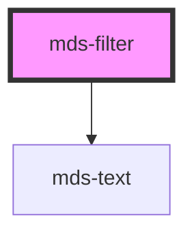

# mds-filter

<!-- Auto Generated Below -->

## Properties

| Property   | Attribute  | Description                                              | Type      | Default     |
| ---------- | ---------- | -------------------------------------------------------- | --------- | ----------- |
| `label`    | `label`    | Sets the label of the filter group                       | `string`  | `undefined` |
| `multiple` | `multiple` | Choose if multiple siblings can be opened simultaneously | `boolean` | `undefined` |

## Dependencies

### Depends on

- [mds-text](../mds-text)

### Graph

----------------------------------------------

Built with love @ **Maggioli Informatica / R&D Department**
