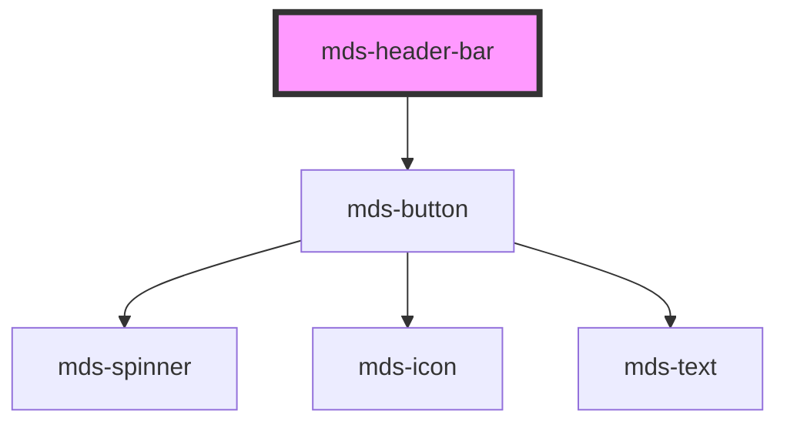

# mds-header-bar

This is a web-component from Maggioli Design System [Magma](https://magma.maggiolicloud.it), built with StencilJS, TypeScript, Storybook. It's based on the web-component standard and it's designed to be agnostic from the JavaScirpt framework you are using.

<!-- Auto Generated Below -->

## Properties

| Property | Attribute | Description                                     | Type                                       | Default     |
| -------- | --------- | ----------------------------------------------- | ------------------------------------------ | ----------- |
| `menu`   | `menu`    | Sets the visibility type of the hamburger menu  | `"all" \| "desktop" \| "mobile" \| "none"` | `'mobile'`  |
| `nav`    | `nav`     | Sets the visibility type of the navigation menu | `"all" \| "desktop" \| "mobile" \| "none"` | `'desktop'` |

## Events

| Event              | Description                        | Type                |
| ------------------ | ---------------------------------- | ------------------- |
| `mdsHeaderBarOpen` | Emits when the component is opened | `CustomEvent<void>` |

## Slots

| Slot        | Description                                                                                                                                          |
| ----------- | ---------------------------------------------------------------------------------------------------------------------------------------------------- |
| `"default"` | Put contents, like logo and a small description shown on the left of the component. Add `text string`, `HTML elements` or `components` to this slot. |
| `"nav"`     | Put the actions shown when the component is on desktop mode. Add `HTML elements` or `components`, it is **recommended** to use `mds-button` element. |

## Shadow Parts

| Part          | Description                                                 |
| ------------- | ----------------------------------------------------------- |
| `"actions"`   | Selects the element which wraps `nav` and `hamburger` parts |
| `"hamburger"` | Selects the `hamburger` menu action element                 |
| `"nav"`       | Selects the `nav` element that contains the horizontal menu |

## Dependencies

### Depends on

- [mds-button](../mds-button)

### Graph

----------------------------------------------

Built with love @ [Gruppo Maggioli](https://www.maggioli.com) from [R&D Department](https://www.maggioli.com/it-it/chi-siamo/ricerca-sviluppo)
