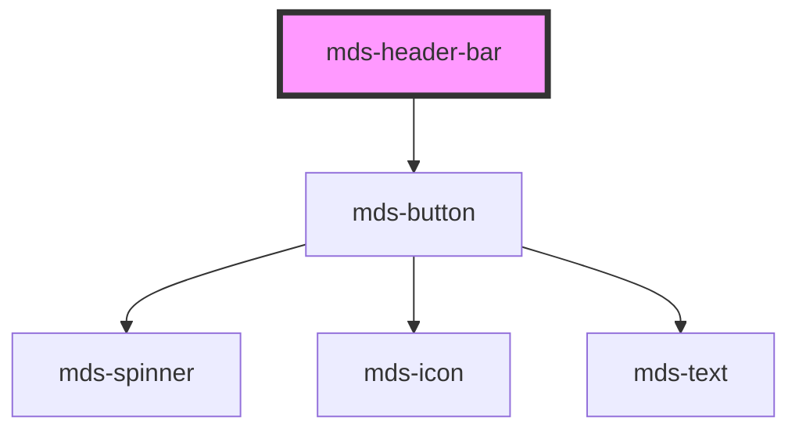

# mds-header-bar


This is a web-component from Maggioli Design System [Magma](https://magma.maggiolicloud.it), built with StencilJS, TypeScript, Storybook. It's based on the web-component standard and it's designed to be agnostic from the JavaScript framework you are using.

<!-- Auto Generated Below -->


## Usage

### 1. Description

The `<mds-header-bar>` web component is the top bar of a Magma application layout: it holds the product branding on the left and the primary navigation actions on the right, collapsing those actions into a hamburger menu on smaller viewports. It is a structural compound element, typically nested inside an `<mds-header>`, with no native HTML primitive equivalent.

#### Semantic Behavior

- **Branding region**: The default (unnamed) slot is the logo/branding area on the left; place text, HTML, or components such as a logo with a short description here.
- **Navigation region**: The `nav` named slot holds the horizontal desktop actions, wrapped in a real `<nav>` element; `mds-button` elements are the recommended children.
- **Conditional nav rendering**: The `<nav>` is rendered only when `nav` is not `'none'` and a `slot="nav"` child is present, so an empty header collapses cleanly.
- **Hamburger trigger**: When `menu` is not `'none'` the component renders a menu button that opens the menu on click.
- **Open event**: Clicking the hamburger emits the bubbling `mdsHeaderBarOpen` event and opens the drawer on the surrounding `mds-header`.
- **Imperative open control**: The public `setOpened(isOpened = true)` method lets a parent or script toggle the opened state programmatically.

#### Properties & Visual Configurations

The two props are both responsive visibility switches sharing the value set `'all' | 'desktop' | 'mobile' | 'none'`, where the value names the breakpoint(s) at which the region is shown (`'none'` hides it entirely, `'all'` always shows it).

- **`menu`** controls when the hamburger button appears. It defaults to `'mobile'`, so the collapsed menu surfaces only on small screens; set it to `'all'` to always expose the menu trigger or `'none'` to suppress it.
- **`nav`** controls when the inline horizontal navigation is shown. It defaults to `'desktop'`, the typical complement to `menu`: links sit inline on wide viewports and fold into the hamburger on narrow ones.


### 2. Pattern

Correct and idiomatic ways to use the `<mds-header-bar>` component, ordered from most common to most specialized. Patterns assume a working knowledge of the variant / tone ladders documented in [`docs/COMPONENTS.md`](../../../../../../docs/COMPONENTS.md) and the generic stencil rules in [`projects/stencil/SPEC.md`](../../../../SPEC.md).

#### Standard Header Bar with Logo and Navigation

The canonical form. Place branding content in the default slot (left side) and `<mds-button>` elements in the `nav` slot (right side). With the defaults (`menu="mobile"` and `nav="desktop"`) the nav is visible on desktop and the hamburger appears only on mobile.

```html
<mds-header-bar>
  <div class="flex gap-200 items-center">
    <mds-img src="./logo.svg" />
    <mds-text typography="h6">Portale Enti</mds-text>
  </div>
  <mds-button slot="nav" variant="dark" tone="outline">Accedi</mds-button>
  <mds-button slot="nav" variant="primary" tone="strong">Registrati</mds-button>
</mds-header-bar>
```

#### Nested Inside `mds-header`

`<mds-header-bar>` is a structural sub-component of [`mds-header`](../../mds-header). Place it inside `<mds-header>` so that the hamburger click is wired to the drawer automatically; the component calls `mds-header.setOpened(true)` on its nearest `mds-header` ancestor.

```html
<mds-header>
  <mds-header-bar>
    <mds-text typography="h6">Gestione Pratiche</mds-text>
    <mds-button slot="nav" variant="dark" tone="text" icon="mi/baseline/person">Account</mds-button>
    <mds-button slot="nav" variant="primary" tone="strong">Nuovo documento</mds-button>
  </mds-header-bar>
  <!-- drawer and other header regions go here -->
</mds-header>
```

#### Controlling Hamburger Visibility

Use the `menu` prop to decide when the hamburger button is shown. The default `mobile` is correct for most apps. Use `all` when you always want a drawer-style menu regardless of viewport, or `none` to remove the hamburger entirely (e.g. a public marketing bar with no drawer).

```html
<!-- Always show the hamburger (single-column layout, any viewport) -->
<mds-header-bar menu="all">
  <mds-text typography="h6">Area Personale</mds-text>
</mds-header-bar>

<!-- No hamburger at all (branding-only bar) -->
<mds-header-bar menu="none">
  <mds-img src="./logo.svg" />
</mds-header-bar>
```

#### Controlling Inline Navigation Visibility

Use the `nav` prop symmetrically with `menu`. The default `desktop` shows the nav slot only on wide viewports. Set `nav="all"` to always show inline links, `nav="mobile"` to show them only on small screens, or `nav="none"` to suppress the nav region entirely.

```html
<!-- Always show inline nav (no responsive collapsing) -->
<mds-header-bar menu="none" nav="all">
  <mds-img src="./logo.svg" />
  <mds-button slot="nav" variant="dark" tone="text">Chi siamo</mds-button>
  <mds-button slot="nav" variant="dark" tone="text">Servizi</mds-button>
  <mds-button slot="nav" variant="primary" tone="strong">Contatti</mds-button>
</mds-header-bar>
```

#### Listening for the Hamburger Open Event

Listen to `mdsHeaderBarOpen` (bubbles) to react when the user taps the hamburger - for example to track analytics or to open a custom side panel not managed by `mds-header`.

```html
<mds-header-bar id="main-bar">
  <mds-text typography="h6">Applicazione</mds-text>
</mds-header-bar>

<script>
  document.getElementById('main-bar').addEventListener('mdsHeaderBarOpen', () => {
    console.log('menu aperto');
  });
</script>
```

#### Programmatic Open via `setOpened`

Call the `setOpened(isOpened)` public method to toggle the opened state from external code - for instance after route navigation in a single-page app.

```html
<mds-header-bar id="main-bar">
  <mds-text typography="h6">Dashboard</mds-text>
</mds-header-bar>

<script>
  // Close the bar after the user selects a menu item
  const bar = document.getElementById('main-bar');
  bar.setOpened(false);
</script>
```

#### Styling the Hamburger Icon Color

Use `--mds-header-bar-hamburger-color` to theme the hamburger icon. Set it on the host element or a parent selector; use a Magma color token wrapped with `rgb(var(...))` so dark-mode works automatically.

```css
mds-header-bar {
  --mds-header-bar-hamburger-color: rgb(var(--variant-primary-03));
}
```

#### Styling via Shadow Parts

The four documented shadow parts (`content`, `actions`, `nav`, `hamburger`) let you adjust layout without piercing the shadow DOM. Target only these documented parts.

```css
/* Increase the gap between the nav buttons and the hamburger */
mds-header-bar::part(actions) {
  gap: var(--spacing-600);
}

/* Visually highlight the hamburger button in a branded theme */
mds-header-bar::part(hamburger) {
  border-radius: var(--radius-md);
  background-color: rgb(var(--variant-primary-02));
}
```


### 3. Antipattern

Common incorrect uses of `<mds-header-bar>`. Each entry pairs the wrong form with the right one and a one-line reason. System-wide rules (boolean-as-string, shadow piercing, Tailwind color utilities, raw native event listening) live in [`docs/COMPONENTS.md`](../../../../../../docs/COMPONENTS.md#system-level-anti-patterns) - they apply here too but are not repeated.

#### Do Not Use `mds-header-bar` Standalone Outside `mds-header`

`<mds-header-bar>` is a structural sub-component of [`mds-header`](../../mds-header). Used alone, the hamburger click has no `mds-header` ancestor to call `setOpened` on, so the drawer never opens. Always place it inside `<mds-header>` unless you have fully replaced drawer management with `mdsHeaderBarOpen` listeners.

```html
<!-- 🚫 INCORRECT -->
<mds-header-bar>
  <mds-text typography="h6">Portale</mds-text>
</mds-header-bar>

<!-- ✅ CORRECT -->
<mds-header>
  <mds-header-bar>
    <mds-text typography="h6">Portale</mds-text>
  </mds-header-bar>
</mds-header>
```

#### Do Not Put Navigation Links in the Default Slot

The default slot is the branding region (left side). Navigation actions must go in the `nav` named slot so the component can apply responsive visibility rules and wrap them in the `<nav>` element for landmark semantics.

```html
<!-- 🚫 INCORRECT -->
<mds-header-bar>
  <mds-img src="./logo.svg" />
  <mds-button variant="dark" tone="text">Servizi</mds-button>
  <mds-button variant="primary" tone="strong">Accedi</mds-button>
</mds-header-bar>

<!-- ✅ CORRECT -->
<mds-header-bar>
  <mds-img src="./logo.svg" />
  <mds-button slot="nav" variant="dark" tone="text">Servizi</mds-button>
  <mds-button slot="nav" variant="primary" tone="strong">Accedi</mds-button>
</mds-header-bar>
```

#### Do Not Set Both `menu` and `nav` to `none` Without a Replacement

Setting both to `none` hides all interactive regions and leaves a branding-only bar with no way to navigate, which is rarely the intended result. If the design truly needs a pure branding strip, be explicit about it and confirm it is intentional; otherwise keep at least one region visible.

```html
<!-- 🚫 INCORRECT (navigation is invisible and unreachable) -->
<mds-header-bar menu="none" nav="none">
  <mds-img src="./logo.svg" />
</mds-header-bar>

<!-- ✅ CORRECT (branding-only bar is an intentional design choice, documented) -->
<!-- Only do this when no navigation is needed on the page (e.g. login screen) -->
<mds-header-bar menu="none" nav="none">
  <mds-img src="./logo.svg" />
</mds-header-bar>
```

#### Do Not Pierce Shadow DOM to Style the Hamburger or Nav

The only documented customization hooks are `--mds-header-bar-hamburger-color` (CSS custom property) and the shadow parts `content`, `actions`, `nav`, `hamburger`. Targeting undocumented internal classes couples your code to implementation details that can change at any minor release.

```css
/* 🚫 INCORRECT */
mds-header-bar >>> .menu {
  fill: red;
}
mds-header-bar::part(icon) {
  fill: blue;
}

/* ✅ CORRECT */
mds-header-bar {
  --mds-header-bar-hamburger-color: rgb(var(--variant-primary-03));
}
mds-header-bar::part(hamburger) {
  background-color: rgb(var(--tone-neutral-02));
}
```

#### Do Not Listen to `click` on the Hamburger Instead of `mdsHeaderBarOpen`

The hamburger button lives inside shadow DOM; a `click` listener on the host may not behave as expected across all frameworks and browsers. Use the documented `mdsHeaderBarOpen` event, which bubbles and is the intended communication channel.

```html
<!-- 🚫 INCORRECT -->
<mds-header-bar id="bar">...</mds-header-bar>
<script>
  document.getElementById('bar').addEventListener('click', handleMenu);
</script>

<!-- ✅ CORRECT -->
<mds-header-bar id="bar">...</mds-header-bar>
<script>
  document.getElementById('bar').addEventListener('mdsHeaderBarOpen', handleMenu);
</script>
```

#### Do Not Set `menu` or `nav` to an Undocumented String Value

The accepted values for both props are `'all' | 'desktop' | 'mobile' | 'none'`. Strings outside that set are silently ignored and the component falls back to the default, producing unexpected layout.

```html
<!-- 🚫 INCORRECT -->
<mds-header-bar menu="always" nav="never">...</mds-header-bar>
<mds-header-bar menu="true" nav="false">...</mds-header-bar>

<!-- ✅ CORRECT -->
<mds-header-bar menu="all" nav="none">...</mds-header-bar>
```


## Properties

| Property | Attribute | Description                                     | Type                                       | Default     |
| -------- | --------- | ----------------------------------------------- | ------------------------------------------ | ----------- |
| `menu`   | `menu`    | Sets the visibility type of the hamburger menu  | `"all" \| "desktop" \| "mobile" \| "none"` | `'mobile'`  |
| `nav`    | `nav`     | Sets the visibility type of the navigation menu | `"all" \| "desktop" \| "mobile" \| "none"` | `'desktop'` |


## Events

| Event              | Description                        | Type                |
| ------------------ | ---------------------------------- | ------------------- |
| `mdsHeaderBarOpen` | Emits when the component is opened | `CustomEvent<void>` |


## Methods

### `setOpened(isOpened?: boolean) => Promise<void>`

Opens or closes the header bar.

#### Parameters

| Name       | Type      | Description                             |
| ---------- | --------- | --------------------------------------- |
| `isOpened` | `boolean` | whether the header bar should be opened |

#### Returns

Type: `Promise<void>`


## Slots

| Slot    | Description                                                                                                                                          |
| ------- | ---------------------------------------------------------------------------------------------------------------------------------------------------- |
|         | Put contents, like logo and a small description shown on the left of the component. Add `text string`, `HTML elements` or `components` to this slot. |
| `"nav"` | Put the actions shown when the component is on desktop mode. Add `HTML elements` or `components`, it is **recommended** to use `mds-button` element. |


## Shadow Parts

| Part          | Description                                                 |
| ------------- | ----------------------------------------------------------- |
| `"actions"`   | Selects the element which wraps `nav` and `hamburger` parts |
| `"content"`   |                                                             |
| `"hamburger"` | Selects the `hamburger` menu action element                 |
| `"nav"`       | Selects the `nav` element that contains the horizontal menu |


## CSS Custom Properties

| Name                               | Description                                             |
| ---------------------------------- | ------------------------------------------------------- |
| `--mds-header-bar-hamburger-color` | The color of the hamburger icon used in the header bar. |


## Dependencies

### Depends on

- [mds-button](../mds-button)

### Graph


----------------------------------------------

Built with love @ [Gruppo Maggioli](https://www.maggioli.com) from [R&D Department](https://www.maggioli.com/it-it/chi-siamo/ricerca-sviluppo)
