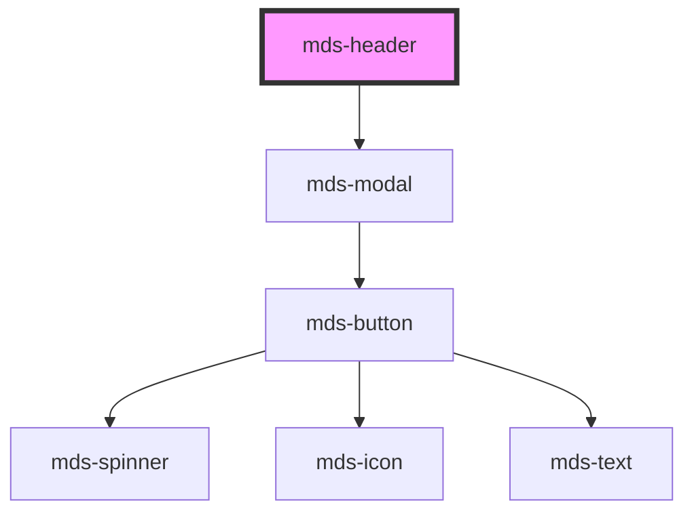

# mds-header


This is a web-component from Maggioli Design System [Magma](https://magma.maggiolicloud.it), built with StencilJS, TypeScript, Storybook. It's based on the web-component standard and it's designed to be agnostic from the JavaScript framework you are using.

<!-- Auto Generated Below -->


## Usage

### 1. Description

The `<mds-header>` web component is the top-level page header container of the Magma Design System. It is a compound parent that wraps one or more `<mds-header-bar>` elements, orchestrating their scroll-driven appearance, auto-hide visibility, and an optional mobile menu rendered as a side modal.

#### Semantic Behavior

- **Compound parent**: Hosts `<mds-header-bar>` children in the default slot and relays its `menu` and `nav` settings down to the bar.
- **Mobile menu**: A `[slot="menu"]` child is rendered inside a right-positioned modal; when absent, the bar's menu mode is forced to `'none'`.
- **Open/close control**: The menu modal is opened programmatically via the `setOpened()` method; closing it emits `mdsHeaderClose` (with the bound bar).
- **Scroll-driven appearance**: When `appearanceSet` defines a threshold, `appearance` swaps between its initial and changed values as the page scrolls past the configured pixel threshold.
- **Auto-hide on scroll**: When `autoHide` is set, scrolling down past that pixel offset hides the bar and scrolling up reveals it again, governed by `threshold` as the directional margin.
- **Visibility event**: Any change to `visibility` (`'visible'`/`'hidden'`) emits `mdsHeaderVisibilityChange`.

#### Properties & Visual Configurations

- **`appearance`** is the bar's current visual mode (`'stripe'` or `'inline'`) and is mutable because the component rewrites it as the page scrolls.
- **`appearanceSet`** is a space/comma-separated string declaring scroll behavior as three tokens: initial appearance, changed appearance, and the `scrollY` pixel threshold (e.g. `"stripe, inline 200"`). Use it instead of `appearance` when the header should transform on scroll; `appearance` alone keeps a fixed look.
- **`autoHide`** is the pixel offset past which the bar starts hiding on downward scroll; leave it unset to keep the bar always present.
- **`threshold`** tunes how many pixels of opposite-direction scroll are required to flip the auto-hide state - raise it to make hide/show less twitchy.
- **`menu`** and **`nav`** select on which viewports the hamburger menu and the navigation are shown (`'all'`, `'desktop'`, `'mobile'`, `'none'`); they are relayed to the child bar.
- **`hideBackdrop`** removes the blurred backdrop layer shown behind the bar when its appearance is `'inline'`.
- **`visibility`** reflects the current shown/hidden state of the bar and can be set to force it.


### 2. Pattern

Correct and idiomatic ways to use the `<mds-header>` component, ordered from most common to most specialized. Patterns assume a working knowledge of the compound-component rules in [`docs/COMPONENTS.md`](../../../../../../docs/COMPONENTS.md) and the generic stencil rules in [`projects/stencil/SPEC.md`](../../../../SPEC.md).

#### Minimal Header with Navigation Bar

The default form. Place exactly one `<mds-header-bar>` in the default slot. The bar receives the `menu` and `nav` breakpoint settings from the parent automatically.

```html
<mds-header>
  <mds-header-bar>
    <mds-img class="w-800" src="/logo.svg" alt="Logo"></mds-img>
    <mds-button slot="nav" label="Accedi" variant="dark" tone="outline"></mds-button>
    <mds-button slot="nav" label="Registrati" variant="primary" tone="strong"></mds-button>
  </mds-header-bar>
</mds-header>
```

#### Mobile Menu via the `menu` Slot

Provide a `[slot="menu"]` child to enable the hamburger-triggered side modal. When this slot is filled, the mobile menu icon is shown according to the `menu` breakpoint prop; when absent, `menu` is forced to `'none'` automatically.

```html
<mds-header menu="mobile">
  <mds-header-bar>
    <mds-img class="w-800" src="/logo.svg" alt="Logo"></mds-img>
    <mds-button slot="nav" label="Accedi" variant="dark" tone="outline"></mds-button>
  </mds-header-bar>

  <div slot="menu">
    <div class="p-600">
      <mds-button label="Accedi" variant="dark" tone="outline"></mds-button>
      <mds-button label="Registrati" variant="primary" tone="strong"></mds-button>
    </div>
  </div>
</mds-header>
```

#### Inline Appearance (Floating Bar)

Set `appearance="inline"` to detach the bar from the top edge and give it a rounded, floating look. A blurred backdrop is shown by default; add `hide-backdrop` to remove it.

```html
<mds-header appearance="inline">
  <mds-header-bar>
    <mds-img class="w-800" src="/logo.svg" alt="Logo"></mds-img>
    <mds-button slot="nav" label="Accedi" variant="dark" tone="outline"></mds-button>
  </mds-header-bar>
</mds-header>
```

#### Scroll-Driven Appearance Change via `appearance-set`

Use `appearance-set` to declare an initial appearance, a changed appearance, and a scroll threshold in pixels. The component swaps `appearance` automatically as the page scrolls past the threshold - no JavaScript needed. Do not combine `appearance-set` with manual writes to `appearance`.

```html
<!-- Starts inline (floating), switches to stripe (full-width) after 300 px of scroll -->
<mds-header appearance-set="inline, stripe 300" appearance="inline">
  <mds-header-bar>
    <mds-img class="w-800" src="/logo.svg" alt="Logo"></mds-img>
  </mds-header-bar>
</mds-header>
```

#### Auto-Hide on Downward Scroll

Set `auto-hide` to the pixel offset at which the bar should start hiding when the user scrolls down. The bar reappears when the user scrolls back up. Use `threshold` (default `1`) to control how many pixels of reverse-scroll are required before the bar snaps back - raise it to reduce twitchiness.

```html
<mds-header auto-hide="300" threshold="10">
  <mds-header-bar>
    <mds-img class="w-800" src="/logo.svg" alt="Logo"></mds-img>
    <mds-button slot="nav" label="Accedi" variant="dark" tone="outline"></mds-button>
  </mds-header-bar>
</mds-header>
```

#### Controlling Menu and Nav Breakpoints

`menu` controls on which viewports the hamburger icon is visible; `nav` controls on which viewports the inline navigation is visible. Both accept `'all'`, `'desktop'`, `'mobile'`, or `'none'`.

```html
<!-- Hamburger shown on all screen sizes; inline nav shown only on desktop -->
<mds-header menu="all" nav="desktop">
  <mds-header-bar>
    <mds-img class="w-800" src="/logo.svg" alt="Logo"></mds-img>
    <mds-button slot="nav" label="Accedi" variant="dark" tone="outline"></mds-button>
  </mds-header-bar>

  <div slot="menu">
    <div class="p-600">
      <mds-button label="Accedi" variant="dark" tone="outline"></mds-button>
    </div>
  </div>
</mds-header>
```

#### Reacting to Visibility Changes

Listen for `mdsHeaderVisibilityChange` to know when the bar is hidden or shown by auto-hide. The event detail carries a `visibility` boolean.

```html
<mds-header auto-hide="200" id="siteHeader">
  <mds-header-bar>
    <mds-img class="w-800" src="/logo.svg" alt="Logo"></mds-img>
  </mds-header-bar>
</mds-header>

<script>
  document.getElementById('siteHeader').addEventListener('mdsHeaderVisibilityChange', (e) => {
    console.log('header visibile:', e.detail.visibility);
  });
</script>
```

#### Reacting to Mobile Menu Close

Listen for `mdsHeaderClose` to run cleanup logic when the side modal is dismissed. The event detail carries the bound `<mds-header-bar>` reference.

```html
<mds-header id="siteHeader">
  <mds-header-bar>
    <mds-img class="w-800" src="/logo.svg" alt="Logo"></mds-img>
  </mds-header-bar>
  <div slot="menu">
    <mds-button label="Accedi" variant="dark" tone="outline"></mds-button>
  </div>
</mds-header>

<script>
  document.getElementById('siteHeader').addEventListener('mdsHeaderClose', (e) => {
    console.log('menu chiuso, bar:', e.detail.bar);
  });
</script>
```

#### Programmatic Open/Close via `setOpened()`

Use the `setOpened()` method to open or close the mobile menu from JavaScript - for example after a navigation event inside the menu panel.

```html
<mds-header id="siteHeader">
  <mds-header-bar>
    <mds-img class="w-800" src="/logo.svg" alt="Logo"></mds-img>
  </mds-header-bar>
  <div slot="menu">
    <mds-button label="Vai alla home" id="homeBtn" variant="primary" tone="strong"></mds-button>
  </div>
</mds-header>

<script>
  document.getElementById('homeBtn').addEventListener('click', async () => {
    window.location.href = '/';
    await document.getElementById('siteHeader').setOpened(false);
  });
</script>
```

#### Styling Customization

Customize the header through its documented `--mds-header-*` CSS custom properties. Use Magma color tokens via `rgb(var(--<token>))` so dark mode and high-contrast continue to work.

```css
mds-header {
  --mds-header-color: rgb(var(--tone-neutral));
  --mds-header-icon-color: rgb(var(--variant-primary-03));
  --mds-header-z-index: 200;
}

/* Inline appearance: wider floating margin on desktop */
mds-header[appearance='inline'] {
  --mds-header-inline-margin: 2rem;
  --mds-header-backdrop-blur-strength: 4px;
}
```


### 3. Antipattern

Common incorrect uses of `<mds-header>`. Each entry pairs the wrong form with the right one and a one-line reason. System-wide rules (boolean-as-string, shadow piercing, Tailwind color utilities, raw native event listening) live in [`docs/COMPONENTS.md`](../../../../../../docs/COMPONENTS.md#system-level-anti-patterns) - they apply here too but are not repeated.

#### Do Not Place `<mds-header-bar>` Outside `<mds-header>`

`<mds-header-bar>` is a compound child; it must be a direct slot child of `<mds-header>`, which relays breakpoint and appearance state down to it. Using the bar standalone breaks that communication and leaves `menu`, `nav`, and auto-hide inoperative.

```html
<!-- 🚫 INCORRECT -->
<mds-header-bar>
  <mds-img src="/logo.svg" alt="Logo"></mds-img>
</mds-header-bar>

<!-- ✅ CORRECT -->
<mds-header>
  <mds-header-bar>
    <mds-img src="/logo.svg" alt="Logo"></mds-img>
  </mds-header-bar>
</mds-header>
```

#### Do Not Drive Scroll Appearance with JavaScript When `appearance-set` Is Available

Manually toggling `appearance` on a scroll listener duplicates what `appearance-set` already handles declaratively and risks conflicts with the component's own watcher.

```html
<!-- 🚫 INCORRECT -->
<mds-header id="hdr" appearance="inline">
  <mds-header-bar>...</mds-header-bar>
</mds-header>
<script>
  window.addEventListener('scroll', () => {
    document.getElementById('hdr').appearance = window.scrollY > 300 ? 'stripe' : 'inline';
  });
</script>

<!-- ✅ CORRECT -->
<mds-header appearance-set="inline, stripe 300" appearance="inline">
  <mds-header-bar>...</mds-header-bar>
</mds-header>
```

#### Do Not Omit the `menu` Slot When Providing a Hamburger-Only Nav

If no `[slot="menu"]` child is present, the component forces `menu="none"` on the bar, so the hamburger icon never appears regardless of the `menu` prop. Always provide menu content when you want the mobile toggle to be visible.

```html
<!-- 🚫 INCORRECT: hamburger icon will never show -->
<mds-header menu="mobile">
  <mds-header-bar>
    <mds-img src="/logo.svg" alt="Logo"></mds-img>
    <mds-button slot="nav" label="Accedi" variant="dark" tone="outline"></mds-button>
  </mds-header-bar>
</mds-header>

<!-- ✅ CORRECT -->
<mds-header menu="mobile">
  <mds-header-bar>
    <mds-img src="/logo.svg" alt="Logo"></mds-img>
    <mds-button slot="nav" label="Accedi" variant="dark" tone="outline"></mds-button>
  </mds-header-bar>
  <div slot="menu">
    <mds-button label="Accedi" variant="dark" tone="outline"></mds-button>
  </div>
</mds-header>
```

#### Do Not Listen to Native `scroll` Events to Detect Auto-Hide State

The component already emits `mdsHeaderVisibilityChange` when the bar flips between hidden and visible. Attaching a second `scroll` listener couples your code to the same threshold logic and risks running out of sync.

```html
<!-- 🚫 INCORRECT -->
<mds-header auto-hide="300" id="hdr">
  <mds-header-bar>...</mds-header-bar>
</mds-header>
<script>
  window.addEventListener('scroll', () => {
    const hidden = window.scrollY > 300;
    document.body.classList.toggle('header-hidden', hidden);
  });
</script>

<!-- ✅ CORRECT -->
<mds-header auto-hide="300" id="hdr">
  <mds-header-bar>...</mds-header-bar>
</mds-header>
<script>
  document.getElementById('hdr').addEventListener('mdsHeaderVisibilityChange', (e) => {
    document.body.classList.toggle('header-hidden', !e.detail.visibility);
  });
</script>
```

#### Do Not Pierce Shadow DOM to Style the Internal Modal

The side-modal container is exposed as `::part(menu)` and its colors are controllable via `--mds-header-*` CSS custom properties. Do not use `>>>`, `/deep/`, or undocumented internal selectors.

```css
/* 🚫 INCORRECT */
mds-header >>> .menu mds-modal {
  background: red;
}

/* ✅ CORRECT */
mds-header {
  --mds-header-z-index: 500;
}
mds-header::part(menu) {
  /* documented part - safe to target */
}
```


## Properties

| Property        | Attribute        | Description                                                                                                                                                                                                                                                                                                                                                     | Type                                       | Default     |
| --------------- | ---------------- | --------------------------------------------------------------------------------------------------------------------------------------------------------------------------------------------------------------------------------------------------------------------------------------------------------------------------------------------------------------- | ------------------------------------------ | ----------- |
| `appearance`    | `appearance`     | Sets the appearance of the header bar element when loaded, it can be changed depending on how `appearance-set` attribute is set                                                                                                                                                                                                                                 | `string`                                   | `'stripe'`  |
| `appearanceSet` | `appearance-set` | Sets the appearance of the header bar element depending on the scroll position you should set three different values: initial appearance, changed appearance and `window.scrollY` threshold Es: appearance-set="stripe, inline 200" means the component will start with stripe appearance that will change to inline if the page is scrolled more of 199 pixels | `string \| undefined`                      | `undefined` |
| `autoHide`      | `auto-hide`      | When the page is scrolled down, the component mds-header-bar is hidden starting from the `autoHide` attribute's value, then if the page is scrolled up it is shown again                                                                                                                                                                                        | `number \| undefined`                      | `undefined` |
| `hideBackdrop`  | `hide-backdrop`  | Hides the backdrop shown when the mds-header-bar attribute appearace is set to `inline`                                                                                                                                                                                                                                                                         | `boolean \| undefined`                     | `false`     |
| `menu`          | `menu`           | Sets the visibility type of the hamburger menu of mds-header-bar                                                                                                                                                                                                                                                                                                | `"all" \| "desktop" \| "mobile" \| "none"` | `'mobile'`  |
| `nav`           | `nav`            | Sets the visibility type of the navigation menu of mds-header-bar                                                                                                                                                                                                                                                                                               | `"all" \| "desktop" \| "mobile" \| "none"` | `'desktop'` |
| `threshold`     | `threshold`      | Sets the threshold margin to trigger hide or show status of the `mds-header-bar` when the page is scrolled                                                                                                                                                                                                                                                      | `number`                                   | `1`         |
| `visibility`    | `visibility`     | Sets the visibility type of the navigation menu of mds-header-bar                                                                                                                                                                                                                                                                                               | `"hidden" \| "visible" \| undefined`       | `'visible'` |


## Events

| Event                       | Description                                                | Type                                          |
| --------------------------- | ---------------------------------------------------------- | --------------------------------------------- |
| `mdsHeaderClose`            | Emits when the component is closed                         | `CustomEvent<MdsHeaderEventDetail>`           |
| `mdsHeaderVisibilityChange` | Emits when the component mds-header-bar is shown or hidden | `CustomEvent<MdsHeaderVisibilityEventDetail>` |


## Methods

### `setOpened(isOpened?: boolean) => Promise<void>`

Opens or closes the header.

#### Parameters

| Name       | Type      | Description                         |
| ---------- | --------- | ----------------------------------- |
| `isOpened` | `boolean` | whether the header should be opened |

#### Returns

Type: `Promise<void>`


## Slots

| Slot     | Description                                                                                                                        |
| -------- | ---------------------------------------------------------------------------------------------------------------------------------- |
|          | Add `mds-header-bar` element/s.                                                                                                    |
| `"menu"` | Put actions and other contents that will be shown as mobile menu. Add `text string`, `HTML elements` or `components` to this slot. |


## Shadow Parts

| Part     | Description                        |
| -------- | ---------------------------------- |
| `"menu"` | The container element of the modal |


## CSS Custom Properties

| Name                                       | Description                                                                                                                                                                              |
| ------------------------------------------ | ---------------------------------------------------------------------------------------------------------------------------------------------------------------------------------------- |
| `--mds-header-backdrop-background-image`   | Sets the background-image of the backdrop element visibile when the component attribute `appearance` is set to `inline`, by default is shown when mds-pref-consumtion is set to `medium` |
| `--mds-header-backdrop-blur-strength`      | Sets the blur strength of the backdrop element visibile when the component attribute `appearance` is set to `inline`, by default is shown when mds-pref-consumtion is set to `high`      |
| `--mds-header-backdrop-height`             | Sets the height of the backdrop element visibile when the component attribute `appearance` is set to `inline`                                                                            |
| `--mds-header-backdrop-show`               | Sets if the backdrop element is visible or not, only visible when the component attribute `appearance` is set to `inline`                                                                |
| `--mds-header-color`                       | Sets the text color of the header and the mobile toggler icon                                                                                                                            |
| `--mds-header-hidden-bar-translate-inline` | Sets translateY value for the appearance inline `mds-header-bar` element                                                                                                                 |
| `--mds-header-hidden-bar-translate-stripe` | Sets translateY value for the appearance stripe `mds-header-bar` element                                                                                                                 |
| `--mds-header-icon-color`                  | Sets the color of the icon toggler                                                                                                                                                       |
| `--mds-header-inline-margin`               | Sets inline margin of `the mds-header-bar` when attribute `appearance` is set to `inline`                                                                                                |
| `--mds-header-inline-margin-mobile`        | Sets inline margin on mobile viewport of `the mds-header-bar` when attribute `appearance` is set to `inline`                                                                             |
| `--mds-header-z-index`                     | Sets the z-index of the modal                                                                                                                                                            |


## Dependencies

### Depends on

- [mds-modal](../mds-modal)

### Graph


----------------------------------------------

Built with love @ [Gruppo Maggioli](https://www.maggioli.com) from [R&D Department](https://www.maggioli.com/it-it/chi-siamo/ricerca-sviluppo)
