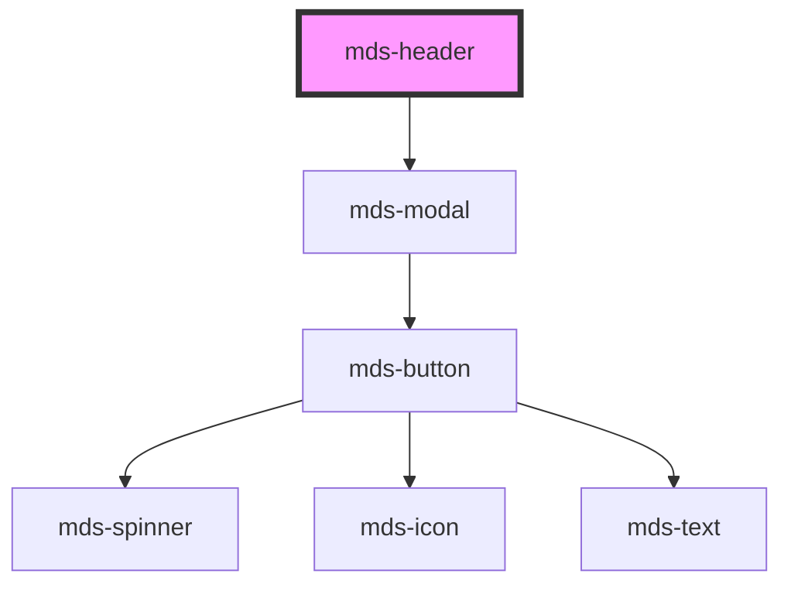

# mds-header

This is a web-component from Maggioli Design System [Magma](https://magma.maggiolicloud.it), built with StencilJS, TypeScript, Storybook. It's based on the web-component standard and it's designed to be agnostic from the JavaScirpt framework you are using.

<!-- Auto Generated Below -->

## Properties

| Property | Attribute | Description                                                       | Type                                       | Default     |
| -------- | --------- | ----------------------------------------------------------------- | ------------------------------------------ | ----------- |
| `menu`   | `menu`    | Sets the visibility type of the hamburger menu of mds-header-bar  | `"all" \| "desktop" \| "mobile" \| "none"` | `'mobile'`  |
| `nav`    | `nav`     | Sets the visibility type of the navigation menu of mds-header-bar | `"all" \| "desktop" \| "mobile" \| "none"` | `'desktop'` |

## Events

| Event            | Description                        | Type                                |
| ---------------- | ---------------------------------- | ----------------------------------- |
| `mdsHeaderClose` | Emits when the component is closed | `CustomEvent<MdsHeaderEventDetail>` |

## Slots

| Slot        | Description                                                                                                                        |
| ----------- | ---------------------------------------------------------------------------------------------------------------------------------- |
| `"default"` | Add `mds-header-bar` element/s.                                                                                                    |
| `"menu"`    | Put actions and other contents that will be shown as mobile menu. Add `text string`, `HTML elements` or `components` to this slot. |

## Shadow Parts

| Part     | Description                        |
| -------- | ---------------------------------- |
| `"menu"` | The container element of the modal |

## Dependencies

### Depends on

- [mds-modal](../mds-modal)

### Graph

----------------------------------------------

Built with love @ [Gruppo Maggioli](https://www.maggioli.com) from [R&D Department](https://www.maggioli.com/it-it/chi-siamo/ricerca-sviluppo)
