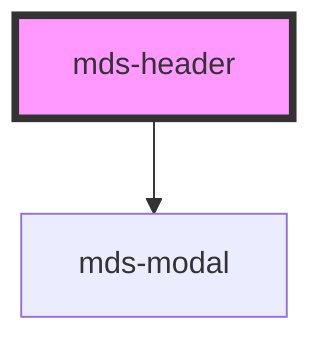

# mds-header

<!-- Auto Generated Below -->

## Properties

| Property | Attribute | Description                                                       | Type                                       | Default     |
| -------- | --------- | ----------------------------------------------------------------- | ------------------------------------------ | ----------- |
| `menu`   | `menu`    | Sets the visibility type of the hamburger menu of mds-header-bar  | `"all" \| "desktop" \| "mobile" \| "none"` | `'mobile'`  |
| `nav`    | `nav`     | Sets the visibility type of the navigation menu of mds-header-bar | `"all" \| "desktop" \| "mobile" \| "none"` | `'desktop'` |

## Events

| Event            | Description                        | Type                                |
| ---------------- | ---------------------------------- | ----------------------------------- |
| `mdsHeaderClose` | Emits when the component is closed | `CustomEvent<MdsHeaderEventDetail>` |

## Slots

| Slot        | Description                                                                                                                        |
| ----------- | ---------------------------------------------------------------------------------------------------------------------------------- |
| `"default"` | Add `mds-header-bar` element/s.                                                                                                    |
| `"menu"`    | Put actions and other contents that will be shown as mobile menu. Add `text string`, `HTML elements` or `components` to this slot. |

## Shadow Parts

| Part     | Description                        |
| -------- | ---------------------------------- |
| `"menu"` | The container element of the modal |

## CSS Custom Properties

| Name                      | Description                                                   |
| ------------------------- | ------------------------------------------------------------- |
| `--mds-header-color`      | Sets the text color of the header and the mobile toggler icon |
| `--mds-header-icon-color` | Sets the color of the icon toggler                            |
| `--mds-header-z-index`    | Sets the z-index of the modal                                 |

## Dependencies

### Depends on

- [mds-modal](../mds-modal)

### Graph

----------------------------------------------

Built with love @ **Maggioli Informatica / R&D Department**
