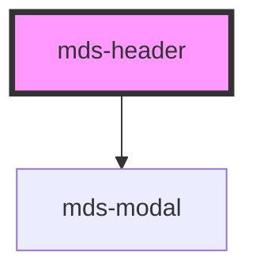

# mds-header

<!-- Auto Generated Below -->

## Events

| Event            | Description                        | Type                                |
| ---------------- | ---------------------------------- | ----------------------------------- |
| `mdsHeaderClose` | Emits when the component is closed | `CustomEvent<MdsHeaderEventDetail>` |

## Slots

| Slot           | Description                                                                                                                        |
| -------------- | ---------------------------------------------------------------------------------------------------------------------------------- |
| `"default"`    | Add `mds-header-bar` element/s.                                                                                                    |
| `"nav-mobile"` | Put actions and other contents that will be shown as mobile menu. Add `text string`, `HTML elements` or `components` to this slot. |

## Dependencies

### Depends on

- [mds-modal](../mds-modal)

### Graph

----------------------------------------------

Built with love @ **Maggioli Informatica / R&D Department**
