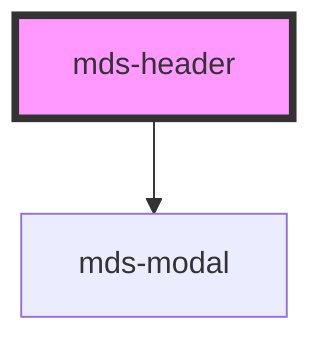

# mds-header

<!-- Auto Generated Below -->

## Events

| Event          | Description                        | Type                |
| -------------- | ---------------------------------- | ------------------- |
| `headerClosed` | Emits when the component is closed | `CustomEvent<void>` |

## CSS Custom Properties

| Name                      | Description                                                   |
| ------------------------- | ------------------------------------------------------------- |
| `--mds-header-color`      | Sets the text color of the header and the mobile toggler icon |
| `--mds-header-icon-color` | Sets the color of the icon toggler                            |
| `--mds-header-z-index`    | Sets the z-index of the modal                                 |

## Dependencies

### Depends on

- [mds-modal](../mds-modal)

### Graph

----------------------------------------------

Built with love @ **Maggioli Informatica / R&D Department**
