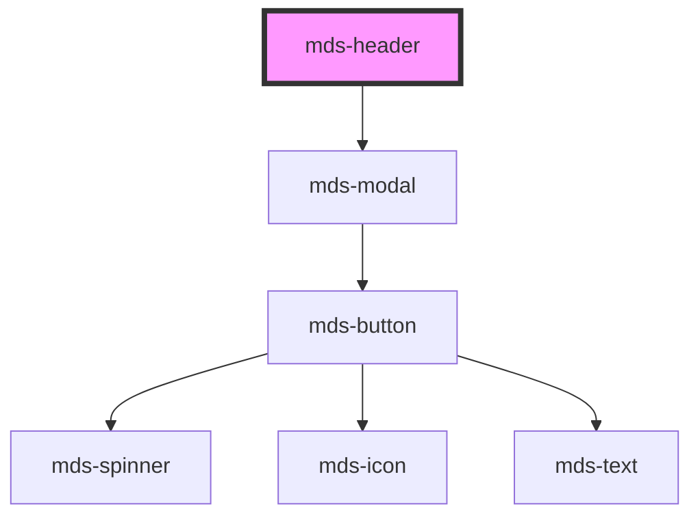

# mds-header

This is a web-component from Maggioli Design System [Magma](https://magma.maggiolicloud.it), built with StencilJS, TypeScript, Storybook. It's based on the web-component standard and it's designed to be agnostic from the JavaScript framework you are using.

<!-- Auto Generated Below -->

## Properties

| Property        | Attribute        | Description                                                                                                                                                                                                                                                                                                                                                     | Type                                       | Default     |
| --------------- | ---------------- | --------------------------------------------------------------------------------------------------------------------------------------------------------------------------------------------------------------------------------------------------------------------------------------------------------------------------------------------------------------- | ------------------------------------------ | ----------- |
| `appearance`    | `appearance`     | Sets the appearance of the header bar element when loaded, it can be changed depending on how `appearance-set` attribute is set                                                                                                                                                                                                                                 | `string`                                   | `'stripe'`  |
| `appearanceSet` | `appearance-set` | Sets the appearance of the header bar element depending on the scroll position you should set three different values: initial appearance, changed appearance and `window.scrollY` threshold Es: appearance-set="stripe, inline 200" means the component will start with stripe appearance that will change to inline if the page is scrolled more of 199 pixels | `string \| undefined`                      | `undefined` |
| `autoHide`      | `auto-hide`      | When the page is scrolled down, the component mds-header-bar is hidden starting from the `autoHide` attribute's value, then if the page is scrolled up it is shown again                                                                                                                                                                                        | `number \| undefined`                      | `undefined` |
| `backdrop`      | `backdrop`       | Sets if the backdrop is shown when the mds-header-bar attribute appearace is set to `inline`                                                                                                                                                                                                                                                                    | `boolean \| undefined`                     | `true`      |
| `menu`          | `menu`           | Sets the visibility type of the hamburger menu of mds-header-bar                                                                                                                                                                                                                                                                                                | `"all" \| "desktop" \| "mobile" \| "none"` | `'mobile'`  |
| `nav`           | `nav`            | Sets the visibility type of the navigation menu of mds-header-bar                                                                                                                                                                                                                                                                                               | `"all" \| "desktop" \| "mobile" \| "none"` | `'desktop'` |
| `threshold`     | `threshold`      | Sets the threshold margin to trigger hide or show status of the `mds-header-bar` when the page is scrolled                                                                                                                                                                                                                                                      | `number`                                   | `1`         |
| `visibility`    | `visibility`     | Sets the visibility type of the navigation menu of mds-header-bar                                                                                                                                                                                                                                                                                               | `"hidden" \| "visible" \| undefined`       | `'visible'` |

## Events

| Event                       | Description                                                | Type                                          |
| --------------------------- | ---------------------------------------------------------- | --------------------------------------------- |
| `mdsHeaderClose`            | Emits when the component is closed                         | `CustomEvent<MdsHeaderEventDetail>`           |
| `mdsHeaderVisibilityChange` | Emits when the component mds-header-bar is shown or hidden | `CustomEvent<MdsHeaderVisibilityEventDetail>` |

## Methods

### `setOpened(isOpened?: boolean) => Promise<void>`

#### Parameters

| Name       | Type      | Description |
| ---------- | --------- | ----------- |
| `isOpened` | `boolean` |             |

#### Returns

Type: `Promise<void>`

## Slots

| Slot        | Description                                                                                                                        |
| ----------- | ---------------------------------------------------------------------------------------------------------------------------------- |
| `"default"` | Add `mds-header-bar` element/s.                                                                                                    |
| `"menu"`    | Put actions and other contents that will be shown as mobile menu. Add `text string`, `HTML elements` or `components` to this slot. |

## Shadow Parts

| Part     | Description                        |
| -------- | ---------------------------------- |
| `"menu"` | The container element of the modal |

## CSS Custom Properties

| Name                                       | Description                                                                                                                                                                              |
| ------------------------------------------ | ---------------------------------------------------------------------------------------------------------------------------------------------------------------------------------------- |
| `--mds-header-backdrop-background-image`   | Sets the background-image of the backdrop element visibile when the component attribute `appearance` is set to `inline`, by default is shown when mds-pref-consumtion is set to `medium` |
| `--mds-header-backdrop-blur-strength`      | Sets the blur strength of the backdrop element visibile when the component attribute `appearance` is set to `inline`, by default is shown when mds-pref-consumtion is set to `high`      |
| `--mds-header-backdrop-filter`             | Sets the backdrop-filter of the backdrop element visibile when the component attribute `appearance` is set to `inline`, by default is shown when mds-pref-consumtion is set to `high`    |
| `--mds-header-backdrop-height`             | Sets the height of the backdrop element visibile when the component attribute `appearance` is set to `inline`                                                                            |
| `--mds-header-backdrop-show`               | Sets if the backdrop element is visible or not, only visible when the component attribute `appearance` is set to `inline`                                                                |
| `--mds-header-color`                       | Sets the text color of the header and the mobile toggler icon                                                                                                                            |
| `--mds-header-hidden-bar-translate-inline` | Sets translateY value for the appearance inline `mds-header-bar` element                                                                                                                 |
| `--mds-header-hidden-bar-translate-stripe` | Sets translateY value for the appearance stripe `mds-header-bar` element                                                                                                                 |
| `--mds-header-icon-color`                  | Sets the color of the icon toggler                                                                                                                                                       |
| `--mds-header-inline-margin`               | Sets inline margin of `the mds-header-bar` when attribute `appearance` is set to `inline`                                                                                                |
| `--mds-header-inline-margin-mobile`        | Sets inline margin on mobile viewport of `the mds-header-bar` when attribute `appearance` is set to `inline`                                                                             |
| `--mds-header-z-index`                     | Sets the z-index of the modal                                                                                                                                                            |

## Dependencies

### Depends on

- [mds-modal](../mds-modal)

### Graph

----------------------------------------------

Built with love @ [Gruppo Maggioli](https://www.maggioli.com) from [R&D Department](https://www.maggioli.com/it-it/chi-siamo/ricerca-sviluppo)
