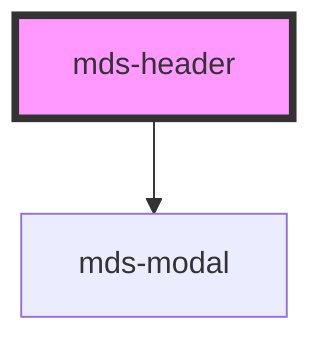

# mds-header

<!-- Auto Generated Below -->

## Events

| Event            | Description                        | Type                                |
| ---------------- | ---------------------------------- | ----------------------------------- |
| `mdsHeaderClose` | Emits when the component is closed | `CustomEvent<MdsHeaderEventDetail>` |

## Dependencies

### Depends on

- [mds-modal](../mds-modal)

### Graph

----------------------------------------------

Built with love @ **Maggioli Informatica / R&D Department**
