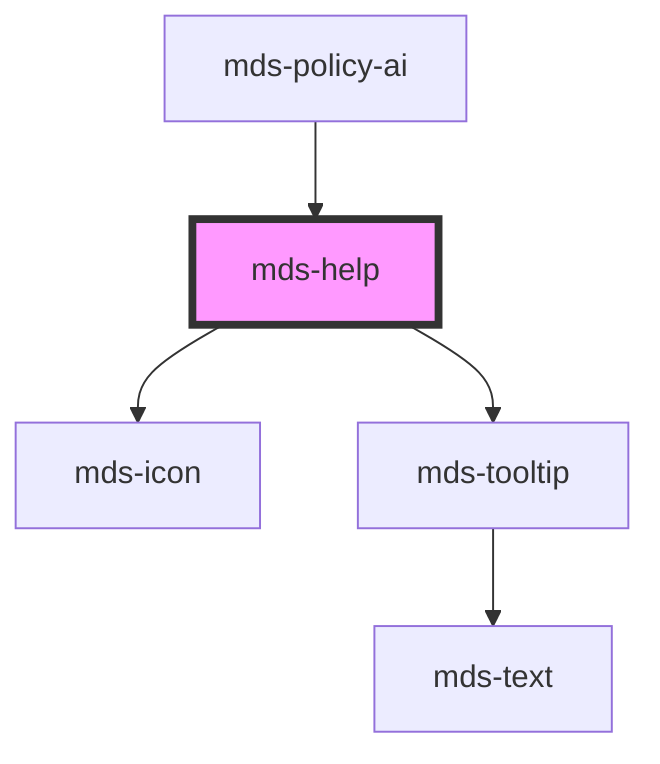

# mds-help

This component does not have shadow DOM enabled.

This is a web-component from Maggioli Design System [Magma](https://magma.maggiolicloud.it), built with StencilJS, TypeScript, Storybook. It's based on the web-component standard and it's designed to be agnostic from the JavaScript framework you are using.

<!-- Auto Generated Below -->


## Usage

### 1. Description

The `<mds-help>` web component is a contextual help affordance of the Magma Design System: a small help icon that reveals an explanatory tooltip on interaction. It composes [`mds-icon`](../../mds-icon) and [`mds-tooltip`](../../mds-tooltip) into a single drop-in element, so there is no native HTML primitive it replaces.

#### Semantic Behavior

- **Tooltip-on-icon**: The host always renders a help icon and anchors a tooltip to it; the slotted text becomes the tooltip body and is shown on hover/focus of the icon.
- **Auto-placement**: With `autoPlacement` enabled (the default), the tooltip repositions itself to stay near its caller and within the viewport, overriding the static `placement` when space is constrained.
- **Default-slot is text**: The default slot is intended for a plain text string only; HTML elements or components in the slot are discouraged because the content is rendered inside the tooltip.

#### Properties & Visual Configurations

- **`icon`** is an SVG filename slug from the Magma icon library; when omitted, the component falls back to the standard outline help glyph, so set it only to convey a help affordance other than the default question mark.
- **`placement`** sets the preferred side of the icon on which the tooltip appears (e.g. `'top'`, `'bottom-start'`). It is the starting position; `autoPlacement` may move the tooltip away from this preference at runtime.
- **`autoPlacement`** toggles dynamic repositioning. Keep it enabled in scrollable or edge-of-viewport contexts; disable it only when you need the tooltip pinned strictly to the `placement` side.

The tooltip's dimensions and reveal timing are tuned via the CSS custom properties documented in [`readme.md`](../readme.md) (`--mds-help-tooltip-width`, `--mds-help-tooltip-min-width`, `--mds-help-tooltip-max-width`, `--mds-help-tooltip-delay`).


### 2. Pattern

Correct and idiomatic ways to use the `<mds-help>` component, ordered from most common to most specialized. Patterns assume a working knowledge of the variant / tone ladders documented in [`docs/COMPONENTS.md`](../../../../../../docs/COMPONENTS.md) and the generic stencil rules in [`projects/stencil/SPEC.md`](../../../../SPEC.md).

#### Basic Inline Help

The canonical form. Drop `<mds-help>` inline next to a label or piece of text and slot in a plain string explaining the concept. The tooltip appears on hover or focus of the help icon.

```html
<mds-text>
  Periodo di fatturazione
  <mds-help>Il ciclo di fatturazione inizia il primo giorno del mese e termina l'ultimo.</mds-help>
</mds-text>
```

#### Placement Preference

Use the `placement` prop to suggest a preferred side for the tooltip. The default is `top`; change it when the element sits near a viewport edge.

```html
<!-- Default: tooltip above the icon -->
<mds-help placement="top">Inserire il codice fiscale a 16 caratteri.</mds-help>

<!-- Tooltip to the right, useful for left-aligned form labels -->
<mds-help placement="right">Il campo e' obbligatorio per la registrazione.</mds-help>

<!-- Tooltip below, e.g. inside a sticky header bar -->
<mds-help placement="bottom">Clicca per espandere il pannello dei filtri.</mds-help>
```

#### Disabling Auto-Placement

`autoPlacement` is enabled by default and overrides `placement` when space is constrained. Disable it only when you need the tooltip pinned strictly to one side - for example in a fixed overlay where you control the available space. In plain HTML, omit the attribute entirely to turn it off; in a framework binding, set the prop to `undefined`.

```html
<!-- Omit the attribute to disable auto-placement and pin the tooltip to placement="bottom" -->
<mds-help placement="bottom">
  Questa descrizione deve sempre apparire in basso.
</mds-help>
```

#### Custom Icon

Override the default question-mark glyph with any slug from the Magma icon library by setting the `icon` prop. Use this to match a specific visual context - for example a warning glyph when the help text explains a potentially destructive action.

```html
<mds-help icon="mi/baseline/info">
  Questa operazione puo' richiedere alcuni minuti.
</mds-help>

<mds-help icon="mi/baseline/warning">
  Attenzione: la modifica sara' applicata a tutti i documenti selezionati.
</mds-help>
```

#### Tooltip Width Customization

Control the tooltip dimensions with `--mds-help-tooltip-width`, `--mds-help-tooltip-min-width`, and `--mds-help-tooltip-max-width`. Useful when the help text is very short (narrow the tooltip) or contains several sentences (widen it).

```css
/* Wider tooltip for a multi-sentence explanation */
.configurazione-avanzata mds-help {
  --mds-help-tooltip-max-width: 480px;
  --mds-help-tooltip-min-width: 300px;
}

/* Narrow tooltip for a short label */
.campo-codice mds-help {
  --mds-help-tooltip-max-width: 180px;
  --mds-help-tooltip-min-width: 120px;
}
```

#### Reveal Delay Customization

Increase `--mds-help-tooltip-delay` to prevent accidental tooltip flicker when users move their pointer across a dense form, or decrease it for touch-primary interfaces where hover is not applicable.

```css
/* Slower reveal for dense data tables */
.tabella-dati mds-help {
  --mds-help-tooltip-delay: 0.6s;
}

/* Faster reveal in a step-by-step wizard */
.wizard-step mds-help {
  --mds-help-tooltip-delay: 0.1s;
}
```

#### Icon Part Customization

Tint the help icon to match a surrounding context using the documented `::part(icon)` surface. Keep using Magma color tokens so dark mode and high-contrast modes continue to work.

```css
/* Match the icon color to a warning banner context */
.banner-warning mds-help::part(icon) {
  fill: rgb(var(--status-warning-05));
}
```


### 3. Antipattern

Common incorrect uses of `<mds-help>`. Each entry pairs the wrong form with the right one and a one-line reason. System-wide rules (boolean-as-string, shadow piercing, Tailwind color utilities, raw native event listening) live in [`docs/COMPONENTS.md`](../../../../../../docs/COMPONENTS.md#system-level-anti-patterns) - they apply here too but are not repeated.

#### Do Not Put HTML Elements in the Default Slot

The default slot is text-only; the content is rendered inside [`mds-tooltip`](../../mds-tooltip), which expects a plain string. Nested elements or components may be stripped or break the tooltip layout.

```html
<!-- 🚫 INCORRECT -->
<mds-help>
  <strong>Attenzione:</strong> il limite massimo e' <em>100 caratteri</em>.
</mds-help>

<!-- ✅ CORRECT -->
<mds-help>Attenzione: il limite massimo e' 100 caratteri.</mds-help>
```

#### Do Not Disable Auto-Placement with a String "false"

`autoPlacement` is a boolean prop. Setting it to the string `"false"` leaves it truthy - any non-empty attribute value is truthy in HTML. Remove the attribute to disable it.

```html
<!-- 🚫 INCORRECT -->
<mds-help placement="right" auto-placement="false">
  Informazioni aggiuntive.
</mds-help>

<!-- ✅ CORRECT -->
<mds-help placement="right">
  Informazioni aggiuntive.
</mds-help>
```

#### Do Not Pierce Shadow DOM to Style the Icon

The only supported customization surface is `--mds-help-*` CSS custom properties and the documented `::part(icon)` shadow part. Targeting internal elements via `>>>` or undocumented selectors couples your code to the shadow DOM implementation.

```css
/* 🚫 INCORRECT */
mds-help >>> mds-icon {
  fill: red;
}

/* ✅ CORRECT */
mds-help::part(icon) {
  fill: rgb(var(--status-warning-05));
}
```

#### Do Not Use `<mds-help>` as a Generic Tooltip Anchor

`<mds-help>` always renders its own help icon and wraps [`mds-tooltip`](../../mds-tooltip) internally. It is not a generic popover wrapper. If you need a tooltip on an arbitrary element, use [`mds-tooltip`](../../mds-tooltip) directly with a `target` selector.

```html
<!-- 🚫 INCORRECT: slotting a custom trigger to replace the icon -->
<mds-help>
  <mds-button slot="default" label="Dettagli"></mds-button>
  Testo di spiegazione.
</mds-help>

<!-- ✅ CORRECT: use mds-tooltip with a target for a custom trigger -->
<mds-button id="info-btn" label="Dettagli"></mds-button>
<mds-tooltip target="#info-btn">Testo di spiegazione.</mds-tooltip>
```

#### Do Not Override Width with Inline Styles Instead of CSS Custom Properties

Setting `style="width: ..."` on the host bypasses the component's layout contract. Use the documented `--mds-help-tooltip-*` CSS custom properties to size the tooltip, and leave the host dimensions alone.

```html
<!-- 🚫 INCORRECT -->
<mds-help style="width: 400px;">Descrizione del campo.</mds-help>

<!-- ✅ CORRECT -->
<style>
  .sezione-avanzata mds-help {
    --mds-help-tooltip-max-width: 400px;
  }
</style>
<mds-help class="sezione-avanzata">Descrizione del campo.</mds-help>
```


## Properties

| Property        | Attribute        | Description                                                            | Type                                                                                                                                                                              | Default     |
| --------------- | ---------------- | ---------------------------------------------------------------------- | --------------------------------------------------------------------------------------------------------------------------------------------------------------------------------- | ----------- |
| `autoPlacement` | `auto-placement` | If set, the component will be placed automatically near it's caller.   | `boolean \| undefined`                                                                                                                                                            | `true`      |
| `icon`          | `icon`           | Set the name of the icon.                                              | `string \| undefined`                                                                                                                                                             | `undefined` |
| `placement`     | `placement`      | Specifies where the component should be placed relative to the caller. | `"bottom" \| "bottom-end" \| "bottom-start" \| "left" \| "left-end" \| "left-start" \| "right" \| "right-end" \| "right-start" \| "top" \| "top-end" \| "top-start" \| undefined` | `'top'`     |


## Slots

| Slot        | Description                                                                |
| ----------- | -------------------------------------------------------------------------- |
| `"default"` | Add `text string` to this slot, **avoid** `HTML elements` or `components`. |


## Shadow Parts

| Part     | Description |
| -------- | ----------- |
| `"icon"` |             |


## CSS Custom Properties

| Name                           | Description                                   |
| ------------------------------ | --------------------------------------------- |
| `--mds-help-tooltip-delay`     | The delay before the tooltip becomes visible. |
| `--mds-help-tooltip-max-width` | The maximum allowed width of the tooltip.     |
| `--mds-help-tooltip-min-width` | The minimum allowed width of the tooltip.     |
| `--mds-help-tooltip-width`     | The width of the tooltip element.             |


## Dependencies

### Used by

 - [mds-policy-ai](../mds-policy-ai)

### Depends on

- [mds-icon](../mds-icon)
- [mds-tooltip](../mds-tooltip)

### Graph


----------------------------------------------

Built with love @ [Gruppo Maggioli](https://www.maggioli.com) from [R&D Department](https://www.maggioli.com/it-it/chi-siamo/ricerca-sviluppo)
