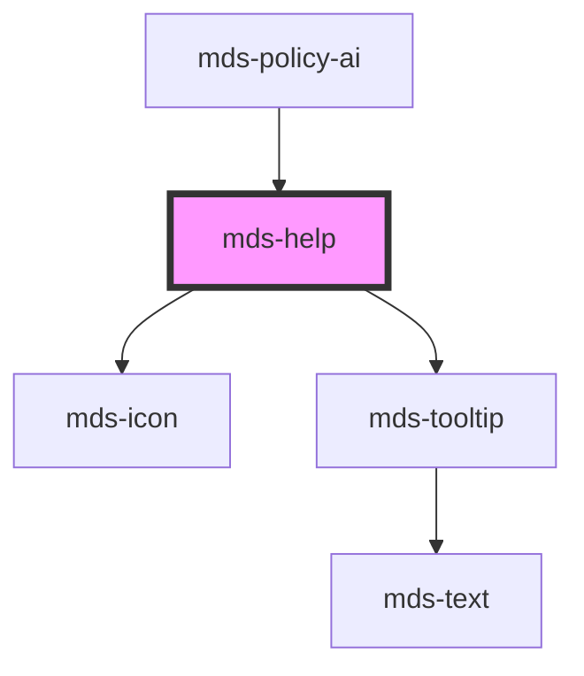

# mds-help

This component does not have shadow DOM enabled.

This is a web-component from Maggioli Design System [Magma](https://magma.maggiolicloud.it), built with StencilJS, TypeScript, Storybook. It's based on the web-component standard and it's designed to be agnostic from the JavaScript framework you are using.

<!-- Auto Generated Below -->

## Properties

| Property        | Attribute        | Description                                                            | Type                                                                                                                                                                              | Default     |
| --------------- | ---------------- | ---------------------------------------------------------------------- | --------------------------------------------------------------------------------------------------------------------------------------------------------------------------------- | ----------- |
| `autoPlacement` | `auto-placement` | If set, the component will be placed automatically near it's caller.   | `boolean \| undefined`                                                                                                                                                            | `true`      |
| `icon`          | `icon`           | Set the name of the icon.                                              | `string \| undefined`                                                                                                                                                             | `undefined` |
| `placement`     | `placement`      | Specifies where the component should be placed relative to the caller. | `"bottom" \| "bottom-end" \| "bottom-start" \| "left" \| "left-end" \| "left-start" \| "right" \| "right-end" \| "right-start" \| "top" \| "top-end" \| "top-start" \| undefined` | `'top'`     |

## Slots

| Slot        | Description                                                                |
| ----------- | -------------------------------------------------------------------------- |
| `"default"` | Add `text string` to this slot, **avoid** `HTML elements` or `components`. |

## Shadow Parts

| Part     | Description |
| -------- | ----------- |
| `"icon"` |             |

## CSS Custom Properties

| Name                           | Description                                   |
| ------------------------------ | --------------------------------------------- |
| `--mds-help-tooltip-delay`     | The delay before the tooltip becomes visible. |
| `--mds-help-tooltip-max-width` | The maximum allowed width of the tooltip.     |
| `--mds-help-tooltip-min-width` | The minimum allowed width of the tooltip.     |
| `--mds-help-tooltip-width`     | The width of the tooltip element.             |

## Dependencies

### Used by

 - [mds-policy-ai](../mds-policy-ai)

### Depends on

- [mds-icon](../mds-icon)
- [mds-tooltip](../mds-tooltip)

### Graph

----------------------------------------------

Built with love @ [Gruppo Maggioli](https://www.maggioli.com) from [R&D Department](https://www.maggioli.com/it-it/chi-siamo/ricerca-sviluppo)
