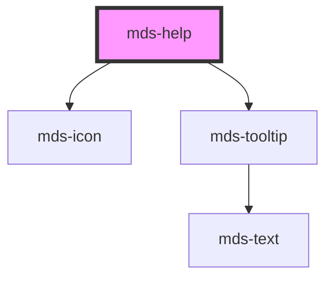

# mds-help

This component does not have shadow DOM enabled.

<!-- Auto Generated Below -->

## Properties

| Property | Attribute | Description               | Type     | Default                     |
| -------- | --------- | ------------------------- | -------- | --------------------------- |
| `icon`   | `icon`    | Set the name of the icon. | `string` | `'mi/outline/help-outline'` |

## Dependencies

### Depends on

- [mds-icon](../mds-icon)
- [mds-tooltip](../mds-tooltip)

### Graph

----------------------------------------------

Built with love @ **Maggioli Informatica / R&D Department**
