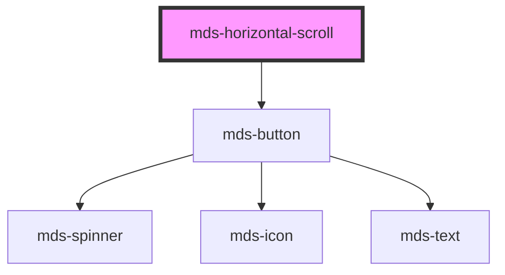

# mds-horizontal-scroll


This is a web-component from Maggioli Design System [Magma](https://magma.maggiolicloud.it), built with StencilJS, TypeScript, Storybook. It's based on the web-component standard and it's designed to be agnostic from the JavaScript framework you are using.

<!-- Auto Generated Below -->


## Usage

### 1. Description

The `<mds-horizontal-scroll>` web component is a horizontally scrolling container of the Magma Design System. It wraps any slotted content in a snap-scrolling viewport and overlays optional navigation controls, replacing the manual overflow/scroll-snap CSS plumbing you would otherwise write around a `<div>`.

#### Semantic Behavior

- **Slotted children drive scrolling**: The default slot's children are the scrollable items.
- **Navigation buttons**: When `controls` resolves to a viewport other than `'none'`, two arrow buttons are rendered; each advances the scroll position to the next/previous item not fully in the viewport.
- **Auto-disabled arrows**: The back arrow hides/disables when the first item is fully visible and the forward arrow when the last item is.
- **Position indicator**: With `navigation="position"` a proportional dot is rendered; its width reflects the visible/total ratio and it translates along its track as the container scrolls.
- **No focus or form semantics**: This is a presentational scroll container - it is not form-associated, exposes no implicit ARIA role, and emits no custom events.

#### Properties & Visual Configurations

- **`controls`** selects the largest viewport breakpoint at which the arrow navigation appears (default `'desktop'`); pick a wider tier like `'large'` or `'wide'` to show arrows only on big screens, or `'none'` to suppress them entirely. The chosen value is the threshold, not a single device.
- **`navigation`** chooses the scroll-progress affordance: `'position'` renders the translating dot indicator, `'scrollbar'` defers to the styled native browser scrollbar, and `'none'` shows neither.
- **`snap`** sets the scroll-snap alignment of each item against the viewport - `'start'` (default) aligns items to the leading edge, `'center'` keeps them centred, `'end'` to the trailing edge, and `'none'` disables snapping for free scrolling.

This component does not use the shared `variant` / `tone` ladders defined in [`projects/stencil/SPEC.md`](../../../../SPEC.md#tone-and-variant-system); appearance is tuned entirely through its CSS custom properties (see readme.md).


### 2. Pattern

Correct and idiomatic ways to use the `<mds-horizontal-scroll>` component, ordered from most common to most specialized. Patterns assume a working knowledge of the conventions in [`docs/COMPONENTS.md`](../../../../../../docs/COMPONENTS.md) and the generic stencil rules in [`projects/stencil/SPEC.md`](../../../../SPEC.md).

#### Basic Horizontal Scroll with Cards

The canonical form. Slot any fixed-width children directly into the component; it wraps them in a snap-scrolling viewport with a proportional dot indicator and arrow buttons automatically.

```html
<mds-horizontal-scroll>
  <mds-card class="min-w-[320px]">
    <mds-card-header>Servizio 1</mds-card-header>
    <mds-card-content>Descrizione del primo servizio.</mds-card-content>
  </mds-card>
  <mds-card class="min-w-[320px]">
    <mds-card-header>Servizio 2</mds-card-header>
    <mds-card-content>Descrizione del secondo servizio.</mds-card-content>
  </mds-card>
  <mds-card class="min-w-[320px]">
    <mds-card-header>Servizio 3</mds-card-header>
    <mds-card-content>Descrizione del terzo servizio.</mds-card-content>
  </mds-card>
</mds-horizontal-scroll>
```

#### Controlling Navigation Arrow Visibility

Use `controls` to restrict arrow buttons to specific viewport tiers. The value is the minimum breakpoint at which arrows appear - `'desktop'` (default) shows them only on desktop and above; `'all'` shows them at every viewport size; `'none'` suppresses them entirely.

```html
<!-- Arrows only on desktop and above (default) -->
<mds-horizontal-scroll controls="desktop">
  <!-- slotted items -->
</mds-horizontal-scroll>

<!-- Arrows on all viewports, including mobile -->
<mds-horizontal-scroll controls="all">
  <!-- slotted items -->
</mds-horizontal-scroll>

<!-- No arrows - touch / keyboard scroll only -->
<mds-horizontal-scroll controls="none">
  <!-- slotted items -->
</mds-horizontal-scroll>
```

#### Scroll Progress Indicator

Use `navigation` to choose the scroll-position affordance shown below the items. `'position'` (default) renders a proportional translating dot; `'scrollbar'` defers to the styled native browser scrollbar; `'none'` hides both.

```html
<!-- Dot indicator (default) -->
<mds-horizontal-scroll navigation="position">
  <!-- slotted items -->
</mds-horizontal-scroll>

<!-- Native scrollbar instead of dot -->
<mds-horizontal-scroll navigation="scrollbar">
  <!-- slotted items -->
</mds-horizontal-scroll>

<!-- No progress indicator -->
<mds-horizontal-scroll navigation="none">
  <!-- slotted items -->
</mds-horizontal-scroll>
```

#### Snap Alignment

`snap` controls how each item aligns to the viewport edge when the scroll settles. Use `'start'` (default) for left-aligned cards, `'center'` for centred carousels, `'end'` for right-aligned layouts, or `'none'` to allow free scrolling without snapping.

```html
<!-- Leading-edge alignment (default, most common) -->
<mds-horizontal-scroll snap="start">
  <!-- slotted items -->
</mds-horizontal-scroll>

<!-- Centred alignment - good for full-bleed hero carousels -->
<mds-horizontal-scroll snap="center">
  <!-- slotted items -->
</mds-horizontal-scroll>

<!-- Free scroll - no snapping -->
<mds-horizontal-scroll snap="none">
  <!-- slotted items -->
</mds-horizontal-scroll>
```

#### Combining Props for a Mobile-Friendly Carousel

Pair `controls="all"` with `snap="center"` and `navigation="position"` to produce a touch-and-arrow carousel that works at every breakpoint.

```html
<mds-horizontal-scroll controls="all" snap="center" navigation="position">
  <mds-card class="min-w-[280px]">
    <mds-card-media>
      <mds-img src="https://example.com/img1.jpg"></mds-img>
    </mds-card-media>
    <mds-card-content>
      <mds-text typography="h5">Categoria A</mds-text>
    </mds-card-content>
  </mds-card>
  <mds-card class="min-w-[280px]">
    <mds-card-media>
      <mds-img src="https://example.com/img2.jpg"></mds-img>
    </mds-card-media>
    <mds-card-content>
      <mds-text typography="h5">Categoria B</mds-text>
    </mds-card-content>
  </mds-card>
</mds-horizontal-scroll>
```

#### Styling Customization

Style the component only through its documented `--mds-horizontal-scroll-*` CSS custom properties. Set them on the host or a parent selector; use Magma tokens via `rgb(var(--<token>))` so dark mode and high-contrast modes keep working.

```css
.sezione-evidenza mds-horizontal-scroll {
  --mds-horizontal-scroll-background: rgb(var(--tone-neutral-09));
  --mds-horizontal-scroll-gap: var(--spacing-400);
  --mds-horizontal-scroll-dot-background: rgb(var(--variant-primary-03));
  --mds-horizontal-scroll-dot-area-background: rgb(var(--variant-primary-08));
  --mds-horizontal-scroll-max-width: 1200px;
}
```

#### Styling the Scrollbar

When `navigation="scrollbar"` is used, customize the native scrollbar appearance through the dedicated properties. All scrollbar props are browser-dependent and may have no effect on browsers that do not expose a styleable scrollbar.

```css
mds-horizontal-scroll {
  --mds-horizontal-scroll-scrollbar-size: 6px;
  --mds-horizontal-scroll-scrollbar-radius: 4px;
  --mds-horizontal-scroll-scrollbar-thumb-background: rgb(var(--variant-primary-03));
  --mds-horizontal-scroll-scrollbar-track-background: rgb(var(--tone-neutral-07));
}
```

#### Customizing the Content Part

The inner scroll container is exposed as `::part(content)`. Use it sparingly - only when a CSS custom property cannot satisfy your requirement - to apply layout overrides without piercing undocumented internals.

```css
mds-horizontal-scroll::part(content) {
  padding-block: var(--spacing-800);
}
```


### 3. Antipattern

Common incorrect uses of `<mds-horizontal-scroll>`. Each entry pairs the wrong form with the right one and a one-line reason. System-wide rules (boolean-as-string, shadow piercing, Tailwind color utilities, raw native event listening) live in [`docs/COMPONENTS.md`](../../../../../../docs/COMPONENTS.md#system-level-anti-patterns) - they apply here too but are not repeated.

#### Do Not Set `controls` to a Boolean

`controls` is a `ViewportType` string prop, not a boolean. Setting it without a value (or as `""`) coerces to a truthy string that is not a recognized viewport tier and produces undefined behavior. Always supply an explicit string value.

```html
<!-- 🚫 INCORRECT -->
<mds-horizontal-scroll controls>
  <!-- slotted items -->
</mds-horizontal-scroll>

<!-- ✅ CORRECT -->
<mds-horizontal-scroll controls="desktop">
  <!-- slotted items -->
</mds-horizontal-scroll>
```

#### Do Not Wrap Slotted Items in an Extra Div

Adding a single wrapper `<div>` around all children collapses the scroll track to one item. The component's arrow and snap logic iterates over the direct slot children - each scrollable item must be a direct child, not grandchildren inside a wrapper.

```html
<!-- 🚫 INCORRECT -->
<mds-horizontal-scroll>
  <div>
    <mds-card class="min-w-[320px]">...</mds-card>
    <mds-card class="min-w-[320px]">...</mds-card>
  </div>
</mds-horizontal-scroll>

<!-- ✅ CORRECT -->
<mds-horizontal-scroll>
  <mds-card class="min-w-[320px]">...</mds-card>
  <mds-card class="min-w-[320px]">...</mds-card>
</mds-horizontal-scroll>
```

#### Do Not Set `controls="none"` as Boolean False

`controls` has no boolean semantic. Removing arrow buttons is done with `controls="none"`, not by writing `controls="false"` or `disabled`. The string `"false"` is not a `ViewportType` and does nothing.

```html
<!-- 🚫 INCORRECT -->
<mds-horizontal-scroll controls="false">
  <!-- slotted items -->
</mds-horizontal-scroll>

<!-- ✅ CORRECT -->
<mds-horizontal-scroll controls="none">
  <!-- slotted items -->
</mds-horizontal-scroll>
```

#### Do Not Use a Raw `<div>` Scroll Container Instead

Replacing `<mds-horizontal-scroll>` with a manually styled `<div style="overflow-x: auto">` loses the managed arrow buttons, the dot indicator, scroll-snap wiring, and the `controls` breakpoint logic. Use the component.

```html
<!-- 🚫 INCORRECT -->
<div style="overflow-x: auto; display: flex; gap: 16px;">
  <mds-card class="min-w-[320px]">...</mds-card>
  <mds-card class="min-w-[320px]">...</mds-card>
</div>

<!-- ✅ CORRECT -->
<mds-horizontal-scroll>
  <mds-card class="min-w-[320px]">...</mds-card>
  <mds-card class="min-w-[320px]">...</mds-card>
</mds-horizontal-scroll>
```

#### Do Not Pierce the Shadow DOM to Style Internal Elements

The navigation buttons and dot indicator live inside the shadow DOM. Targeting them via `>>>`, `/deep/`, or undocumented class names (`.navigation`, `.dot`) will break on future releases. Use `--mds-horizontal-scroll-*` CSS custom properties instead.

```css
/* 🚫 INCORRECT */
mds-horizontal-scroll >>> .dot {
  background: red;
}
mds-horizontal-scroll >>> .navigation {
  border-radius: 0;
}

/* ✅ CORRECT */
mds-horizontal-scroll {
  --mds-horizontal-scroll-dot-background: rgb(var(--variant-primary-03));
}
mds-horizontal-scroll::part(content) {
  padding-block: var(--spacing-800);
}
```

#### Do Not Provide Slotted Items Without a Fixed Width

Slotted items without a declared width collapse to zero or stretch unpredictably. Always give direct children an explicit `min-width` or `width` so the container has measurable items to snap and scroll among.

```html
<!-- 🚫 INCORRECT: card has no fixed width, items will collapse -->
<mds-horizontal-scroll>
  <mds-card>...</mds-card>
  <mds-card>...</mds-card>
</mds-horizontal-scroll>

<!-- ✅ CORRECT: each card has a declared minimum width -->
<mds-horizontal-scroll>
  <mds-card class="min-w-[320px]">...</mds-card>
  <mds-card class="min-w-[320px]">...</mds-card>
</mds-horizontal-scroll>
```


## Properties

| Property     | Attribute    | Description                                                        | Type                                                                                             | Default      |
| ------------ | ------------ | ------------------------------------------------------------------ | ------------------------------------------------------------------------------------------------ | ------------ |
| `controls`   | `controls`   | Specifies the viewport which will display navigation controls      | `"all" \| "desktop" \| "large" \| "none" \| "tablet" \| "tv" \| "wide" \| "xlarge" \| undefined` | `'desktop'`  |
| `navigation` | `navigation` | Specifies the box’s snap position as an alignment of its snap area | `"none" \| "position" \| "scrollbar" \| undefined`                                               | `'position'` |
| `snap`       | `snap`       | Specifies the box’s snap position as an alignment of its snap area | `"center" \| "end" \| "none" \| "start" \| undefined`                                            | `'start'`    |


## Slots

| Slot        | Description                                                      |
| ----------- | ---------------------------------------------------------------- |
| `"default"` | Add `text string`, `HTML elements` or `components` to this slot. |


## Shadow Parts

| Part        | Description |
| ----------- | ----------- |
| `"content"` |             |


## CSS Custom Properties

| Name                                                 | Description                                                                                              |
| ---------------------------------------------------- | -------------------------------------------------------------------------------------------------------- |
| `--mds-horizontal-scroll-background`                 | Sets the background-color of the component                                                               |
| `--mds-horizontal-scroll-behavior`                   | Sets the scroll-behavior animation                                                                       |
| `--mds-horizontal-scroll-dot-area-background`        | Sets the dot container area color                                                                        |
| `--mds-horizontal-scroll-dot-background`             | Sets the navigation dot color                                                                            |
| `--mds-horizontal-scroll-dot-max-width`              | Sets the navigation dot max-width, if you want to avoid is scales in proportion of the container         |
| `--mds-horizontal-scroll-max-width`                  | Sets the max-width of the slotted elements container, to keep layout limited as the rest of the sections |
| `--mds-horizontal-scroll-scrollbar-margin`           | Sets the margin of the browser scroll bar (if supported)                                                 |
| `--mds-horizontal-scroll-scrollbar-radius`           | Sets the border-radius of the browser scroll bar (if supported)                                          |
| `--mds-horizontal-scroll-scrollbar-size`             | Sets the height and width of the browser scroll bar (if supported)                                       |
| `--mds-horizontal-scroll-scrollbar-thumb-background` | Sets the background-color of the browser scroll bar thumb (if supported)                                 |
| `--mds-horizontal-scroll-scrollbar-track-background` | Sets the background-color of the browser scroll bar track (if supported)                                 |


## Dependencies

### Depends on

- [mds-button](../mds-button)

### Graph


----------------------------------------------

Built with love @ [Gruppo Maggioli](https://www.maggioli.com) from [R&D Department](https://www.maggioli.com/it-it/chi-siamo/ricerca-sviluppo)
