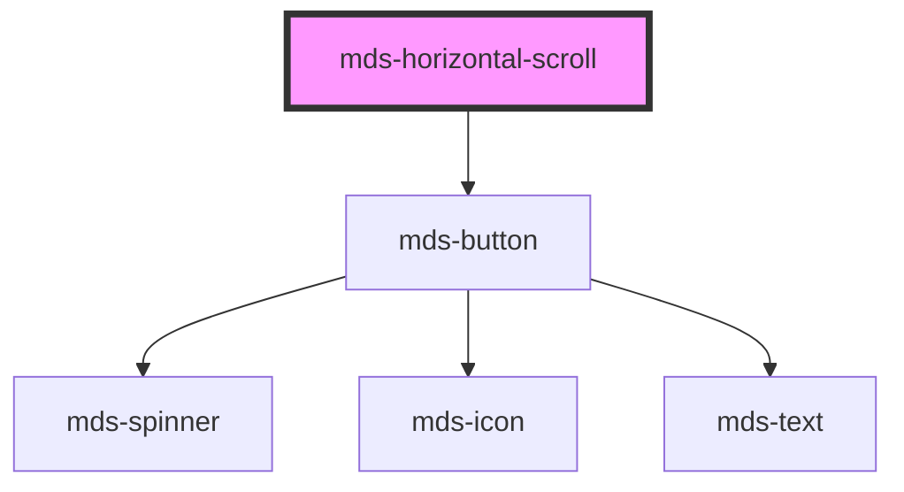

# mds-horizontal-scroll

This is a web-component from Maggioli Design System [Magma](https://magma.maggiolicloud.it), built with StencilJS, TypeScript, Storybook. It's based on the web-component standard and it's designed to be agnostic from the JavaScirpt framework you are using.

<!-- Auto Generated Below -->

## Properties

| Property    | Attribute   | Description                                                        | Type                                                                                             | Default     |
| ----------- | ----------- | ------------------------------------------------------------------ | ------------------------------------------------------------------------------------------------ | ----------- |
| `controls`  | `controls`  | Specifies the viewport which will display navigation controls      | `"all" \| "desktop" \| "large" \| "none" \| "tablet" \| "tv" \| "wide" \| "xlarge" \| undefined` | `'desktop'` |
| `scrollbar` | `scrollbar` | Specifies the box’s snap position as an alignment of its snap area | `boolean \| undefined`                                                                           | `undefined` |
| `snap`      | `snap`      | Specifies the box’s snap position as an alignment of its snap area | `"center" \| "end" \| "none" \| "start" \| undefined`                                            | `'start'`   |

## Slots

| Slot        | Description                                                      |
| ----------- | ---------------------------------------------------------------- |
| `"default"` | Add `text string`, `HTML elements` or `components` to this slot. |

## Shadow Parts

| Part        | Description |
| ----------- | ----------- |
| `"content"` |             |

## CSS Custom Properties

| Name                                                 | Description                                                              |
| ---------------------------------------------------- | ------------------------------------------------------------------------ |
| `--mds-horizontal-scroll-background`                 | Sets the background-color of the component                               |
| `--mds-horizontal-scroll-scrollbar-margin`           | Sets the margin of the browser scroll bar (if supported)                 |
| `--mds-horizontal-scroll-scrollbar-radius`           | Sets the border-radius of the browser scroll bar (if supported)          |
| `--mds-horizontal-scroll-scrollbar-size`             | Sets the height and width of the browser scroll bar (if supported)       |
| `--mds-horizontal-scroll-scrollbar-thumb-background` | Sets the background-color of the browser scroll bar thumb (if supported) |
| `--mds-horizontal-scroll-scrollbar-track-background` | Sets the background-color of the browser scroll bar track (if supported) |

## Dependencies

### Depends on

- [mds-button](../mds-button)

### Graph

----------------------------------------------

Built with love @ [Gruppo Maggioli](https://www.maggioli.com) from [R&D Department](https://www.maggioli.com/it-it/chi-siamo/ricerca-sviluppo)
