# mds-icon

## How to use

This component is intented to be used only with svg files. In order to properly work, you need  to tell the component the path to the svg file directory.

### Via `sessionStorage` (recommended)

The simplest way to instruct the component is using `window.sessionStorage.setItem('mdsIconSvgPath', <path-to-svg-directory>)`.
For example, if your svg directory is located in `assets/img/svg`, you should put the following code in your application

```javascript
window.sessionStorage.setItem('mdsIconSvgPath', 'assets/img/svg/');
```

The path to the directory is based on how the `assets` are handled by the framework you are using.

### Via `setSvgPath` stencil method

Another way would be, after you have called `defineCustomElements()` of this component, to instantiate a temporary MdsIcon DOM node element to call the `setSvgPath` class method

```javascript
const mdsIconGet = async () => {
  // Wait for the web component to be defined
  await customElements.whenDefined('mds-icon')
  // Create an instance of mds-icon
  const mdsIcon = document.createElement('mds-icon')
  // Append element to body
  document.body.appendChild(mdsIcon)
  // Check for method existance and set svg directory path
  if ('setSvgPath' in mdsIcon) {
    mdsIcon.setSvgPath('/assets/img/svg/')
  }
  // Remove element from body
  document.body.removeChild(mdsIcon)
}

mdsIconGet()
```

### Via `setSvgPathStatic` static class function

Last way to set it is by calling the static function present in the class. This is done after the `defineCustomElements()` call

```javascript
import { mds_icon } from '@maggioli-design-system/mds-icon/dist/esm/mds-icon.entry'

const mdsIconGet = async () => {
  await customElements.whenDefined('mds-icon')

  mds_icon.setSvgPathStatic('/assets/img/svg/')
}

mdsIconGet()
```

## Force icon update

In some cases it may happens that when setting the path to where the SVG are located, icons still fail to load them.

This may be caused by the instatiation of `mds-icon` component happening before the setting of the directory path.

To force the update of the icons, after you have called `window.sessionStorage` or the `mds-icon` functions, you can dispatch a global event from the window with the key `mdsIconSvgPathUpdate`

```javascript
window.dispatchEvent(new CustomEvent('mdsIconSvgPathUpdate'))
```

Once done this, the icons component already instantiated will be notified of the update and try to reload the icons.

This is a web-component from Maggioli Design System [Magma](https://magma.maggiolicloud.it), built with StencilJS, TypeScript, Storybook. It's based on the web-component standard and it's designed to be agnostic from the JavaScript framework you are using.

<!-- Auto Generated Below -->


## Usage

### 1. Description

The `<mds-icon>` web component is the single glyph primitive of the Magma Design System: it inlines an SVG into the DOM so the artwork inherits color and sizing from CSS, and it is the building block that nearly every other component (button, chip, input, banner, list-item, etc.) composes to render its iconography. It replaces a raw ``/`<svg>` tag and centralizes how icon artwork is resolved.

#### Semantic Behavior

- **Decorative by default**: The icon contributes no accessible name; meaning must come from the surrounding labelled control or text.
- **Source resolution**: `name` is interpreted three ways - a base64 `data:` SVG string is decoded inline, a raw `<svg>`/`<?xml>` markup string is used verbatim, and anything else is treated as an icon filename slug fetched from the configured SVG directory.
- **Async load**: When `name` is a slug the icon paints once the SVG arrives; a failed fetch renders empty rather than throwing.
- **Path configuration**: The SVG directory can be set imperatively via the `setSvgPath` instance method or the `setSvgPathStatic` static method; icons that mounted before the path was configured reload themselves once it is set.

#### Properties & Visual Configurations

- **`name`** is the only configurable input and is overloaded: pass an icon filename slug to pull artwork from the shared library, a base64-encoded SVG `data:` URI for inline/dynamic artwork, or a full raw SVG string when the markup is generated at runtime.

This component does not use the shared `variant` / `tone` / `size` ladders defined in [`projects/stencil/SPEC.md`](../../../../SPEC.md#tone-and-variant-system); color and dimensions are inherited from the host context via CSS (e.g. `currentColor` and font size), which is how parent components tint and scale their icons.


### 2. Pattern

Correct and idiomatic ways to use the `<mds-icon>` component, ordered from most common to most specialized. Patterns assume a working knowledge of the icon slug conventions documented in [`projects/stencil/SPEC.md`](../../../../SPEC.md) and the catalogue in [`docs/COMPONENTS.md`](../../../../../../docs/COMPONENTS.md).

#### Icon Slug from the Shared Library

The canonical form. Pass a slug string as `name`; the component fetches the matching SVG from the configured assets directory. Slugs follow the convention of the active iconsauce plugin: `mi/<variant>/<name>` for Material Icons, `mdi/<name>` for Material Design Icons, and a semantic name for the internal `mgg-icons` set.

```html
<!-- Material Icons baseline variant -->
<mds-icon name="mi/baseline/search"></mds-icon>

<!-- Material Design Icons -->
<mds-icon name="mdi/alien"></mds-icon>

<!-- Internal mgg-icons semantic slug -->
<mds-icon name="action-email-send"></mds-icon>
```

#### Configuring the SVG Base Path via sessionStorage

Set `mdsIconSvgPath` in `sessionStorage` before any `<mds-icon>` mounts. This is the recommended one-liner: every icon instance reads it on init and falls back to this key when no path has been set programmatically.

```javascript
window.sessionStorage.setItem('mdsIconSvgPath', 'assets/img/svg/');
```

#### Forcing a Reload After Late Path Configuration

If icons are already in the DOM when the SVG path is set (for example, inside a lazy-loaded module), dispatch `mdsIconSvgPathUpdate` after configuring the path. Every mounted instance listens for this event and re-fetches.

```javascript
window.sessionStorage.setItem('mdsIconSvgPath', 'assets/img/svg/');
window.dispatchEvent(new CustomEvent('mdsIconSvgPathUpdate'));
```

#### Configuring the SVG Base Path via the Instance Method

Use `setSvgPath` when the path is only known at runtime and the `sessionStorage` approach is not possible (for example, in isolated web workers or testing environments).

```javascript
await customElements.whenDefined('mds-icon');
const tmp = document.createElement('mds-icon');
document.body.appendChild(tmp);
if ('setSvgPath' in tmp) {
  tmp.setSvgPath('/assets/img/svg/');
}
document.body.removeChild(tmp);
```

#### Inline Raw SVG String

Pass a full SVG markup string as `name` when the artwork is generated or received at runtime and does not have a slug in the library. The component uses the string verbatim - no network request is made.

```html
<mds-icon
  name='<svg xmlns="http://www.w3.org/2000/svg" viewBox="0 0 24 24"><path d="M12 2L2 22h20L12 2z"/></svg>'
></mds-icon>
```

#### Base64-encoded SVG Data URI

Pass a `data:image/svg+xml;base64,...` string when the icon is delivered from an API as a Base64 payload. The component decodes it inline - no external fetch occurs.

```html
<mds-icon name="data:image/svg+xml;base64,PHN2ZyB4bWxucz0iaHR0cDovL3d3dy53My5vcmcvMjAwMC9zdmci..."></mds-icon>
```

#### Sizing via CSS Width

`<mds-icon>` is `display: inline-flex` with `aspect-ratio: 1` and a default width of `--spacing(600)`. Override size by setting a `width` on the host - height scales automatically via the aspect ratio. Use Magma spacing tokens to stay on-grid.

```html
<!-- Small icon using a Tailwind spacing utility -->
<mds-icon name="mi/baseline/info" class="w-800"></mds-icon>

<!-- Large icon -->
<mds-icon name="mi/baseline/star" class="w-1200"></mds-icon>
```

#### Coloring via `fill` Utility or `currentColor`

The inlined SVG inherits `currentColor` from the host element, so setting `color` on a parent or a Tailwind `fill-*` utility on the host is enough to tint the artwork. Use Magma color tokens.

```html
<!-- Tint with a Magma label token -->
<mds-icon name="mi/baseline/check-circle" class="fill-label-green-06"></mds-icon>

<!-- Inherit the current text color from a parent -->
<p class="text-status-success-05">
  <mds-icon name="mi/baseline/check"></mds-icon>
  Operazione completata
</p>
```

#### Standalone Decorative Icon Inside a Labelled Control

`<mds-icon>` renders with `aria-hidden="true"` on its inner element; it carries no accessible name itself. When used standalone next to visible text, no extra ARIA is needed. When used as the only visual indicator inside an interactive control, the control must supply the accessible name.

```html
<!-- Decorative: the adjacent text provides the meaning -->
<span class="flex items-center gap-200">
  <mds-icon name="mi/baseline/email"></mds-icon>
  Invia messaggio
</span>
```

#### Styling via `::part(svg)`

The single documented shadow part is `svg` - the `<i>` wrapper around the inlined SVG. Use `::part(svg)` only for deep SVG styling not achievable through `fill` or `color`. Keep to documented parts; undocumented internals can change on minor releases.

```css
mds-icon::part(svg) {
  filter: drop-shadow(0 1px 2px rgb(var(--tone-kaolin-07)));
}
```


### 3. Antipattern

Common incorrect uses of `<mds-icon>`. Each entry pairs the wrong form with the right one and a one-line reason. System-wide rules (boolean-as-string, shadow piercing, Tailwind color utilities, raw native event listening) live in [`docs/COMPONENTS.md`](../../../../../../docs/COMPONENTS.md#system-level-anti-patterns) - they apply here too but are not repeated.

#### Do Not Use `` or Inline `<svg>` Instead of `<mds-icon>`

Using a raw `` or a hardcoded `<svg>` literal bypasses the iconsauce build pipeline (tree-shaking, caching, path management) and the shared theming surface. Use `<mds-icon name="...">` with the slug so the icon is tree-shaken, cached, and inherits color from CSS.

```html
<!-- 🚫 INCORRECT -->

<svg xmlns="http://www.w3.org/2000/svg" viewBox="0 0 24 24"><path d="..."/></svg>

<!-- ✅ CORRECT -->
<mds-icon name="mi/baseline/add"></mds-icon>
```

#### Do Not Slot `<mds-icon>` to Add an Icon to Another Component

`<mds-icon>` has no slot and accepts no children. Other Magma components expose an `icon` prop that renders the SVG through the shared service with correct positioning. Slotting `<mds-icon>` into the default slot of another component is stripped or misaligned.

```html
<!-- 🚫 INCORRECT -->
<mds-button>
  <mds-icon name="mi/baseline/add"></mds-icon>
  Aggiungi
</mds-button>

<!-- ✅ CORRECT -->
<mds-button label="Aggiungi" icon="mi/baseline/add" variant="secondary" tone="weak"></mds-button>
```

#### Do Not Use a Relative Path Without a Leading Slash in `setSvgPath`

`setSvgPath` validates the path with a regex that requires an absolute path (starting with `/`) or a full URL. A bare relative path like `assets/svg/` throws an error. Use `sessionStorage` with a relative value or pass an absolute path.

```javascript
// 🚫 INCORRECT - throws: "Svg path not recognize assets/svg/"
element.setSvgPath('assets/svg/');

// ✅ CORRECT - absolute path
element.setSvgPath('/assets/svg/');

// ✅ CORRECT - sessionStorage accepts relative values
window.sessionStorage.setItem('mdsIconSvgPath', 'assets/svg/');
```

#### Do Not Rely on `<mds-icon>` for an Accessible Label

`<mds-icon>` renders its inner element with `aria-hidden="true"`. An icon used as the sole indicator inside an interactive control or next to no visible text provides no accessible name by itself. The surrounding control must carry the accessible name.

```html
<!-- 🚫 INCORRECT - button has no accessible name -->
<button>
  <mds-icon name="mi/baseline/delete"></mds-icon>
</button>

<!-- ✅ CORRECT - use mds-button with aria-label -->
<mds-button
  icon="mi/baseline/delete"
  aria-label="Elimina elemento"
  variant="error"
  tone="text"
></mds-button>
```

#### Do Not Pierce the Shadow DOM to Style the SVG

The only supported styling surface is `::part(svg)` and CSS custom properties (color, fill) set on the host. Using `>>>`, `/deep/`, or descendant selectors on `.icon` or internal class names couples code to the Shadow DOM structure and breaks on minor releases.

```css
/* 🚫 INCORRECT */
mds-icon >>> .icon svg path {
  fill: red;
}
mds-icon .icon {
  transform: rotate(45deg);
}

/* ✅ CORRECT */
mds-icon {
  color: rgb(var(--status-error-05));
}
mds-icon::part(svg) {
  transform: rotate(45deg);
}
```

#### Do Not Add `.svg` Extension to a Slug

The slug passed to `name` must not include the `.svg` extension - the service appends it when building the fetch URL. Adding the extension causes a double-`.svg` path (`mi/baseline/close.svg.svg`) that returns a 404.

```html
<!-- 🚫 INCORRECT -->
<mds-icon name="mi/baseline/close.svg"></mds-icon>

<!-- ✅ CORRECT -->
<mds-icon name="mi/baseline/close"></mds-icon>
```

#### Do Not Override Size with Fixed `width` and `height` HTML Attributes

`<mds-icon>` is a custom element - HTML `width` and `height` attributes have no effect on it. Size is controlled by the CSS `width` property on the host (height follows from `aspect-ratio: 1`). Use a Tailwind width utility or a custom CSS rule.

```html
<!-- 🚫 INCORRECT - attributes are ignored -->
<mds-icon name="mi/baseline/star" width="32" height="32"></mds-icon>

<!-- ✅ CORRECT - CSS width drives the size -->
<mds-icon name="mi/baseline/star" class="w-1200"></mds-icon>
```


## Properties

| Property            | Attribute | Description                                                    | Type     | Default     |
| ------------------- | --------- | -------------------------------------------------------------- | -------- | ----------- |
| `name` _(required)_ | `name`    | The name of the icon or a base64 string to render it as an svg | `string` | `undefined` |


## Methods

### `setSvgPath(svgPath: string) => Promise<void>`

Set the path to the directory of svg files

#### Parameters

| Name      | Type     | Description                        |
| --------- | -------- | ---------------------------------- |
| `svgPath` | `string` | path to the directory of svg files |

#### Returns

Type: `Promise<void>`


## Shadow Parts

| Part    | Description                   |
| ------- | ----------------------------- |
| `"svg"` | The svg container of the icon |


## Dependencies

### Used by

 - [mds-avatar](../mds-avatar)
 - [mds-banner](../mds-banner)
 - [mds-button](../mds-button)
 - [mds-chip](../mds-chip)
 - [mds-file](../mds-file)
 - [mds-file-preview](../mds-file-preview)
 - [mds-filter-item](../mds-filter-item)
 - [mds-help](../mds-help)
 - [mds-img](../mds-img)
 - [mds-input](../mds-input)
 - [mds-input-switch](../mds-input-switch)
 - [mds-input-upload](../mds-input-upload)
 - [mds-keyboard-key](../mds-keyboard-key)
 - [mds-kpi-item](../mds-kpi-item)
 - [mds-list-item](../mds-list-item)
 - [mds-mention](../mds-mention)
 - [mds-paginator-item](../mds-paginator-item)
 - [mds-policy-ai](../mds-policy-ai)
 - [mds-radial-progress](../mds-radial-progress)
 - [mds-stepper-bar-item](../mds-stepper-bar-item)
 - [mds-tab-bar-item](../mds-tab-bar-item)
 - [mds-url-view](../mds-url-view)
 - [mds-usage](../mds-usage)

### Graph

```mermaid
graph TD;
  mds-avatar --> mds-icon
  mds-banner --> mds-icon
  mds-button --> mds-icon
  mds-chip --> mds-icon
  mds-file --> mds-icon
  mds-file-preview --> mds-icon
  mds-filter-item --> mds-icon
  mds-help --> mds-icon
  mds-img --> mds-icon
  mds-input --> mds-icon
  mds-input-switch --> mds-icon
  mds-input-upload --> mds-icon
  mds-keyboard-key --> mds-icon
  mds-kpi-item --> mds-icon
  mds-list-item --> mds-icon
  mds-mention --> mds-icon
  mds-paginator-item --> mds-icon
  mds-policy-ai --> mds-icon
  mds-radial-progress --> mds-icon
  mds-stepper-bar-item --> mds-icon
  mds-tab-bar-item --> mds-icon
  mds-url-view --> mds-icon
  mds-usage --> mds-icon
  style mds-icon fill:#f9f,stroke:#333,stroke-width:4px
```


----------------------------------------------

Built with love @ [Gruppo Maggioli](https://www.maggioli.com) from [R&D Department](https://www.maggioli.com/it-it/chi-siamo/ricerca-sviluppo)
