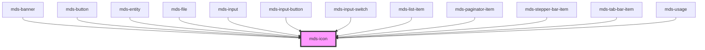

# mds-icon

## How to use

This component is intented to be used only with svg files. In order to properly work, you need  to tell the component the path to the svg file directory.

### Via `sessionStorage` (recommended)

The simplest way to instruct the component is using `window.sessionStorage('mdsIconSvgPath', <path-to-svg-directory>)`.
For example, if your svg directory is located in `assets/img/svg`, you should put the following code in your application

```javascript
window.sessionStorage('mdsIconSvgPath', 'assets/img/svg/');
```

The path to the directory is based on how the `assets` are handled by the framework you are using.

### Via `setSvgPath` stencil method

Another way would be, after you have called `defineCustomElements()` of this component, to instantiate a temporary MdsIcon DOM node element to call the `setSvgPath` class method

```javascript
const mdsIconGet = async () => {
  // Wait for the web component to be defined
  await customElements.whenDefined('mds-icon')
  // Create an instance of mds-icon
  const mdsIcon = document.createElement('mds-icon')
  // Append element to body
  document.body.appendChild(mdsIcon)
  // Check for method existance and set svg directory path
  if ('setSvgPath' in mdsIcon) {
    mdsIcon.setSvgPath('/assets/img/svg/')
  }
  // Remove element from body
  document.body.removeChild(mdsIcon)
}

mdsIconGet()
```

### Via `setSvgPathStatic` static class function

Last way to set it is by calling the static function present in the class. This is done after the `defineCustomElements()` call

```javascript
import { mds_icon } from '@maggioli-design-system/mds-icon/dist/esm/mds-icon.entry'

const mdsIconGet = async () => {
  await customElements.whenDefined('mds-icon')

  mds_icon.setSvgPathStatic('/assets/img/svg/')
}

mdsIconGet()
```

<!-- Auto Generated Below -->


## Properties

| Property            | Attribute | Description           | Type     | Default     |
| ------------------- | --------- | --------------------- | -------- | ----------- |
| `name` _(required)_ | `name`    | The name of the icon. | `string` | `undefined` |


## Methods

### `setSvgPath(svgPath: string) => Promise<void>`

Set the path to the directory of svg files

#### Returns

Type: `Promise<void>`

## Dependencies

### Used by

 - [mds-banner](../mds-banner)
 - [mds-button](../mds-button)
 - [mds-entity](../mds-entity)
 - [mds-file](../mds-file)
 - [mds-input](../mds-input)
 - [mds-input-button](../mds-input-button)
 - [mds-input-switch](../mds-input-switch)
 - [mds-list-item](../mds-list-item)
 - [mds-paginator-item](../mds-paginator-item)
 - [mds-stepper-bar-item](../mds-stepper-bar-item)
 - [mds-tab-bar-item](../mds-tab-bar-item)
 - [mds-usage](../mds-usage)

### Graph


----------------------------------------------

Built with love @ **Maggioli Informatica / R&D Department**
