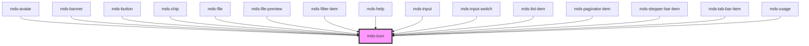

# mds-icon

## How to use

This component is intented to be used only with svg files. In order to properly work, you need  to tell the component the path to the svg file directory.

### Via `sessionStorage` (recommended)

The simplest way to instruct the component is using `window.sessionStorage.setItem('mdsIconSvgPath', <path-to-svg-directory>)`.
For example, if your svg directory is located in `assets/img/svg`, you should put the following code in your application

```javascript
window.sessionStorage.setItem('mdsIconSvgPath', 'assets/img/svg/');
```

The path to the directory is based on how the `assets` are handled by the framework you are using.

### Via `setSvgPath` stencil method

Another way would be, after you have called `defineCustomElements()` of this component, to instantiate a temporary MdsIcon DOM node element to call the `setSvgPath` class method

```javascript
const mdsIconGet = async () => {
  // Wait for the web component to be defined
  await customElements.whenDefined('mds-icon')
  // Create an instance of mds-icon
  const mdsIcon = document.createElement('mds-icon')
  // Append element to body
  document.body.appendChild(mdsIcon)
  // Check for method existance and set svg directory path
  if ('setSvgPath' in mdsIcon) {
    mdsIcon.setSvgPath('/assets/img/svg/')
  }
  // Remove element from body
  document.body.removeChild(mdsIcon)
}

mdsIconGet()
```

### Via `setSvgPathStatic` static class function

Last way to set it is by calling the static function present in the class. This is done after the `defineCustomElements()` call

```javascript
import { mds_icon } from '@maggioli-design-system/mds-icon/dist/esm/mds-icon.entry'

const mdsIconGet = async () => {
  await customElements.whenDefined('mds-icon')

  mds_icon.setSvgPathStatic('/assets/img/svg/')
}

mdsIconGet()
```

## Force icon update

In some cases it may happens that when setting the path to where the SVG are located, icons still fail to load them.

This may be caused by the instatiation of `mds-icon` component happening before the setting of the directory path.

To force the update of the icons, after you have called `window.sessionStorage` or the `mds-icon` functions, you can dispatch a global event from the window with the key `mdsIconSvgPathUpdate`

```javascript
window.dispatchEvent(new CustomEvent('mdsIconSvgPathUpdate'))
```

Once done this, the icons component already instantiated will be notified of the update and try to reload the icons.

This is a web-component from Maggioli Design System [Magma](https://magma.maggiolicloud.it), built with StencilJS, TypeScript, Storybook. It's based on the web-component standard and it's designed to be agnostic from the JavaScirpt framework you are using.

<!-- Auto Generated Below -->


## Properties

| Property            | Attribute | Description                                                    | Type     | Default     |
| ------------------- | --------- | -------------------------------------------------------------- | -------- | ----------- |
| `name` _(required)_ | `name`    | The name of the icon or a base64 string to render it as an svg | `string` | `undefined` |


## Methods

### `setSvgPath(svgPath: string) => Promise<void>`

Set the path to the directory of svg files

#### Parameters

| Name      | Type     | Description                        |
| --------- | -------- | ---------------------------------- |
| `svgPath` | `string` | path to the directory of svg files |

#### Returns

Type: `Promise<void>`


## Shadow Parts

| Part    | Description                   |
| ------- | ----------------------------- |
| `"svg"` | The svg container of the icon |


## Dependencies

### Used by

 - [mds-avatar](../mds-avatar)
 - [mds-banner](../mds-banner)
 - [mds-button](../mds-button)
 - [mds-chip](../mds-chip)
 - [mds-file](../mds-file)
 - [mds-file-preview](../mds-file-preview)
 - [mds-filter-item](../mds-filter-item)
 - [mds-help](../mds-help)
 - [mds-input](../mds-input)
 - [mds-input-switch](../mds-input-switch)
 - [mds-list-item](../mds-list-item)
 - [mds-paginator-item](../mds-paginator-item)
 - [mds-stepper-bar-item](../mds-stepper-bar-item)
 - [mds-tab-bar-item](../mds-tab-bar-item)
 - [mds-usage](../mds-usage)

### Graph


----------------------------------------------

Built with love @ [Gruppo Maggioli](https://www.maggioli.com) from [R&D Department](https://www.maggioli.com/it-it/chi-siamo/ricerca-sviluppo)
