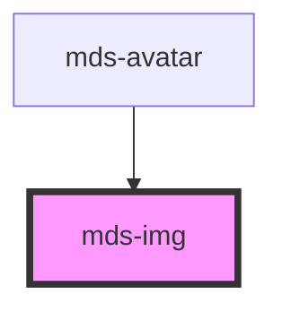

# mds-img

<!-- Auto Generated Below -->

## Properties

| Property         | Attribute        | Description                                                                                                                                                                                                                                                                                                                                                    | Type                                                                                                      | Default                        |
| ---------------- | ---------------- | -------------------------------------------------------------------------------------------------------------------------------------------------------------------------------------------------------------------------------------------------------------------------------------------------------------------------------------------------------------- | --------------------------------------------------------------------------------------------------------- | ------------------------------ |
| `alt`            | `alt`            | Specifies an alternate text for an image                                                                                                                                                                                                                                                                                                                       | `string`                                                                                                  | `undefined`                    |
| `aspectRatio`    | `aspect-ratio`   | Specifies the aspect ratio of the image, useful to render all images of a list with the same proportions. When defined, mds-img will render the Host element with background-image instead of wrapping ad img element. This will drop all atributes useful for img elements only: alt, crossorigin, height, loading, referrerpolicy, sizes, src, srcset, width | `string`                                                                                                  | `undefined`                    |
| `crossorigin`    | `crossorigin`    | Allow images from third-party sites that allow cross-origin access to be used with canvas                                                                                                                                                                                                                                                                      | `"anonymous" \| "use-credentials"`                                                                        | `'use-credentials'`            |
| `height`         | `height`         | The height attribute specifies the height of an image, in pixels.                                                                                                                                                                                                                                                                                              | `string`                                                                                                  | `undefined`                    |
| `loading`        | `loading`        | Specifies whether a browser should load an image immediately or to defer loading of images until some conditions are met.                                                                                                                                                                                                                                      | `"eager" \| "lazy"`                                                                                       | `'lazy'`                       |
| `referrerpolicy` | `referrerpolicy` | Specifies which referrer information to use when fetching an image.                                                                                                                                                                                                                                                                                            | `"no-referrer" \| "no-referrer-when-downgrade" \| "origin" \| "origin-when-cross-origin" \| "unsafe-url"` | `'no-referrer-when-downgrade'` |
| `sizes`          | `sizes`          | One or more strings separated by commas, indicating a set of source sizes. https://medium.com/@MRWwebDesign/responsive-images-the-sizes-attribute-and-unexpected-image-sizes-882a2eadb6db                                                                                                                                                                      | `string`                                                                                                  | `undefined`                    |
| `src`            | `src`            | Specifies the path to the image                                                                                                                                                                                                                                                                                                                                | `string`                                                                                                  | `undefined`                    |
| `srcset`         | `srcset`         | Specifies a list of image files to use in different situations. Defines multiple sizes of the same image, allowing the browser to select the appropriate image source.                                                                                                                                                                                         | `string`                                                                                                  | `undefined`                    |
| `width`          | `width`          | The width attribute specifies the width of an image, in pixels.                                                                                                                                                                                                                                                                                                | `string`                                                                                                  | `undefined`                    |

## Events

| Event         | Description                                | Type                            |
| ------------- | ------------------------------------------ | ------------------------------- |
| `loadError`   | Emits when the accordion changes it's item | `CustomEvent<HTMLImageElement>` |
| `loadSuccess` | Emits when the accordion changes it's item | `CustomEvent<HTMLImageElement>` |

## Dependencies

### Used by

 - [mds-avatar](../mds-avatar)

### Graph

----------------------------------------------

Built with love @ **Maggioli Informatica / R&D Department**
