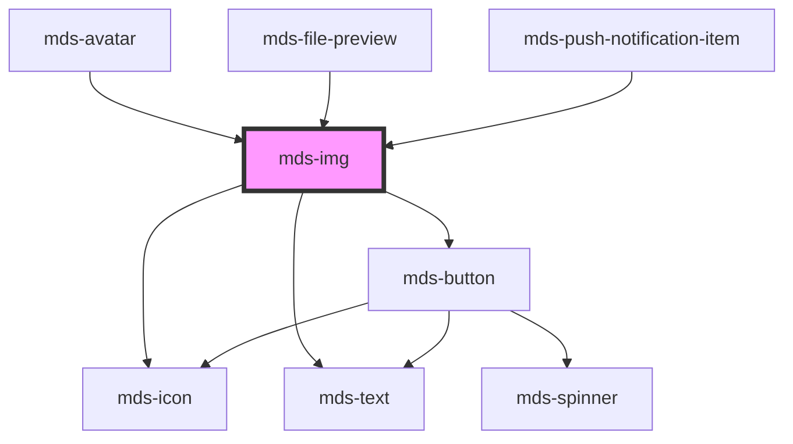

# mds-img


This is a web-component from Maggioli Design System [Magma](https://magma.maggiolicloud.it), built with StencilJS, TypeScript, Storybook. It's based on the web-component standard and it's designed to be agnostic from the JavaScript framework you are using.

<!-- Auto Generated Below -->


## Usage

### 1. Description

The `<mds-img>` web component is the responsive image primitive of the Magma Design System. It wraps the native `` element, adding accessible defaults, a built-in error/fallback state, and data-consumption-aware source selection driven by the user's bandwidth preference.

#### Semantic Behavior

- **Automatic alt fallback**: When `alt` is omitted, it is derived from the trailing filename segment of `src` so the image is never left without an accessible name.
- **Error state**: A failed load swaps the picture for a broken-image icon plus the `alt` text, emitting `mdsImgLoadError`; changing `src` clears the error and retries.
- **Load events**: `mdsImgLoadSuccess` and `mdsImgLoadError` both carry the underlying `HTMLImageElement` in their detail, letting consumers read natural dimensions or react to failures.
- **Consumption-aware loading**: When `srcsetConsumption` is set, the component reads the persisted consumption preference and picks the matching source; under the `low` preference the image is deferred behind a "click to load" placeholder until the user opts in.
- **Localized placeholder**: The deferred-load placeholder label is resolved through the shared locale system (el/en/es/it).

#### Properties & Visual Configurations

Most props are pass-throughs to the native image attributes of the same name (`src`, `srcset`, `sizes`, `width`, `height`, `loading`, `crossorigin`, `referrerpolicy`) and behave exactly as in HTML; pick values as you would for a plain ``. `loading` defaults to `'lazy'`, so opt into `'eager'` only for above-the-fold imagery.

#### Other behavioral props

- **`srcsetConsumption`** is a comma-separated map of sources tagged `low` / `medium` / `high` (e.g. `"img-bw.jpg low, img.jpg medium, img@2x.jpg high"`). Unlike native `srcset`, the bucket is chosen by the stored consumption preference rather than viewport, letting low-bandwidth users save data by deferring or downgrading the image.
- **`alt`** supply meaningful text for content images, since it doubles as both the accessible name and the visible label in the error and deferred-load states.


### 2. Pattern

Correct and idiomatic ways to use the `<mds-img>` component, ordered from most common to most specialized. Patterns assume a working knowledge of the variant / tone ladders documented in [`docs/COMPONENTS.md`](../../../../../../docs/COMPONENTS.md) and the generic stencil rules in [`projects/stencil/SPEC.md`](../../../../SPEC.md).

#### Basic Image with Alt Text

The canonical form. Always supply a meaningful `alt` value for content images - it doubles as the accessible name and as the visible label in both the error state and the deferred-load placeholder.

```html
<mds-img src="/assets/img/copertina-corso.jpg" alt="Copertina del corso di formazione"></mds-img>
```

#### Responsive Image with `srcset` and `sizes`

Pass the standard `srcset` and `sizes` attributes exactly as you would on a native ``. The browser picks the best source based on viewport and device pixel ratio.

```html
<mds-img
  src="/assets/img/hero-800.jpg"
  srcset="/assets/img/hero-400.jpg 400w, /assets/img/hero-800.jpg 800w, /assets/img/hero-1600.jpg 1600w"
  sizes="(max-width: 600px) 400px, (max-width: 1200px) 800px, 1600px"
  alt="Vista panoramica del centro storico"
></mds-img>
```

#### Eager Loading for Above-the-Fold Images

`loading` defaults to `"lazy"`. Set it to `"eager"` only for images that are immediately visible on page load, such as hero images or content at the top of the first screen.

```html
<mds-img
  src="/assets/img/hero-principale.jpg"
  alt="Hero della pagina principale"
  loading="eager"
></mds-img>
```

#### Consumption-Aware Sources with `srcset-consumption`

Use `srcset-consumption` to serve a different image source depending on the user's bandwidth preference stored via `mds-pref-consumption`. Tag each source with `low`, `medium`, or `high`. Under the `low` preference the image is deferred behind a "Carica immagine" placeholder until the user clicks.

```html
<mds-img
  src="/assets/img/copertina-libro.jpg"
  srcset-consumption="/assets/img/copertina-bw-1x.jpg low, /assets/img/copertina-1x.jpg medium, /assets/img/copertina-2x.jpg high"
  alt="Il nuovo codice dei contratti pubblici"
></mds-img>
```

#### Consumption-Aware with Fallback `src`

Provide `src` alongside `srcset-consumption` as the fallback used when a bucket is missing from the consumption map. Here `src` is the high-resolution file; only `low` and `medium` buckets are overridden.

```html
<mds-img
  src="/assets/img/copertina-2x.jpg"
  srcset-consumption="/assets/img/copertina-bw-1x.jpg low, /assets/img/copertina-1x.jpg medium"
  alt="Manuale pratico degli appalti pubblici"
></mds-img>
```

#### Reacting to Load Events

Listen to `mdsImgLoadSuccess` and `mdsImgLoadError` to react to image load outcomes. Both events carry the underlying `HTMLImageElement` in `event.detail.image`, allowing you to read natural dimensions or show fallback UI.

```html
<mds-img
  id="hero"
  src="/assets/img/hero-principale.jpg"
  alt="Immagine principale"
></mds-img>

<script>
  document.getElementById('hero').addEventListener('mdsImgLoadSuccess', (event) => {
    const img = event.detail.image;
    console.log('Caricata:', img.naturalWidth, 'x', img.naturalHeight);
  });

  document.getElementById('hero').addEventListener('mdsImgLoadError', (event) => {
    console.warn('Immagine non disponibile:', event.detail.image.src);
  });
</script>
```

#### Fixed Dimensions

Set `width` and `height` (as string pixel values) to reserve layout space and prevent content reflow during load. The host element is `display: flex; width: 100%` by default - set both attributes only when a fixed pixel size is intended.

```html
<mds-img
  src="/assets/img/thumbnail.jpg"
  alt="Anteprima documento"
  width="320"
  height="240"
></mds-img>
```

#### Styling Customization

Style the component through its documented `--mds-img-*` CSS custom properties. Use Magma color tokens wrapped in `rgb(var(...))` so dark mode and high-contrast modes keep working.

```css
.card-copertina mds-img {
  --mds-img-background: rgb(var(--variant-secondary-03));
  --mds-img-color: rgb(var(--variant-secondary-09));
  --mds-img-icon-color: rgb(var(--variant-secondary-07));
  --mds-img-error-background: rgb(var(--status-error-09));
  --mds-img-error-color: rgb(var(--status-error-04));
}
```

#### Styling the Inner `` via `::part(media)`

When a CSS property must be applied directly to the inner `` element (for example `object-fit` or `border-radius`) use the documented `media` shadow part. This is the only supported way to pierce the shadow boundary.

```css
.copertina-libro mds-img::part(media) {
  border-radius: var(--radius-md);
  object-fit: cover;
}
```


### 3. Antipattern

Common incorrect uses of `<mds-img>`. Each entry pairs the wrong form with the right one and a one-line reason. System-wide rules (boolean-as-string, shadow piercing, Tailwind color utilities, raw native event listening) live in [`docs/COMPONENTS.md`](../../../../../../docs/COMPONENTS.md#system-level-anti-patterns) - they apply here too but are not repeated.

#### Do Not Replace `<mds-img>` with a Raw `` Element

Using a plain `` bypasses the built-in error fallback, consumption-aware loading, and accessible-name defaults that `<mds-img>` provides.

```html
<!-- 🚫 INCORRECT -->


<!-- ✅ CORRECT -->
<mds-img src="/assets/img/copertina.jpg" alt="Copertina"></mds-img>
```

#### Do Not Omit `alt` When the Image Conveys Information

`<mds-img>` derives a fallback `alt` from the filename when none is supplied, but a raw filename slug is not a meaningful description. Supply a descriptive `alt` for every content image.

```html
<!-- 🚫 INCORRECT -->
<mds-img src="/assets/img/report-annuale-2024.jpg"></mds-img>

<!-- ✅ CORRECT -->
<mds-img src="/assets/img/report-annuale-2024.jpg" alt="Report annuale 2024"></mds-img>
```

#### Do Not Listen to the Native `load` or `error` Events

The inner `` lives in shadow DOM and its native events may not bubble to the light-DOM listener. Use the documented `mdsImgLoadSuccess` and `mdsImgLoadError` custom events instead.

```html
<!-- 🚫 INCORRECT -->
<mds-img id="foto" src="/assets/img/foto.jpg" alt="Foto"></mds-img>
<script>
  document.getElementById('foto').addEventListener('load', handler);
  document.getElementById('foto').addEventListener('error', handler);
</script>

<!-- ✅ CORRECT -->
<mds-img id="foto" src="/assets/img/foto.jpg" alt="Foto"></mds-img>
<script>
  document.getElementById('foto').addEventListener('mdsImgLoadSuccess', handler);
  document.getElementById('foto').addEventListener('mdsImgLoadError', handler);
</script>
```

#### Do Not Use `srcset-consumption` Without a Meaningful Bucket Tag

Each entry in `srcset-consumption` must end with `low`, `medium`, or `high`. Entries with any other tag are silently ignored, leaving that consumption level without a source.

```html
<!-- 🚫 INCORRECT -->
<mds-img
  srcset-consumption="/assets/img/small.jpg 1x, /assets/img/large.jpg 2x"
  alt="Immagine"
></mds-img>

<!-- ✅ CORRECT -->
<mds-img
  srcset-consumption="/assets/img/small.jpg low, /assets/img/medium.jpg medium, /assets/img/large.jpg high"
  alt="Immagine"
></mds-img>
```

#### Do Not Pierce the Shadow DOM to Style the Inner ``

Targeting internal selectors with `>>>`, `/deep/`, or undocumented class names couples your code to the shadow DOM structure and will break on minor releases. Use `--mds-img-*` CSS custom properties for color theming, and the documented `::part(media)` for geometry/object-fit overrides.

```css
/* 🚫 INCORRECT */
mds-img >>> img {
  border-radius: 8px;
  object-fit: cover;
}

/* ✅ CORRECT */
mds-img::part(media) {
  border-radius: var(--radius-md);
  object-fit: cover;
}
```

#### Do Not Set `loading="eager"` for Every Image

`loading` defaults to `"lazy"`, which is the correct behavior for most images. Setting `"eager"` on all images forces the browser to download every image immediately, degrading performance. Reserve `"eager"` for images that are visible on first paint.

```html
<!-- 🚫 INCORRECT -->
<mds-img src="/assets/img/thumbnail-1.jpg" alt="Anteprima 1" loading="eager"></mds-img>
<mds-img src="/assets/img/thumbnail-2.jpg" alt="Anteprima 2" loading="eager"></mds-img>
<mds-img src="/assets/img/thumbnail-3.jpg" alt="Anteprima 3" loading="eager"></mds-img>

<!-- ✅ CORRECT -->
<mds-img src="/assets/img/hero.jpg" alt="Hero principale" loading="eager"></mds-img>
<mds-img src="/assets/img/thumbnail-1.jpg" alt="Anteprima 1"></mds-img>
<mds-img src="/assets/img/thumbnail-2.jpg" alt="Anteprima 2"></mds-img>
```


## Properties

| Property            | Attribute            | Description                                                                                                                                                                                                                                                                                                                       | Type                                                                                                                   | Default                        |
| ------------------- | -------------------- | --------------------------------------------------------------------------------------------------------------------------------------------------------------------------------------------------------------------------------------------------------------------------------------------------------------------------------- | ---------------------------------------------------------------------------------------------------------------------- | ------------------------------ |
| `alt`               | `alt`                | Specifies an alternate text for an image                                                                                                                                                                                                                                                                                          | `string`                                                                                                               | `''`                           |
| `crossorigin`       | `crossorigin`        | Allow images from third-party sites that allow cross-origin access to be used with canvas                                                                                                                                                                                                                                         | `"anonymous" \| "use-credentials" \| undefined`                                                                        | `'use-credentials'`            |
| `height`            | `height`             | The height attribute specifies the height of an image, in pixels.                                                                                                                                                                                                                                                                 | `string \| undefined`                                                                                                  | `undefined`                    |
| `loading`           | `loading`            | Specifies whether a browser should load an image immediately or to defer loading of images until some conditions are met.                                                                                                                                                                                                         | `"eager" \| "lazy" \| undefined`                                                                                       | `'lazy'`                       |
| `referrerpolicy`    | `referrerpolicy`     | Specifies which referrer information to use when fetching an image.                                                                                                                                                                                                                                                               | `"no-referrer" \| "no-referrer-when-downgrade" \| "origin" \| "origin-when-cross-origin" \| "unsafe-url" \| undefined` | `'no-referrer-when-downgrade'` |
| `sizes`             | `sizes`              | One or more strings separated by commas, indicating a set of source sizes. https://medium.com/@MRWwebDesign/responsive-images-the-sizes-attribute-and-unexpected-image-sizes-882a2eadb6db                                                                                                                                         | `string \| undefined`                                                                                                  | `undefined`                    |
| `src`               | `src`                | Specifies the path to the image                                                                                                                                                                                                                                                                                                   | `string`                                                                                                               | `undefined`                    |
| `srcset`            | `srcset`             | Specifies a list of image files to use in different situations. Defines multiple sizes of the same image, allowing the browser to select the appropriate image source.                                                                                                                                                            | `string \| undefined`                                                                                                  | `undefined`                    |
| `srcsetConsumption` | `srcset-consumption` | Specifies a list of image files to use in different situations. Defines multiple sizes of the same image, allowing the browser to select the appropriate image source based on consumption configuration. ``` <mds-img srcset-consumption="image-black-n-white-1x.jpg low, image-1x.jpg medium, image-2x.jpg high"></mds-img> ``` | `string \| undefined`                                                                                                  | `undefined`                    |
| `width`             | `width`              | The width attribute specifies the width of an image, in pixels.                                                                                                                                                                                                                                                                   | `string \| undefined`                                                                                                  | `undefined`                    |


## Events

| Event               | Description                                 | Type                             |
| ------------------- | ------------------------------------------- | -------------------------------- |
| `mdsImgLoadError`   | Emits when the image is not loaded          | `CustomEvent<MdsImgEventDetail>` |
| `mdsImgLoadSuccess` | Emits when the image is successfully loaded | `CustomEvent<MdsImgEventDetail>` |


## Methods

### `updateLang() => Promise<void>`


#### Returns

Type: `Promise<void>`


## Shadow Parts

| Part      | Description |
| --------- | ----------- |
| `"media"` |             |


## CSS Custom Properties

| Name                         | Description                                                    |
| ---------------------------- | -------------------------------------------------------------- |
| `--mds-img-background`       | The background color of the image container.                   |
| `--mds-img-color`            | The foreground/text color used inside the image component.     |
| `--mds-img-error-background` | The background color shown when the image fails to load.       |
| `--mds-img-error-color`      | The text or foreground color shown in the error state.         |
| `--mds-img-error-icon-color` | The icon color used in the error state.                        |
| `--mds-img-icon-color`       | The color applied to icons displayed within the image element. |


## Dependencies

### Used by

 - [mds-avatar](../mds-avatar)
 - [mds-file-preview](../mds-file-preview)
 - [mds-push-notification-item](../mds-push-notification-item)

### Depends on

- [mds-icon](../mds-icon)
- [mds-text](../mds-text)
- [mds-button](../mds-button)

### Graph


----------------------------------------------

Built with love @ [Gruppo Maggioli](https://www.maggioli.com) from [R&D Department](https://www.maggioli.com/it-it/chi-siamo/ricerca-sviluppo)
