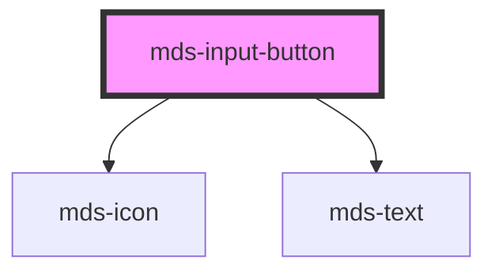

# mds-input-button

<!-- Auto Generated Below -->

## Properties

| Property       | Attribute       | Description                                                           | Type                                                                            | Default     |
| -------------- | --------------- | --------------------------------------------------------------------- | ------------------------------------------------------------------------------- | ----------- |
| `active`       | `active`        | Specifies if the button is active or not                              | `boolean`                                                                       | `undefined` |
| `icon`         | `icon`          | The icon displayed in the button                                      | `string`                                                                        | `undefined` |
| `iconPosition` | `icon-position` | Specifies the horizontal position of the icon displayed in the button | `"left" \| "right"`                                                             | `'left'`    |
| `size`         | `size`          | Specifies the size for the button                                     | `"lg" \| "md" \| "sm" \| "xl"`                                                  | `'md'`      |
| `tone`         | `tone`          | Specifies the tone variant for the button                             | `"ghost" \| "quiet" \| "strong" \| "weak"`                                      | `'strong'`  |
| `type`         | `type`          | The type of the button element                                        | `"a" \| "button" \| "reset" \| "submit"`                                        | `'submit'`  |
| `variant`      | `variant`       | Specifies the color variant for the button                            | `"dark" \| "error" \| "info" \| "light" \| "primary" \| "success" \| "warning"` | `'primary'` |

## CSS Custom Properties

| Name             | Description                                |
| ---------------- | ------------------------------------------ |
| `--background`   | Sets the background-color of the component |
| `--border-color` | Sets the border-color of the component     |
| `--color`        | Sets the text color of the component       |
| `--icon-color`   | Sets the icon color of the component       |
| `--radius`       | Sets the border-radius of the component    |

## Dependencies

### Depends on

- [mds-icon](../mds-icon)
- [mds-text](../mds-text)

### Graph

----------------------------------------------

Built with love @ **Maggioli Informatica / R&D Department**
