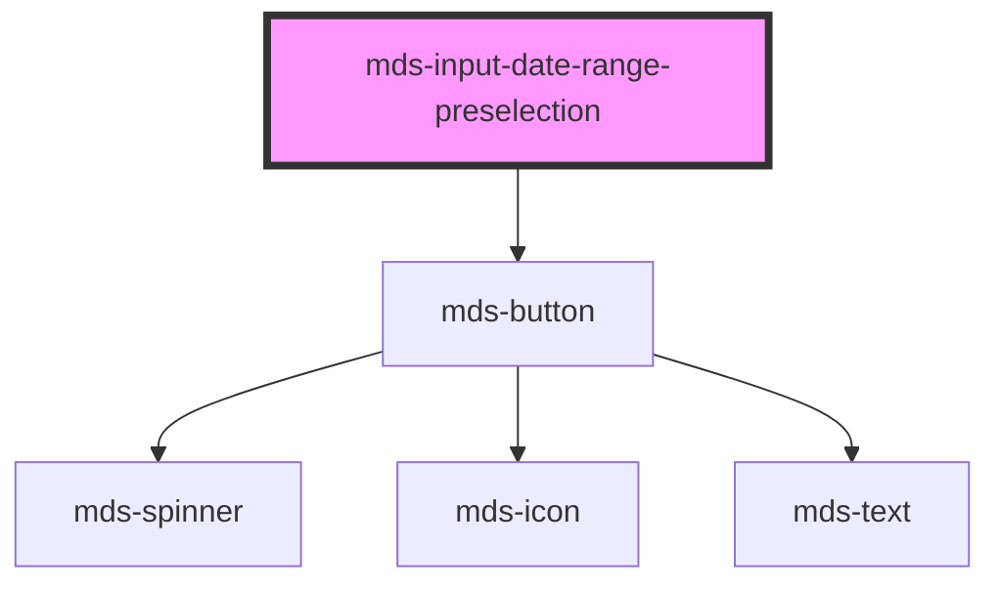

# mds-input-date-range-preselection

<!-- Auto Generated Below -->

## Properties

| Property             | Attribute  | Description                             | Type                   | Default     |
| -------------------- | ---------- | --------------------------------------- | ---------------------- | ----------- |
| `end`                | `end`      | Sets the end date of the preselection   | `string \| undefined`  | `undefined` |
| `selected`           | `selected` | Sets the preselection date range        | `boolean \| undefined` | `undefined` |
| `start` _(required)_ | `start`    | Sets the start date of the preselection | `string`               | `undefined` |

## CSS Custom Properties

| Name                                                | Description                                                     |
| --------------------------------------------------- | --------------------------------------------------------------- |
| `--mds-date-range-preselection-default-background`  | Background used for the default (unselected) preselection state |
| `--mds-date-range-preselection-default-border`      | Border color used for the default preselection state            |
| `--mds-date-range-preselection-default-color`       | Text color used in the default preselection state               |
| `--mds-date-range-preselection-hover-background`    | Background used when a preselection item is hovered             |
| `--mds-date-range-preselection-hover-border`        | Border color used on hover state                                |
| `--mds-date-range-preselection-hover-color`         | Text color used on hover state                                  |
| `--mds-date-range-preselection-selected-background` | Background used for the selected preselection state             |
| `--mds-date-range-preselection-selected-border`     | Border color used for the selected preselection state           |
| `--mds-date-range-preselection-selected-color`      | Text color used in the selected preselection state              |

## Dependencies

### Depends on

- [mds-button](../mds-button)

### Graph

----------------------------------------------

Built with love @ [Gruppo Maggioli](https://www.maggioli.com) from [R&D Department](https://www.maggioli.com/it-it/chi-siamo/ricerca-sviluppo)
