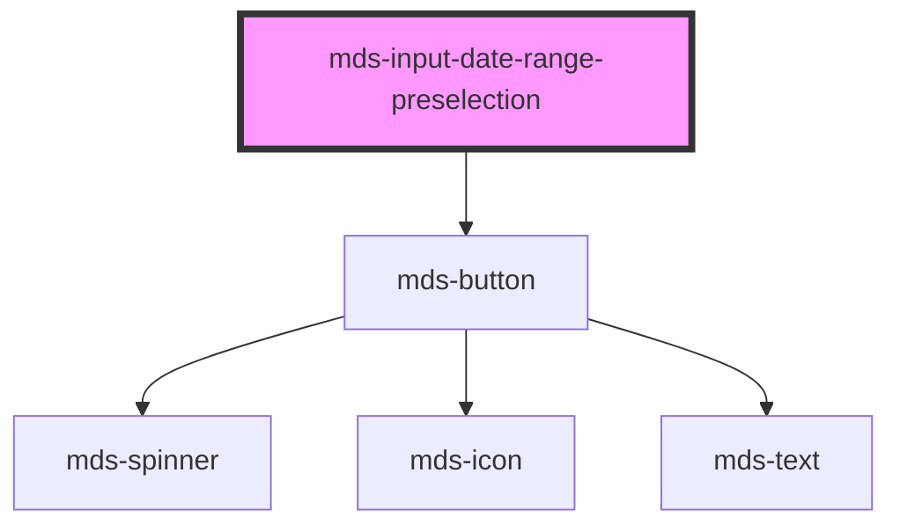

# mds-input-date-range-preselection


<!-- Auto Generated Below -->


## Usage

### 1. Description

The `<mds-input-date-range-preselection>` web component is a compound child of [`<mds-input-date-range>`](../../mds-input-date-range). It renders a clickable shortcut button (a quick range like "Last 7 days" or "This month") that, when activated, fills the parent's date range with a predefined `start`/`end` pair instead of requiring the user to pick dates manually on the calendar.

#### Semantic Behavior

- **Compound child only**: Must be placed as a direct child of `<mds-input-date-range>`; it auto-assigns itself to the parent's `calendar-preselection` slot and is not used standalone or mixed with other child types.
- **Click drives the parent**: On click it applies its `start`/`end` range to the parent, which populates and validates the range, syncs the form value, and closes the dropdown.
- **Selection is parent-managed**: Choosing one preselection clears the active state on its siblings and marks the active one; the parent also re-marks a preselection as selected whenever the current range matches its dates (including single-day matches where `end` is undefined).

#### Properties & Visual Configurations

- **`start`** (required) and **`end`**: Define the ISO date range this shortcut applies. Provide both for a true range; omit `end` to express a single-day preselection.
- **`selected`**: Reflects whether this preselection is currently the active one. Treat it as read-only in normal use - the parent sets it; do not hand-toggle it to drive selection.

The default slot holds the human-readable label. Visual states (default, hover, selected) are themed through the `--mds-date-range-preselection-*` CSS custom properties listed in `readme.md`; the component does not expose `variant`/`tone` props of its own.


### 2. Pattern

Correct and idiomatic ways to use the `<mds-input-date-range-preselection>` component, ordered from most common to most specialized. Patterns assume a working knowledge of the variant / tone ladders documented in [`docs/COMPONENTS.md`](../../../../../../docs/COMPONENTS.md) and the generic stencil rules in [`projects/stencil/SPEC.md`](../../../../SPEC.md).

#### Basic Preset Range Shortcuts

Place one or more `<mds-input-date-range-preselection>` elements as direct children of [`<mds-input-date-range>`](../../mds-input-date-range). Each element needs a `start` date (ISO format) and a human-readable label in its default slot. The component auto-assigns itself to the parent's `calendar-preselection` slot.

```html
<mds-input-date-range name="periodo">
  <mds-input-date-range-preselection start="2025-06-01" end="2025-06-30">
    Questo mese
  </mds-input-date-range-preselection>
  <mds-input-date-range-preselection start="2025-05-01" end="2025-05-31">
    Mese scorso
  </mds-input-date-range-preselection>
  <mds-input-date-range-preselection start="2025-01-01" end="2025-12-31">
    Anno corrente
  </mds-input-date-range-preselection>
</mds-input-date-range>
```

#### Single-Day Shortcut (omit `end`)

Omit the `end` attribute to create a single-day preselection. The parent matches it as active whenever its current range is a single day equal to `start`.

```html
<mds-input-date-range name="data-singola">
  <mds-input-date-range-preselection start="2025-06-05">
    Oggi
  </mds-input-date-range-preselection>
</mds-input-date-range>
```

#### Multiple Preset Windows Together

Group semantically related shortcuts - short-term, medium-term, and long-term - so users can jump to the most common reporting windows without opening the calendar. Only one item carries `selected` at a time; the parent manages it automatically.

```html
<mds-input-date-range name="finestra-report">
  <mds-input-date-range-preselection start="2025-05-29" end="2025-06-04">
    Ultima settimana
  </mds-input-date-range-preselection>
  <mds-input-date-range-preselection start="2025-05-01" end="2025-05-31">
    Ultimo mese
  </mds-input-date-range-preselection>
  <mds-input-date-range-preselection start="2025-01-01" end="2025-06-30">
    Ultimo semestre
  </mds-input-date-range-preselection>
  <mds-input-date-range-preselection start="2024-01-01" end="2024-12-31">
    Anno precedente
  </mds-input-date-range-preselection>
</mds-input-date-range>
```

#### Reading the Selected Value via Parent Events

Listen to the parent's `mdsInputDateRangeSelect` event to read the chosen range. The preselection component itself fires no event - the parent owns the value contract.

```html
<mds-input-date-range id="date-range" name="periodo">
  <mds-input-date-range-preselection start="2025-06-01" end="2025-06-30">
    Questo mese
  </mds-input-date-range-preselection>
</mds-input-date-range>

<script>
  document.getElementById('date-range').addEventListener('mdsInputDateRangeSelect', (e) => {
    console.log(e.detail.startDate, e.detail.endDate);
  });
</script>
```

#### Styling Customization

Override the three visual states - default, hover, and selected - through the documented `--mds-date-range-preselection-*` CSS custom properties. Set them on the host element or a parent selector; use Magma color tokens with `rgb(var(--<token>))` so dark mode keeps working.

```css
.dashboard mds-input-date-range-preselection {
  --mds-date-range-preselection-default-background: rgb(var(--tone-neutral-07) / 0.1);
  --mds-date-range-preselection-default-border: var(--tone-neutral-06);
  --mds-date-range-preselection-selected-background: rgb(var(--variant-secondary-03));
  --mds-date-range-preselection-selected-border: var(--variant-secondary-03);
  --mds-date-range-preselection-selected-color: rgb(var(--tone-neutral));
}
```


### 3. Antipattern

Common incorrect uses of `<mds-input-date-range-preselection>`. Each entry pairs the wrong form with the right one and a one-line reason. System-wide rules (boolean-as-string, shadow piercing, Tailwind color utilities, raw native event listening) live in [`docs/COMPONENTS.md`](../../../../../../docs/COMPONENTS.md#system-level-anti-patterns) - they apply here too but are not repeated.

#### Do Not Use Outside `<mds-input-date-range>`

The component only works as a direct child of [`<mds-input-date-range>`](../../mds-input-date-range). Used standalone it renders an inert button because `closest('mds-input-date-range')` returns null and the click handler does nothing.

```html
<!-- 🚫 INCORRECT -->
<mds-input-date-range-preselection start="2025-06-01" end="2025-06-30">
  Questo mese
</mds-input-date-range-preselection>

<!-- ✅ CORRECT -->
<mds-input-date-range name="periodo">
  <mds-input-date-range-preselection start="2025-06-01" end="2025-06-30">
    Questo mese
  </mds-input-date-range-preselection>
</mds-input-date-range>
```

#### Do Not Set `selected` Manually to Drive Selection

`selected` is a read-only output attribute managed entirely by the parent. Setting it by hand does not apply the range, does not clear sibling active states, and will be overwritten by the parent on the next range change.

```html
<!-- 🚫 INCORRECT -->
<mds-input-date-range name="periodo">
  <mds-input-date-range-preselection start="2025-06-01" end="2025-06-30" selected>
    Questo mese
  </mds-input-date-range-preselection>
</mds-input-date-range>

<!-- ✅ CORRECT: let the parent set selection by initialising it with start-date / end-date -->
<mds-input-date-range name="periodo" start-date="2025-06-01" end-date="2025-06-30">
  <mds-input-date-range-preselection start="2025-06-01" end="2025-06-30">
    Questo mese
  </mds-input-date-range-preselection>
</mds-input-date-range>
```

#### Do Not Set `selected` as a Boolean String

As with every boolean prop in Stencil, any non-empty string is truthy. `selected="false"` keeps the item in the selected state. Remove the attribute to deselect it - but again, prefer letting the parent control it.

```html
<!-- 🚫 INCORRECT -->
<mds-input-date-range-preselection start="2025-06-01" end="2025-06-30" selected="false">
  Questo mese
</mds-input-date-range-preselection>

<!-- ✅ CORRECT: remove the attribute entirely -->
<mds-input-date-range-preselection start="2025-06-01" end="2025-06-30">
  Questo mese
</mds-input-date-range-preselection>
```

#### Do Not Use HTML in the Default Slot

The default slot is the plain-text label read by the internal `<mds-button>`. Placing HTML elements inside it breaks button layout and may be stripped by the shadow DOM projection.

```html
<!-- 🚫 INCORRECT -->
<mds-input-date-range-preselection start="2025-06-01" end="2025-06-30">
  <strong>Questo mese</strong>
  <small>(giu)</small>
</mds-input-date-range-preselection>

<!-- ✅ CORRECT -->
<mds-input-date-range-preselection start="2025-06-01" end="2025-06-30">
  Questo mese (giu)
</mds-input-date-range-preselection>
```

#### Do Not Provide Only the `end` Date Without `start`

`start` is a required prop; omitting it leaves the component without a valid range anchor and the parent cannot apply any preselection. `end` is optional and meaningful only together with `start`.

```html
<!-- 🚫 INCORRECT -->
<mds-input-date-range name="periodo">
  <mds-input-date-range-preselection end="2025-06-30">
    Fine mese
  </mds-input-date-range-preselection>
</mds-input-date-range>

<!-- ✅ CORRECT -->
<mds-input-date-range name="periodo">
  <mds-input-date-range-preselection start="2025-06-01" end="2025-06-30">
    Questo mese
  </mds-input-date-range-preselection>
</mds-input-date-range>
```

#### Do Not Customize via Undocumented Shadow Parts or Internal Selectors

The only supported customization surface is the `--mds-date-range-preselection-*` CSS custom properties for the three visual states. Targeting the inner `mds-button` or its shadow internals couples your code to implementation details that can change without notice.

```css
/* 🚫 INCORRECT */
mds-input-date-range-preselection .action {
  background: blue;
}
mds-input-date-range-preselection::part(button) {
  border-radius: 0;
}

/* ✅ CORRECT */
mds-input-date-range-preselection {
  --mds-date-range-preselection-default-background: rgb(var(--tone-neutral-07) / 0.1);
  --mds-date-range-preselection-selected-background: rgb(var(--variant-primary-03));
}
```


## Properties

| Property             | Attribute  | Description                             | Type                   | Default     |
| -------------------- | ---------- | --------------------------------------- | ---------------------- | ----------- |
| `end`                | `end`      | Sets the end date of the preselection   | `string \| undefined`  | `undefined` |
| `selected`           | `selected` | Sets the preselection date range        | `boolean \| undefined` | `undefined` |
| `start` _(required)_ | `start`    | Sets the start date of the preselection | `string`               | `undefined` |


## CSS Custom Properties

| Name                                                | Description                                                     |
| --------------------------------------------------- | --------------------------------------------------------------- |
| `--mds-date-range-preselection-default-background`  | Background used for the default (unselected) preselection state |
| `--mds-date-range-preselection-default-border`      | Border color used for the default preselection state            |
| `--mds-date-range-preselection-default-color`       | Text color used in the default preselection state               |
| `--mds-date-range-preselection-hover-background`    | Background used when a preselection item is hovered             |
| `--mds-date-range-preselection-hover-border`        | Border color used on hover state                                |
| `--mds-date-range-preselection-hover-color`         | Text color used on hover state                                  |
| `--mds-date-range-preselection-selected-background` | Background used for the selected preselection state             |
| `--mds-date-range-preselection-selected-border`     | Border color used for the selected preselection state           |
| `--mds-date-range-preselection-selected-color`      | Text color used in the selected preselection state              |


## Dependencies

### Depends on

- [mds-button](../mds-button)

### Graph


----------------------------------------------

Built with love @ [Gruppo Maggioli](https://www.maggioli.com) from [R&D Department](https://www.maggioli.com/it-it/chi-siamo/ricerca-sviluppo)
